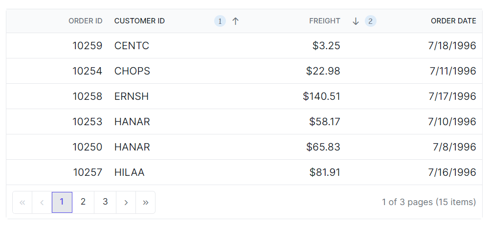

# Sorting customization in Syncfusion Blazor DataGrid

You can customize the appearance of the sorting icons and multi sorting icons in the Syncfusion<sup style="font-size:70%">&reg;</sup> Blazor DataGrid using CSS. You can use the available Syncfusion<sup style="font-size:70%">&reg;</sup> [icons](https://blazor.syncfusion.com/themestudio/?theme=material3) based on your theme. Here's how to do it:

## Customizing the Blazor DataGrid sorting icon

To customize the sorting icon that appears in the Grid header when sorting is applied, you can use the following CSS code:

```css
.e-grid .e-icon-ascending::before {
    content: '\e7a3'; /* Icon code for ascending order */
}
.e-grid .e-icon-descending::before {
    content: '\e7b6'; /* Icon code for descending order */
}
```
In this example, the **.e-icon-ascending::before** class targets the sorting icon for ascending order, and the **.e-icon-descending::before** class targets the sorting icon for descending order.


## Customizing the Blazor DataGrid multi sorting icon

To customize the multi sorting icon that appears in the Grid header when multiple columns are sorted, you can use the following CSS code:

```css
.e-grid .e-sortnumber {
    background-color: #deecf9;
    font-family: cursive;
}
```

In this example, the **.e-sortnumber** class targets the background color and font family of the multi sorting icon. You can modify the `background-color` and `font-family` properties to customize the appearance of the multi sorting icon.






@using Syncfusion.Blazor.Grids

<SfGrid @ref="Grid" DataSource="@Orders" Height="315" AllowSorting="true" AllowPaging="true">
    <GridPageSettings PageSize="8"></GridPageSettings>
    <GridColumns>
        <GridColumn Field=@nameof(OrderData.OrderID) HeaderText="Order ID" TextAlign="Syncfusion.Blazor.Grids.TextAlign.Right" Width="140"></GridColumn>
        <GridColumn Field=@nameof(OrderData.CustomerID) HeaderText="Customer ID" Width="120"></GridColumn>
        <GridColumn Field=@nameof(OrderData.Freight) HeaderText="Freight" TextAlign="Syncfusion.Blazor.Grids.TextAlign.Right" Width="120"></GridColumn>
        <GridColumn Field=@nameof(OrderData.OrderDate) HeaderText="Order Date" Format="d" Width="100" TextAlign="Syncfusion.Blazor.Grids.TextAlign.Right"></GridColumn>
    </GridColumns>
</SfGrid>

<style>
    .e-grid .e-sortnumber {
        background-color: #deecf9;
        font-family: cursive;
    }
    .e-grid .e-icon-ascending::before {
        content: '\e7a3'; /* Icon code for ascending order */
    }
    .e-grid .e-icon-descending::before {
        content: '\e7b6'; /* Icon code for descending order */
    }
</style>

@code {
    private SfGrid<OrderData> Grid;
    public List<OrderData> Orders { get; set; }

    protected override void OnInitialized()
    {
        Orders = OrderData.GetAllRecords();
    }
}





public class OrderData
{
    public static List<OrderData> Orders = new List<OrderData>();

    public OrderData(int orderID, string customerID, double freight, DateTime orderDate)
    {
        this.OrderID = orderID;
        this.CustomerID = customerID;
        this.Freight = freight;
        this.OrderDate = orderDate;
    }

    public static List<OrderData> GetAllRecords()
    {
        if (Orders.Count == 0)
        {
            Orders.Add(new OrderData(10248, "VINET", 32.38, new DateTime(2024, 1, 10)));
            Orders.Add(new OrderData(10249, "TOMSP", 11.61, new DateTime(2024, 1, 11)));
            Orders.Add(new OrderData(10250, "HANAR", 65.83, new DateTime(2024, 1, 12)));
            Orders.Add(new OrderData(10251, "VICTE", 41.34, new DateTime(2024, 1, 13)));
            Orders.Add(new OrderData(10252, "SUPRD", 51.3, new DateTime(2024, 1, 14)));
            Orders.Add(new OrderData(10253, "HANAR", 58.17, new DateTime(2024, 1, 15)));
            Orders.Add(new OrderData(10254, "CHOPS", 22.98, new DateTime(2024, 1, 16)));
            Orders.Add(new OrderData(10255, "RICSU", 148.33, new DateTime(2024, 1, 17)));
            Orders.Add(new OrderData(10256, "WELLI", 13.97, new DateTime(2024, 1, 18)));
            Orders.Add(new OrderData(10257, "HILAA", 81.91, new DateTime(2024, 1, 19)));
        }

        return Orders;
    }

    public int OrderID { get; set; }
    public string CustomerID { get; set; }
    public double Freight { get; set; }
    public DateTime OrderDate { get; set; }
}




