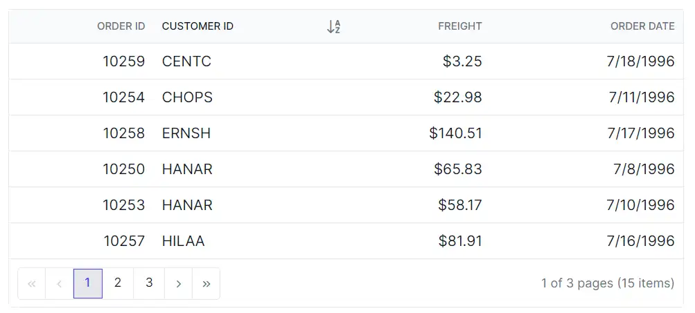
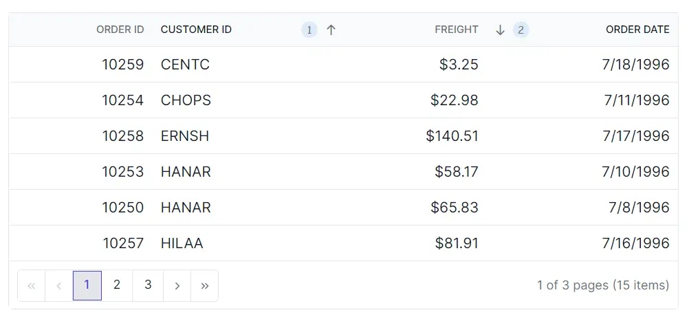

# Sorting Customization in Blazor Data Grid

The appearance of sort icons in the [Blazor Data Grid](https://www.syncfusion.com/blazor-components/blazor-datagrid) can be customized using CSS. Styling options are available for:

- **Ascending and descending sort icons:** Show the current sort direction in column headers.
- **Multi-sort badge:** Display the sort order when multiple columns are sorted.

## Customize the sort icons

Use the `.e-icon-ascending` and `.e-icon-descending` classes to style the icons shown in the Data Grid header when a column is sorted in `ascending` or `descending` order:

```css
.e-grid .e-icon-ascending::before,
.e-grid .e-icon-descending::before {
    font-family: 'e-icons' !important; /* Required for the icon glyphs to render */
    font-weight: normal;
    font-size: 14px;
    color: #0b6aa2;
    margin: 0 2px;
}

.e-grid .e-icon-ascending::before {
    content: '\e7a3'; /* Ascending icon code */
}

.e-grid .e-icon-descending::before {
    content: '\e7b6'; /* Descending icon code */
}
```

Adjust properties such as `content`, `color`, `font-size`, and `margin` to match the Data Grid design. Ensure the `e-icons` font family from the loaded theme is available so the icons render correctly.

> The icon codes shown above are theme and version dependent. For the complete list of available icons, refer to the [Syncfusion Blazor built-in icons](https://blazor.syncfusion.com/documentation/appearance/icons) reference.



## Customize the multi-sort badge

The `.e-sortnumber` class styles the numeric badge shown when multiple columns are sorted. Apply CSS to change the appearance:

```css
.e-grid .e-sortnumber {
    background-color: #deecf9;
    color: #0b6aa2;
    font-family: cursive;
    font-size: 12px;
}
```

Properties such as `background-color`, `font-family`, `font-size`, and `border-radius` can be modified to align with the grid layout. Maintain clear contrast and focus styles to support accessibility.

> The multi-sort badge appears only when more than one column is sorted. To trigger multi-sort, hold **Ctrl** (or **Cmd** on macOS) while clicking an additional column header, or tap additional headers on touch devices. Sorting a single column will not display the badge.

Enable multi-sort at the component level by setting the [`AllowMultiSorting`](https://blazor.syncfusion.com/documentation/datagrid/sorting#enable-multi-sorting) property to `true`. For programmatic configuration of the sorted columns and direction, use [`GridSortSettings`](https://blazor.syncfusion.com/documentation/datagrid/sorting#sort-settings). See the [Sorting in Blazor Data Grid](https://blazor.syncfusion.com/documentation/datagrid/sorting) documentation for the complete list of sort APIs.






@using Syncfusion.Blazor.Grids

<SfGrid @ref="Grid" DataSource="@Orders" Height="315" AllowSorting="true" AllowPaging="true">
    <GridPageSettings PageSize="8"></GridPageSettings>
    <GridColumns>
        <GridColumn Field=@nameof(OrderData.OrderID) HeaderText="Order ID" TextAlign="TextAlign.Right" Width="140"></GridColumn>
        <GridColumn Field=@nameof(OrderData.CustomerID) HeaderText="Customer ID" Width="120"></GridColumn>
        <GridColumn Field=@nameof(OrderData.Freight) HeaderText="Freight" TextAlign="TextAlign.Right" Width="120"></GridColumn>
        <GridColumn Field=@nameof(OrderData.OrderDate) HeaderText="Order Date" Format="d" Width="100" TextAlign="TextAlign.Right"></GridColumn>
    </GridColumns>
</SfGrid>

<style>
    /* Multi-sorting order badge (e.g., 1, 2, 3) */
    .e-grid .e-sortnumber {
        background-color: #deecf9;
        color: #0b6aa2;
        font-family: cursive;
        border-radius: 10px;
        padding: 0 6px;
        min-width: 18px;
        text-align: center;
        line-height: 18px;
        height: 18px;
        display: inline-block;
        margin-left: 4px;
    }

    /* Override sorting icons (ensure correct icon font family) */
    .e-grid .e-icon-ascending::before,
    .e-grid .e-icon-descending::before {
        font-family: 'e-icons' !important; /* required for glyphs to render */
        font-weight: normal;
        speak: none;
    }
    .e-grid .e-icon-ascending::before {
        content: '\e7a3'; /* Ascending icon code (verify for your theme/version) */
    }
    .e-grid .e-icon-descending::before {
        content: '\e7b6'; /* Descending icon code (verify for your theme/version) */
    }

    /* Optional: emphasize sorted header and provide better focus visibility.
       Note: the [aria-sort] selector relies on the component emitting aria-sort
       on .e-headercell. Verify the attribute is rendered for the active theme
       before publishing; use .e-headercell.e-sortasc / .e-headercell.e-sortdesc
       as a fallback when the attribute is absent. */
    .e-grid .e-headercell[aria-sort] {
        background-color: #f3f9ff;
    }
    .e-grid .e-headercell:focus-visible {
        outline: 2px solid #005a9e;
        outline-offset: -2px;
    }
</style>

@code {
    private SfGrid<OrderData> Grid;
    private List<OrderData> Orders { get; set; }

    protected override void OnInitialized()
    {
        Orders = OrderData.GetAllRecords();
    }
}





internal sealed class OrderData
{
    public OrderData(int orderID, string customerID, double freight, DateTime orderDate)
    {
        OrderID = orderID;
        CustomerID = customerID;
        Freight = freight;
        OrderDate = orderDate;
    }

    internal static List<OrderData> GetAllRecords() => new()
    {
        new OrderData(10248, "VINET", 32.38, new DateTime(2024, 1, 10)),
        new OrderData(10249, "TOMSP", 11.61, new DateTime(2024, 1, 11)),
        new OrderData(10250, "HANAR", 65.83, new DateTime(2024, 1, 12)),
		new OrderData(10251, "CHOPS", 45.83, new DateTime(2024, 1, 13)),
		new OrderData(10252, "SUPRD", 55.34, new DateTime(2024, 1, 14)),
		new OrderData(10250, "WELLI", 75.73, new DateTime(2024, 1, 15)),
		new OrderData(10254, "HILAA", 32.73, new DateTime(2024, 1, 16))
    };

    public int OrderID { get; set; }
    public string CustomerID { get; set; }
    public double Freight { get; set; }
    public DateTime OrderDate { get; set; }
}




