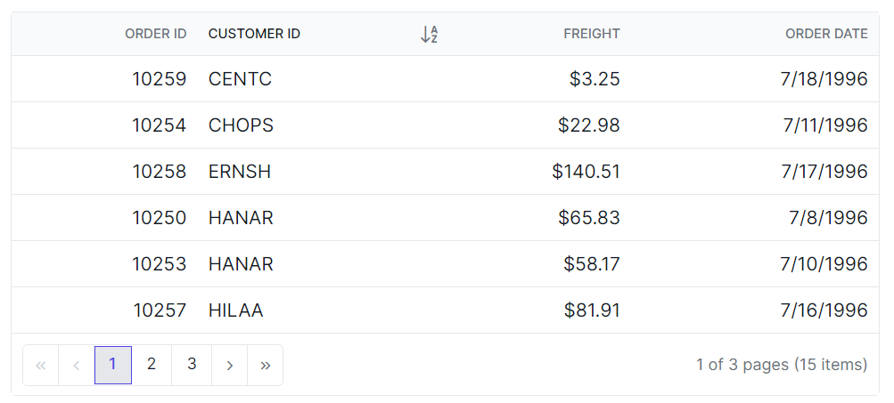

# Sorting customization in Syncfusion Blazor DataGrid

The appearance of sorting indicators in the Syncfusion® Blazor DataGrid can be styled using CSS. Styling options are available for:

- Ascending and descending sort icons
- Sort order indicators for multi-column sorting

N> - Enable sorting by setting the [AllowSorting](https://help.syncfusion.com/cr/blazor/Syncfusion.Blazor.Grids.SfGrid-1.html#Syncfusion_Blazor_Grids_SfGrid_1_AllowSorting) property. Ensure that the appropriate theme stylesheet is referenced so that sorting-related UI elements are displayed correctly.
- Icon glyph codes (such as `\e7a2`, `\e7a3`) vary depending on the theme and version. Confirm the correct glyph values by inspecting the icon font used in the current setup.
- When using CSS isolation (.razor.css), use the **::deep** selector to reach internal parts of the DataGrid, or place the grid inside a custom wrapper class and apply styles to that wrapper for better control.
- Class names may vary slightly depending on the theme or version. Use browser inspection tools to confirm the correct selectors.
- Ensure sufficient color contrast and visible focus indicators to support accessibility standards.

## Customizing the Sorting Icon

The **.e-icon-ascending** and **.e-icon-descending** classes define the icons shown in the Blazor DataGrid header when a column is sorted in `ascending` or `descending` order.

```css
.e-grid .e-icon-ascending::before {
    content: '\e7a3'; /* Icon code for ascending order */
}
.e-grid .e-icon-descending::before {
    content: '\e7b6'; /* Icon code for descending order */
}
```

Style properties such as `content`, `color`, `font-size`, and `margin` can be adjusted to match the desired design. Ensure the correct icon font family is loaded, as overriding content without the appropriate font may cause icons to not display.



## Customizing the Multi-Sorting Icon

The **.e-sortnumber** class is used to style the icon that appears in the Grid header when multiple columns are sorted. To change its appearance, apply CSS as shown below:

```css
.e-grid .e-sortnumber {
    background-color: #deecf9;
    font-family: cursive;
}
```

Style properties such as `background-color`, `font-family`, `font-size`, and `border-radius` can be adjusted to match the desired design. Maintain sufficient color contrast and preserve focus indicators to support accessibility.





@using Syncfusion.Blazor.Grids

<SfGrid @ref="Grid" DataSource="@Orders" Height="315" AllowSorting="true" AllowPaging="true">
    <GridPageSettings PageSize="8"></GridPageSettings>
    <GridColumns>
        <GridColumn Field=@nameof(OrderData.OrderID) HeaderText="Order ID" TextAlign="Syncfusion.Blazor.Grids.TextAlign.Right" Width="140"></GridColumn>
        <GridColumn Field=@nameof(OrderData.CustomerID) HeaderText="Customer ID" Width="120"></GridColumn>
        <GridColumn Field=@nameof(OrderData.Freight) HeaderText="Freight" TextAlign="Syncfusion.Blazor.Grids.TextAlign.Right" Width="120"></GridColumn>
        <GridColumn Field=@nameof(OrderData.OrderDate) HeaderText="Order Date" Format="d" Width="100" TextAlign="Syncfusion.Blazor.Grids.TextAlign.Right"></GridColumn>
    </GridColumns>
</SfGrid>

<style>
    .e-grid .e-sortnumber {
        background-color: #deecf9;
        font-family: cursive;
    }
    .e-grid .e-icon-ascending::before {
        content: '\e7a3'; /* Icon code for ascending order */
    }
    .e-grid .e-icon-descending::before {
        content: '\e7b6'; /* Icon code for descending order */
    }
</style>

@code {
    private SfGrid<OrderData> Grid;
    public List<OrderData> Orders { get; set; }

    protected override void OnInitialized()
    {
        Orders = OrderData.GetAllRecords();
    }
}





public class OrderData
{
    public static List<OrderData> Orders = new List<OrderData>();

    public OrderData(int orderID, string customerID, double freight, DateTime orderDate)
    {
        this.OrderID = orderID;
        this.CustomerID = customerID;
        this.Freight = freight;
        this.OrderDate = orderDate;
    }

    public static List<OrderData> GetAllRecords()
    {
        if (Orders.Count == 0)
        {
            Orders.Add(new OrderData(10248, "VINET", 32.38, new DateTime(2024, 1, 10)));
            Orders.Add(new OrderData(10249, "TOMSP", 11.61, new DateTime(2024, 1, 11)));
            Orders.Add(new OrderData(10250, "HANAR", 65.83, new DateTime(2024, 1, 12)));
            Orders.Add(new OrderData(10251, "VICTE", 41.34, new DateTime(2024, 1, 13)));
            Orders.Add(new OrderData(10252, "SUPRD", 51.3, new DateTime(2024, 1, 14)));
            Orders.Add(new OrderData(10253, "HANAR", 58.17, new DateTime(2024, 1, 15)));
            Orders.Add(new OrderData(10254, "CHOPS", 22.98, new DateTime(2024, 1, 16)));
            Orders.Add(new OrderData(10255, "RICSU", 148.33, new DateTime(2024, 1, 17)));
            Orders.Add(new OrderData(10256, "WELLI", 13.97, new DateTime(2024, 1, 18)));
            Orders.Add(new OrderData(10257, "HILAA", 81.91, new DateTime(2024, 1, 19)));
        }

        return Orders;
    }

    public int OrderID { get; set; }
    public string CustomerID { get; set; }
    public double Freight { get; set; }
    public DateTime OrderDate { get; set; }
}




