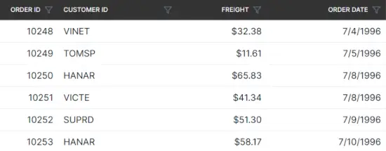
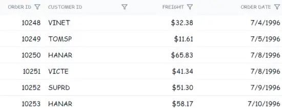
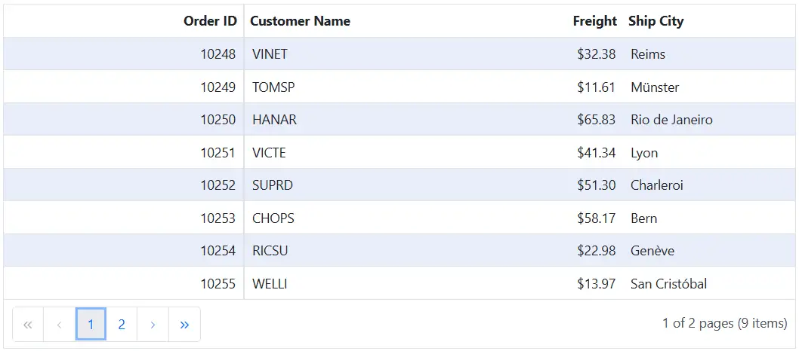
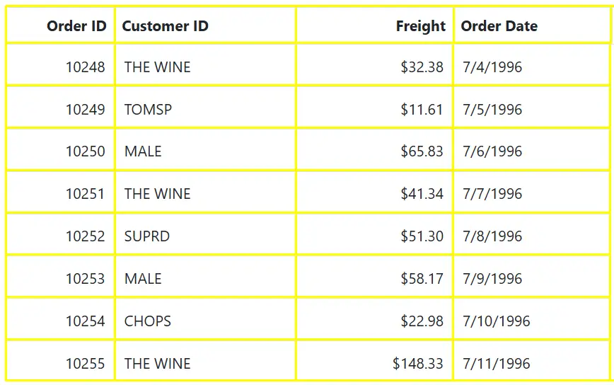

# Style and appearance in Blazor DataGrid

The [Blazor DataGrid](https://www.syncfusion.com/blazor-components/blazor-datagrid) supports visual customization using CSS and theme-based styling. Styles can be applied to various elements to match the application's design. Styling options are available for:

- **DataGrid root element:** Defines the overall appearance of the grid container.
- **Alternate rows with frozen columns:** Applies styles to alternate rows when frozen columns are enabled.
- **Grid lines:** Controls the color and visibility of horizontal and vertical lines between cells.

**Override Default Styles:**

Default styles such as **colors**, **typography**, **spacing**, and **borders** can be customized using CSS. Use browser developer tools to inspect the rendered HTML and identify relevant selectors. Where possible, use CSS variables or theme tokens to maintain consistency across components.

```css
.e-grid .e-headercell {
    background-color: #333; /* Override the header background color */
    color: #fff;
}
```

Properties like **background-color**, **color**, **font-family**, and **padding** can be changed to match the grid layout design and improve visual consistency.



## Customize the DataGrid root element

The **.e-grid** class styles the root container of the Blazor DataGrid. Apply CSS to modify its appearance:

```css
.e-grid {
    font-family: cursive;
}
```

Properties such as f **font-family**,**background-color**, and spacing-related styles can be adjusted to align with the grid design.



This customization applies a `cursive` font to the grid content. Additional styling can be applied to rows, alternate rows, selected rows, and hover states. Avoid using `!important` for hover styles in production environments. Instead, increase selector specificity to maintain consistent styling control.




@using Syncfusion.Blazor.Grids

<SfGrid @ref="Grid" DataSource="@Orders" Height="315" AllowPaging="true">
    <GridSelectionSettings Type="SelectionType.Multiple"></GridSelectionSettings>
    <GridPageSettings PageSize="8"></GridPageSettings>
    <GridColumns>
        <GridColumn Field=@nameof(OrderData.OrderID) HeaderText="Order ID" TextAlign="TextAlign.Right" Width="140"></GridColumn>
        <GridColumn Field=@nameof(OrderData.CustomerID) HeaderText="Customer Name" Width="120"></GridColumn>
        <GridColumn Field=@nameof(OrderData.Freight) HeaderText="Freight" Format="C2" TextAlign="TextAlign.Right" Width="100"></GridColumn>
        <GridColumn Field=@nameof(OrderData.ShipCity) HeaderText="Ship City" Width="100"></GridColumn>
    </GridColumns>
</SfGrid>

<style>
    .e-grid {
        font-family: cursive;
        /* Optional: set a base background for the grid area */
        /* background-color: #fafafa; */
    }

    /* Prefer specificity over !important for hover */
    .e-grid .e-content .e-row:hover .e-rowcell {
        background-color: rgb(204, 229, 255);
    }

    .e-grid .e-rowcell.e-selectionbackground {
        background-color: rgb(230, 230, 250);
    }

    .e-grid .e-row.e-altrow {
        background-color: rgb(150, 212, 212);
    }

    .e-grid .e-row {
        background-color: rgb(180, 180, 180);
    }

    /* Optional: keyboard focus visibility */
    .e-grid .e-row:focus-visible .e-rowcell {
        outline: 2px solid #005a9e;
        outline-offset: -2px;
    }
</style>

@code {
    private SfGrid<OrderData> Grid;
    private List<OrderData> Orders { get; set; }

    protected override void OnInitialized()
    {
        Orders = OrderData.GetAllRecords();
    }
}





internal sealed class OrderData
{
    private static readonly List<OrderData> Data = new();
    public OrderData(int orderId, string customerId, double freight, string shipCity)
    {
        OrderID = orderId;
        CustomerID = customerId;
        Freight = freight;
        ShipCity = shipCity;
    }

    internal static List<OrderData> GetAllRecords()
    {
        if (Data.Count == 0)
        {
            Data.Add(new OrderData(10248, "VINET", 32.38, "Reims"));
            Data.Add(new OrderData(10249, "TOMSP", 11.61, "Münster"));
            Data.Add(new OrderData(10250, "HANAR", 65.83, "Rio de Janeiro"));
            Data.Add(new OrderData(10251, "VICTE", 41.34, "Lyon"));
            Data.Add(new OrderData(10252, "SUPRD", 51.30, "Charleroi"));
            Data.Add(new OrderData(10253, "CHOPS", 58.17, "Bern"));
            Data.Add(new OrderData(10254, "RICSU", 22.98, "Genève"));
            Data.Add(new OrderData(10255, "WELLI", 13.97, "San Cristóbal"));
            Data.Add(new OrderData(10256, "HILAA", 81.91, "Graz"));
        }

        return Data;
    }

    public int OrderID { get; set; }
    public string CustomerID { get; set; }
    public double Freight { get; set; }
    public string ShipCity { get; set; }
}






## Customize alternate rows with frozen columns

The **.e-altrow .e-rowcell** selector styles cells in alternate rows when [Frozen columns](https://blazor.syncfusion.com/documentation/datagrid/frozen-column) are enabled in the Blazor DataGrid.

```css
.e-grid .e-altrow .e-rowcell {
    background-color: #E8EEFA;
}
```

Adjust properties like **background-color**,**font-family**, and **border** to maintain consistent styling across frozen and movable sections.






@using Syncfusion.Blazor.Grids

<SfGrid @ref="Grid" DataSource="@Orders" Height="315" AllowPaging="true">
    <GridPageSettings PageSize="8"></GridPageSettings>
    <GridColumns>
        <GridColumn Field=@nameof(OrderData.OrderID) HeaderText="Order ID" IsFrozen="true" TextAlign="TextAlign.Right" Width="140"></GridColumn>
        <GridColumn Field=@nameof(OrderData.CustomerID) HeaderText="Customer Name" Width="120"></GridColumn>
        <GridColumn Field=@nameof(OrderData.Freight) HeaderText="Freight" Format="C2" TextAlign="TextAlign.Right" Width="100"></GridColumn>
        <GridColumn Field=@nameof(OrderData.ShipCity) HeaderText="Ship City" Width="100"></GridColumn>
    </GridColumns>
</SfGrid>

<style>
    /* Applies to alt rows across frozen and movable sections */
    .e-grid .e-altrow .e-rowcell {
        background-color: #E8EEFA;
    }
</style>

@code {
    private SfGrid<OrderData> Grid;
    private List<OrderData> Orders { get; set; }

    protected override void OnInitialized()
    {
        Orders = OrderData.GetAllRecords();
    }
}




internal sealed class OrderData
{
    private static readonly List<OrderData> Data = new();

    public OrderData(int orderId, string customerId, double freight, string shipCity)
    {
        OrderID = orderId;
        CustomerID = customerId;
        Freight = freight;
        ShipCity = shipCity;
    }

    internal static List<OrderData> GetAllRecords()
    {
        if (Data.Count == 0)
        {
            Data.Add(new OrderData(10248, "VINET", 32.38, "Reims"));
            Data.Add(new OrderData(10249, "TOMSP", 11.61, "Münster"));
            Data.Add(new OrderData(10250, "HANAR", 65.83, "Rio de Janeiro"));
            Data.Add(new OrderData(10251, "VICTE", 41.34, "Lyon"));
            Data.Add(new OrderData(10252, "SUPRD", 51.30, "Charleroi"));
            Data.Add(new OrderData(10253, "CHOPS", 58.17, "Bern"));
            Data.Add(new OrderData(10254, "RICSU", 22.98, "Genève"));
            Data.Add(new OrderData(10255, "WELLI", 13.97, "San Cristóbal"));
            Data.Add(new OrderData(10256, "HILAA", 81.91, "Graz"));
        }

        return Data;
    }

    public int OrderID { get; set; }
    public string CustomerID { get; set; }
    public double Freight { get; set; }
    public string ShipCity { get; set; }
}
 





## Customize the color of grid lines

The Blazor DataGrid allows customization of grid lines to match application design requirements. Apply CSS to structural elements such as header cells, row cells, and the grid container to control color, thickness, and border style.

The [GridLines](https://help.syncfusion.com/cr/blazor/Syncfusion.Blazor.Grids.SfGrid-1.html#Syncfusion_Blazor_Grids_SfGrid_1_GridLines) property defines border visibility and supports options for `Horizontal`, `Vertical`, `Both`, or `None`.

```css
    /* Customize the color of Grid lines */
    .e-grid .e-gridheader, .e-grid .e-headercell, .e-grid .e-rowcell, .e-grid {
        border-color: yellow;
        border-style: solid;
        border-width: 2px;
    }

```






@using Syncfusion.Blazor.Grids

<SfGrid DataSource="@Orders" Height="315" GridLines="GridLine.Both">
    <GridColumns>
        <GridColumn Field=@nameof(OrderData.OrderID) HeaderText="Order ID" TextAlign="TextAlign.Right" Width="90"></GridColumn>
        <GridColumn Field=@nameof(OrderData.CustomerID) HeaderText="Customer ID" Width="150"></GridColumn>
        <GridColumn Field=@nameof(OrderData.Freight) HeaderText="Freight" TextAlign="TextAlign.Right" Format="C2" Width="130"></GridColumn>
        <GridColumn Field=@nameof(OrderData.OrderDate) HeaderText="Order Date" Format="d" Type="ColumnType.Date" Width="130"></GridColumn>
    </GridColumns>
</SfGrid>

<style>
    /* Customize the color and thickness of grid lines */
    .e-grid .e-gridheader,
    .e-grid .e-headercell,
    .e-grid .e-rowcell,
    .e-grid {
        border-color: yellow;
        border-style: solid;
        border-width: 2px;
    }

    /* Optional: ensure header divider lines are visible */
    .e-grid .e-headercell {
        border-right-width: 2px;
    }
</style>

@code {
    private List<OrderData> Orders { get; set; }

    protected override void OnInitialized()
    {
        Orders = OrderData.GetAllRecords();
    }
}




internal sealed class OrderData
{
    private static readonly List<OrderData> Data = new();

    public OrderData(int orderId, string customerId, double freight, DateTime orderDate)
    {
        OrderID = orderId;
        CustomerID = customerId;
        Freight = freight;
        OrderDate = orderDate;
    }

    internal static List<OrderData> GetAllRecords()
    {
        if (Data.Count == 0)
        {
            Data.Add(new OrderData(10248, "VINET", 32.38, new DateTime(1996, 7, 4)));
            Data.Add(new OrderData(10249, "TOMSP", 11.61, new DateTime(1996, 7, 5)));
            Data.Add(new OrderData(10250, "HANAR", 65.83, new DateTime(1996, 7, 6)));
            Data.Add(new OrderData(10251, "VINET", 41.34, new DateTime(1996, 7, 7)));
            Data.Add(new OrderData(10252, "SUPRD", 51.30, new DateTime(1996, 7, 8)));
            Data.Add(new OrderData(10253, "HANAR", 58.17, new DateTime(1996, 7, 9)));
            Data.Add(new OrderData(10254, "CHOPS", 22.98, new DateTime(1996, 7, 10)));
            Data.Add(new OrderData(10255, "VINET", 148.33, new DateTime(1996, 7, 11)));
            Data.Add(new OrderData(10256, "HANAR", 13.97, new DateTime(1996, 7, 12)));
        }

        return Data;
    }

    public int OrderID { get; set; }
    public string CustomerID { get; set; }
    public double Freight { get; set; }
    public DateTime OrderDate { get; set; }
}
 






## Theme customization

The Blazor Data Grid provides flexible theme customization options to align control appearance with application design requirements. Built-in themes can be customized by overriding default CSS variables or by creating completely customized themes using Syncfusion Theme Studio.

### Default CSS override

The Blazor Data Grid themes use CSS variables with the unified `–sf` naming convention. This ensures visual consistency, straightforward customization, and global updates. Centralized variables allow quick adjustments to **colors**, **backgrounds**, and **borders** across the grid.

#### Material 3 theme color variables

The **Material 3** theme applies scalable CSS custom properties to maintain consistency within the Blazor Data Grid. Variables are designed for straightforward theming and responsive behavior.

The following table highlights commonly used color-related variables in the Material 3 theme:

| Name | Purpose |
|------|---------|
| `--e-font-name` | Specifies the default font family applied across the DataGrid |
| `--color-sf-surface` | Controls base surface styling for UI elements |
| `--color-sf-on-surface` | Defines text appearance on surface elements |
| `--color-sf-primary-container` | Applies background styling for active or highlighted row states |
| `--color-sf-outline-variant` | Defines border and separator styling |

| Name | Purpose |
|------|---------|
| `--e-font-name` | Specifies the default font family used across the DataGrid |
| `--color-sf-surface` | Controls the base surface styling for UI elements |
| `--color-sf-on-surface` | Sets text appearance on surface elements |
| `--color-sf-primary-container` | Used for background styling of active or highlighted row states |
| `--color-sf-outline-variant` | Defines border and separator styling |

#### Bootstrap 5.3 theme color variables

The **Bootstrap 5.3** theme extends Bootstrap's framework with CSS custom properties for the Data Grid. The following table lists color-related variables defined for the Bootstrap 5.3 theme:

| Name | Purpose |
|------|---------|
| `--e-font-name` | Specifies the default font family used across the DataGrid |
| `--color-sf-content-bg-color-alt1` | Controls the background of the DataGrid header |
| `--color-sf-content-bg-color` | Controls the background of the DataGrid content |
| `--color-sf-table-bg-color-hover` | Defines the background styling for selected rows during hover interaction |
| `--color-sf-content-bg-color-hover` | Defines background behavior when primary elements are hovered |
| `--color-sf-primary` | Defines the main theme styling used across components |
| `--color-sf-primary-light` | Provides a softer variation of the primary theme for backgrounds |
| `--color-sf-border-light` | Specifies styling for light borders and separators |

#### Tailwind 3 theme color variables

The **Tailwind 3** theme uses utility-first CSS custom properties to deliver a **flexible**, **modern design system**. The following table presents color-related variables available in the Tailwind 3 theme:

| Name | Purpose |
|------|---------|
| `--e-font-name` | Specifies the default font family used across the UI |
| `--color-sf-content-bg-color` | Controls the main background of the application area |
| `--color-sf-table-bg-color-hover` | Defines background behavior during hover interaction |
| `--color-sf-content-bg-color-hover` | Defines the background color for pager during hover interaction |
| `--color-sf-primary` | Defines the main theme color used across components |
| `--color-sf-border-light` | Defines the border color used across the component |

#### Fluent 2 theme color variables

The **Fluent 2** theme leverages modern CSS custom properties to provide a clean and consistent design aligned with Fluent UI principles. The following table outlines color-related variables available in the Fluent 2 theme:

| Name | Purpose |
|------|---------|
| `--e-font-name` | Specifies the default font family used across the DataGrid |
| `--color-sf-content-bg-color-alt1` | Controls the main background of the DataGrid |
| `--color-sf-table-bg-color-hover` | Defines the background styling for selected rows during hover interaction |
| `--color-sf-content-bg-color-hover` | Defines background behavior when primary elements are hovered |
| `--color-sf-primary` | Defines the main theme styling used across components |
| `--color-sf-border-light` | Specifies styling for light borders and separators |
| `--color-sf-border-alt` | Defines alternate border styling for DataGrid elements |





@using Syncfusion.Blazor.Grids

<SfGrid @ref="Grid" DataSource="@Orders" Height="315" AllowPaging="true">
    <GridSelectionSettings Type="SelectionType.Multiple"></GridSelectionSettings>
    <GridPageSettings PageSize="8"></GridPageSettings>
    <GridColumns>
        <GridColumn Field=@nameof(OrderData.OrderID) HeaderText="Order ID" TextAlign="TextAlign.Right" Width="140"></GridColumn>
        <GridColumn Field=@nameof(OrderData.CustomerID) HeaderText="Customer Name" Width="120"></GridColumn>
        <GridColumn Field=@nameof(OrderData.Freight) HeaderText="Freight" Format="C2" TextAlign="TextAlign.Right" Width="100"></GridColumn>
        <GridColumn Field=@nameof(OrderData.ShipCity) HeaderText="Ship City" Width="100"></GridColumn>
    </GridColumns>
</SfGrid>

<style>
    <style>
    :root {
        /* tailwind 3 */
        /* font family */
        /* --e-font-name: 'Verdana'; */
        /* grid background color */
        /* --color-sf-content-bg-color: rgba(240, 253, 244); */
        /* grid row hover background color */
        /* --color-sf-table-bg-color-hover: rgba(70, 100, 20, 0.05); */
        /* grid cell focus border, current page background */
        /* --color-sf-primary: rgba(34, 197, 94); */
        /* pager icon hover background color */
        /* --color-sf-content-bg-color-hover: rgba(70, 100, 20, 0.05); */
        /* grid pager border color */
        /* --color-sf-border-light: rgba(34, 197, 94); */
        /* material 3 */
        --e-font-name: 'Verdana';
        --color-sf-surface: 240, 253, 244;
        --color-sf-on-surface: 70, 100, 20;
        --color-sf-primary: 34, 197, 94;
        --color-sf-primary-container: 34, 197, 94;
        --color-sf-outline-variant: 34, 197, 94;
        /* fluent 2 */
        /* --e-font-name: 'Verdana';
            --color-sf-content-bg-color-alt1: rgba(240, 253, 244);
            --color-sf-table-bg-color-hover: rgba(70, 100, 20, 0.05);
            --color-sf-border-alt: rgba(34, 197, 94);
            --color-sf-content-bg-color-hover: rgba(70, 100, 20, 0.05);
            --color-sf-primary: rgba(34, 197, 94);
            --color-sf-border-light: rgba(34, 197, 94); */
        /* bootstrap 5.3 */
        /* --e-font-name: 'Verdana';
            --color-sf-content-bg-color-alt1: rgb(240, 253, 244);
            --color-sf-content-bg-color: rgba(240, 253, 244);
            --color-sf-table-bg-color-hover: rgba(70, 100, 20, 0.05);
            --color-sf-primary: rgba(34, 197, 94);
            --color-sf-content-bg-color-hover: rgba(70, 100, 20, 0.05);
            --color-sf-primary: rgba(34, 197, 94);
            --color-sf-primary-light: rgba(34, 197, 94);
            --color-sf-border-light: rgba(34, 197, 94); */
    }
</style>

@code {
    private SfGrid<OrderData> Grid;
    private List<OrderData> Orders { get; set; }

    protected override void OnInitialized()
    {
        Orders = OrderData.GetAllRecords();
    }
}





internal sealed class OrderData
{
    private static readonly List<OrderData> Data = new();
    public OrderData(int orderId, string customerId, double freight, string shipCity)
    {
        OrderID = orderId;
        CustomerID = customerId;
        Freight = freight;
        ShipCity = shipCity;
    }

    internal static List<OrderData> GetAllRecords()
    {
        if (Data.Count == 0)
        {
            Data.Add(new OrderData(10248, "VINET", 32.38, "Reims"));
            Data.Add(new OrderData(10249, "TOMSP", 11.61, "Münster"));
            Data.Add(new OrderData(10250, "HANAR", 65.83, "Rio de Janeiro"));
            Data.Add(new OrderData(10251, "VICTE", 41.34, "Lyon"));
            Data.Add(new OrderData(10252, "SUPRD", 51.30, "Charleroi"));
            Data.Add(new OrderData(10253, "CHOPS", 58.17, "Bern"));
            Data.Add(new OrderData(10254, "RICSU", 22.98, "Genève"));
            Data.Add(new OrderData(10255, "WELLI", 13.97, "San Cristóbal"));
            Data.Add(new OrderData(10256, "HILAA", 81.91, "Graz"));
        }

        return Data;
    }

    public int OrderID { get; set; }
    public string CustomerID { get; set; }
    public double Freight { get; set; }
    public string ShipCity { get; set; }
}






### Using Theme Studio

Syncfusion Theme Studio provides a unified approach to create custom themes for all controls, including the Blazor Data Grid. This advanced method defines a comprehensive set of styles to achieve consistent appearance across the application.

1. Navigate to the Syncfusion® [Theme Studio]((https://blazor.syncfusion.com/themestudio/?theme=material3)).
2. Select the **Grid** control from the left panel.
3. Customize **colors**, **typography**, **spacing**, and other **visual tokens**.
4. Download the generated CSS file and integrate it into the Blazor project's site stylesheet or theme bundle.