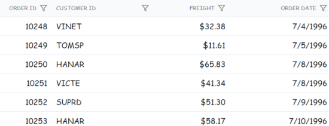

# Style and appearance in Syncfusion<sup style="font-size:70%">&reg;</sup> Blazor DataGrid

The Syncfusion<sup style="font-size:70%">&reg;</sup> Blazor DataGrid supports extensive visual customization using default CSS and custom themes. The following guidance focuses on practical CSS overrides and theme-based styling. Note: when using CSS isolation (.razor.css), target Grid internals with the ::deep combinator or apply a wrapper class to increase selector specificity if theme styles override custom CSS.

**Default CSS overrides:**

Use custom CSS to override default Grid styles such as colors, typography, padding, and borders. Inspect the rendered HTML with browser developer tools to identify relevant selectors and class names.

Here is a basic example that overrides the header background color:

```css
/* In your control's CSS file */
.e-grid .e-headercell {
    background-color: #333; /* Override the header background color */
    color: #fff;
}
```


**Using theme studio:**

Syncfusion Theme Studio enables creating custom themes for all components, including the DataGrid, to achieve a consistent look and feel across an application.

1. Visit the [Syncfusion<sup style="font-size:70%">&reg;</sup> Theme Studio](https://blazor.syncfusion.com/themestudio/?theme=material3).
2. Select the Grid from the left panel.
3. Customize colors, typography, spacing, and other visual tokens.
4. Download the generated CSS and include it in the Blazor project.

## Customizing the Blazor DataGrid root element

To customize the appearance of the Grid root element, apply CSS selectors to the root container. The following example modifies the font family:

```css
.e-grid {
      font-family: cursive;
}

```



In the above code snippet, the `.e-grid` selector targets the Grid root element, and the font-family property is set to cursive to change the Grid’s font family.

In the following sample, the Grid content uses the `cursive` font family, and the background color of rows, selected rows, alternate rows, and row hover state is customized using the CSS shown.




@using Syncfusion.Blazor.Grids

<SfGrid @ref="Grid" DataSource="@Orders" Height="315" AllowPaging="true">
   <GridSelectionSettings Type="SelectionType.Multiple"></GridSelectionSettings>
    <GridPageSettings PageSize="8"></GridPageSettings>
    <GridColumns>
        <GridColumn Field=@nameof(OrderData.OrderID) HeaderText="Order ID" TextAlign="TextAlign.Right" Width="140"></GridColumn>
        <GridColumn Field=@nameof(OrderData.CustomerID) HeaderText="Customer Name" Width="120"></GridColumn>
        <GridColumn Field=@nameof(OrderData.Freight) HeaderText="Freight" Format="C2" TextAlign="TextAlign.Right" Width="100"></GridColumn>
        <GridColumn Field=@nameof(OrderData.ShipCity) HeaderText="Ship City" Width="100"></GridColumn>
    </GridColumns>
</SfGrid>

<style>

    .e-grid {
        font-family: cursive;
    }

    .e-grid .e-row:hover .e-rowcell {
        background-color: rgb(204, 229, 255) !important;
    }

    .e-grid .e-rowcell.e-selectionbackground {
        background-color: rgb(230, 230, 250);
     }

    .e-grid .e-row.e-altrow {
        background-color: rgb(150, 212, 212);
     }

    .e-grid .e-row {
        background-color: rgb(180, 180, 180);
    }
    
</style>

@code {
    private SfGrid<OrderData> Grid;
    public bool IsEncode { get; set; } = true;
    public List<OrderData> Orders { get; set; }

    protected override void OnInitialized()
    {
        Orders = OrderData.GetAllRecords();
    }
}





public class OrderData
{
    public static List<OrderData> Orders = new List<OrderData>();
    public OrderData()
    {

    }

    public OrderData(int? OrderID, string CustomerId, double? Freight, string ShipCity)
    {
        this.OrderID = OrderID;
        this.CustomerID = CustomerId;
        this.Freight = Freight;
        this.ShipCity= ShipCity;
    }

    public static List<OrderData> GetAllRecords()
    {
        if (Orders.Count() == 0)
        {
            int code = 10;
            for (int i = 1; i < 2; i++)
            {
                Orders.Add(new OrderData(10248, "VINET",32.38, "Reims"));
                Orders.Add(new OrderData(10249, "TOMSP", 11.61, "Münster"));
                Orders.Add(new OrderData(10250, "HANAR", 65.83, "Rio de Janeiro"));
                Orders.Add(new OrderData(10251, "VICTE", 41.34, "Lyon"));
                Orders.Add(new OrderData(10252, "SUPRD", 51.30, "Charleroi"));
                Orders.Add(new OrderData(10253, "CHOPS", 58.17, "Bern"));
                Orders.Add(new OrderData(10254, "RICSU", 22.98, "Genève"));
                Orders.Add(new OrderData(10255, "WELLI", 13.97, "San Cristóbal"));
                Orders.Add(new OrderData(10256, "HILAA", 81.91, "Graz"));
                code += 5;
            }
        }
        return Orders;
    }

    public int? OrderID { get; set; }
    public string CustomerID { get; set; }
    public double? Freight { get; set; }
    public string ShipCity { get; set; }
}
 





## Customizing alternate row with Frozen columns

To adjust the alternate row style when [Frozen columns](https://blazor.syncfusion.com/documentation/datagrid/frozen-column) are enabled, apply CSS to the alternate row selector as shown below:

```css
.e-grid .e-altrow .e-rowcell {
    background-color: #E8EEFA;
}

```

In this example, the `.e-altrow .e-rowcell` selector targets the cells in alternate rows and applies a custom background color.





@using Syncfusion.Blazor.Grids

<SfGrid @ref="Grid" DataSource="@Orders" Height="315" AllowPaging="true">
    <GridPageSettings PageSize="8"></GridPageSettings>
    <GridColumns>
        <GridColumn Field=@nameof(OrderData.OrderID) HeaderText="Order ID" IsFrozen="true" TextAlign="TextAlign.Right" Width="140"></GridColumn>
        <GridColumn Field=@nameof(OrderData.CustomerID) HeaderText="Customer Name" Width="120"></GridColumn>
        <GridColumn Field=@nameof(OrderData.Freight) HeaderText="Freight" Format="C2" TextAlign="TextAlign.Right" Width="100"></GridColumn>
        <GridColumn Field=@nameof(OrderData.ShipCity) HeaderText="Ship City" Width="100"></GridColumn>
    </GridColumns>
</SfGrid>

<style>

    .e-grid .e-altrow .e-rowcell {
        background-color: #E8EEFA;
    }
    
</style>

@code {
    private SfGrid<OrderData> Grid;
    public bool IsEncode { get; set; } = true;
    public List<OrderData> Orders { get; set; }

    protected override void OnInitialized()
    {
        Orders = OrderData.GetAllRecords();
    }
}





public class OrderData
{
    public static List<OrderData> Orders = new List<OrderData>();
    public OrderData()
    {

    }

    public OrderData(int? OrderID, string CustomerId, double? Freight, string ShipCity)
    {
        this.OrderID = OrderID;
        this.CustomerID = CustomerId;
        this.Freight = Freight;
        this.ShipCity= ShipCity;
    }

    public static List<OrderData> GetAllRecords()
    {
        if (Orders.Count() == 0)
        {
            int code = 10;
            for (int i = 1; i < 2; i++)
            {
                Orders.Add(new OrderData(10248, "VINET",32.38, "Reims"));
                Orders.Add(new OrderData(10249, "TOMSP", 11.61, "Münster"));
                Orders.Add(new OrderData(10250, "HANAR", 65.83, "Rio de Janeiro"));
                Orders.Add(new OrderData(10251, "VICTE", 41.34, "Lyon"));
                Orders.Add(new OrderData(10252, "SUPRD", 51.30, "Charleroi"));
                Orders.Add(new OrderData(10253, "CHOPS", 58.17, "Bern"));
                Orders.Add(new OrderData(10254, "RICSU", 22.98, "Genève"));
                Orders.Add(new OrderData(10255, "WELLI", 13.97, "San Cristóbal"));
                Orders.Add(new OrderData(10256, "HILAA", 81.91, "Graz"));
                code += 5;
            }
        }
        return Orders;
    }

    public int? OrderID { get; set; }
    public string CustomerID { get; set; }
    public double? Freight { get; set; }
    public string ShipCity { get; set; }
}
 





## Customize the color of Grid lines

The Syncfusion<sup style="font-size:70%">&reg;</sup> Blazor DataGrid allows customization of Grid line appearance to match application design requirements.

To customize the color of Grid lines, apply CSS to structural elements such as header cells and row cells. This approach provides control over color, thickness, and style of borders between cells.

```css
    /* Customize the color of Grid lines */
    .e-grid .e-gridheader, .e-grid .e-headercell, .e-grid .e-rowcell, .e-grid {
        border-color: yellow;
        border-style: solid;
        border-width: 2px;
    }

```


The following example demonstrates customizing Grid line color while using the [GridLines](https://help.syncfusion.com/cr/blazor/Syncfusion.Blazor.Grids.SfGrid-1.html#Syncfusion_Blazor_Grids_SfGrid_1_GridLines) property in the Grid:




@using Syncfusion.Blazor.Grids

<SfGrid DataSource="@Orders" Height="315" GridLines="Syncfusion.Blazor.Grids.GridLine.Both">
    <GridColumns>
        <GridColumn Field=@nameof(OrderData.OrderID) HeaderText="Order ID" TextAlign="Syncfusion.Blazor.Grids.TextAlign.Right" Width="90"></GridColumn>
        <GridColumn Field=@nameof(OrderData.CustomerID) HeaderText="Customer ID" Width="150"></GridColumn>
        <GridColumn Field=@nameof(OrderData.Freight) HeaderText="Freight" TextAlign="Syncfusion.Blazor.Grids.TextAlign.Right" Format="C2" Width="130"></GridColumn>
        <GridColumn Field=@nameof(OrderData.OrderDate) HeaderText="Order Date" Format="d" Type="Syncfusion.Blazor.Grids.ColumnType.Date" Width="130"></GridColumn>
    </GridColumns>
</SfGrid>

<style>
    /* Customize the color of Grid lines */
    .e-grid .e-gridheader, .e-grid .e-headercell, .e-grid .e-rowcell, .e-grid {
        border-color: yellow;
        border-style: solid;
        border-width: 2px;
        
    }
</style>

@code {
    public List<OrderData> Orders { get; set; }
   
    protected override void OnInitialized()
    {
        Orders = OrderData.GetAllRecords();
    }    
}





public class OrderData
{
    public static List<OrderData> Orders = new List<OrderData>();
    public OrderData()
    {

    }
    public OrderData(int? OrderID, string CustomerID, double Freight,DateTime? OrderDate)
    {
        this.OrderID = OrderID;
        this.CustomerID = CustomerID;   
        this.Freight = Freight;  
        this.OrderDate = OrderDate;           
    }

    public static List<OrderData> GetAllRecords()
    {
        if (Orders.Count() == 0)
        {
            int code = 10;
            for (int i = 1; i < 2; i++)
            {
                Orders.Add(new OrderData(10248, "VINET", 32.38,new DateTime(1996,7,4)));
                Orders.Add(new OrderData(10249, "TOMSP", 11.61, new DateTime(1996, 7, 5)));
                Orders.Add(new OrderData(10250, "HANAR", 65.83, new DateTime(1996, 7, 6)));
                Orders.Add(new OrderData(10251, "VINET", 41.34, new DateTime(1996, 7, 7)));
                Orders.Add(new OrderData(10252, "SUPRD", 51.30, new DateTime(1996, 7, 8)));
                Orders.Add(new OrderData(10253, "HANAR", 58.17, new DateTime(1996, 7, 9)));
                Orders.Add(new OrderData(10254, "CHOPS", 22.98, new DateTime(1996, 7, 10)));
                Orders.Add(new OrderData(10255, "VINET", 148.33, new DateTime(1996, 7, 11)));
                Orders.Add(new OrderData(10256, "HANAR", 13.97, new DateTime(1996, 7, 12)));
                code += 5;
            }
        }
        return Orders;
    }
    public int? OrderID { get; set; }
    public string CustomerID { get; set; }
    public double? Freight { get; set; }
    public DateTime? OrderDate { get; set; }       
}
 



