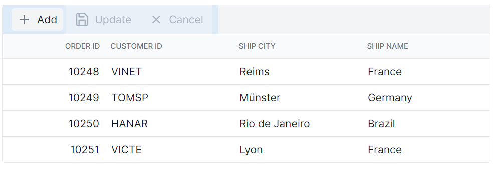
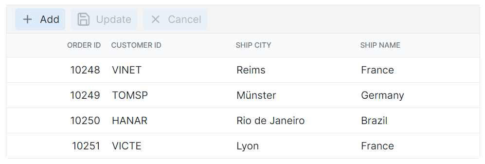

# Toolbar customization in Syncfusion Blazor DataGrid

The appearance of toolbar elements in the Syncfusion Blazor DataGrid can be customized using CSS. Styling options are available for different parts of the toolbar interface:

- **Toolbar root container:** The outer wrapper that holds all toolbar items.
- **Toolbar buttons:** Interactive elements used for actions such as add, edit, delete, update, and cancel.

N> - Ensure that the required theme stylesheet is referenced so that toolbar UI elements are displayed correctly.
- When using CSS isolation (.razor.css), use the **::deep** selector to reach internal parts of the DataGrid, or place the grid inside a custom wrapper class and apply styles to that wrapper for better control.
- Class names may change slightly depending on the theme or version. Inspect the DOM to confirm selectors before applying styles.
- Maintain strong color contrast and clear focus indicators to support accessibility and improve readability.
- For configuring toolbar functionality (e.g., add, edit, delete, or custom actions), refer to the [Blazor DataGrid Toolbar](https://blazor.syncfusion.com/documentation/datagrid/tool-bar) documentation.

## Customize the toolbar root element

The **.e-toolbar-items** class styles the toolbar root container in the Blazor DataGrid. This container holds all toolbar items and can be styled using CSS:

```css
.e-grid .e-toolbar-items {
    background-color: #deecf9;
}
```
Properties such as **background-color**, **padding**, **border**, and **box-shadow** can be modified to suit the layout design.



# Customize the toolbar button elements

The **.e-btn** class inside **.e-toolbar** defines the appearance of toolbar buttons in the Blazor DataGrid. Apply CSS to customize their styling:
```css
.e-grid .e-toolbar .e-btn {
    background-color: #deecf9;
}
```
Properties such as **background-color**, **color**, **border**, **font-size**, and **padding** can be adjusted to align with the design. Ensure that customized colors meet WCAG contrast guidelines and that focus indicators remain visible for keyboard navigation.






@using Syncfusion.Blazor.Grids

<SfGrid DataSource="@Orders"
        Height="315"
        AllowPaging="true"
        Toolbar="@(new List<string> { "Add", "Edit", "Delete", "Cancel", "Update" })">
    <GridPageSettings PageSize="8"></GridPageSettings>
    <GridEditSettings AllowAdding="true" AllowEditing="true" AllowDeleting="true"></GridEditSettings>
    <GridColumns>
        <GridColumn Field=@nameof(OrderData.OrderID) HeaderText="Order ID" TextAlign="Syncfusion.Blazor.Grids.TextAlign.Right" Width="140"></GridColumn>
        <GridColumn Field=@nameof(OrderData.CustomerID) HeaderText="Customer ID" Width="120"></GridColumn>
        <GridColumn Field=@nameof(OrderData.ShipCity) HeaderText="Ship City" Width="100"></GridColumn>
        <GridColumn Field=@nameof(OrderData.ShipName) HeaderText="Ship Name" Width="100"></GridColumn>
    </GridColumns>
</SfGrid>

<style>
   .e-grid .e-toolbar-items {
        background-color: #deecf9;
    }
   .e-grid .e-toolbar .e-btn {
        background-color: #c8ddf1;
    }
</style>

@code {
    private List<OrderData> Orders { get; set; }

    protected override void OnInitialized()
    {
        Orders = OrderData.GetAllRecords();
    }
}





internal sealed class OrderData
{
    private static readonly List<OrderData> Data = new List<OrderData>();

    internal OrderData(int orderID, string customerID, string shipCity, string shipName)
    {
        OrderID = orderID;
        CustomerID = customerID;
        ShipCity = shipCity;
        ShipName = shipName;
    }

    public static List<OrderData> GetAllRecords()
    {
        if (Data.Count == 0)
        {
            Data.Add(new OrderData(10248, "VINET", "Reims", "Vins et alcools Chevalier"));
            Data.Add(new OrderData(10249, "TOMSP", "Münster", "Toms Spezialitäten"));
            Data.Add(new OrderData(10250, "HANAR", "Rio de Janeiro", "Hanari Carnes"));
            Data.Add(new OrderData(10251, "VICTE", "Lyon", "Victuailles en stock"));
            Data.Add(new OrderData(10252, "SUPRD", "Charleroi", "Suprêmes délices"));
            Data.Add(new OrderData(10253, "HANAR", "Rio de Janeiro", "Hanari Carnes"));
            Data.Add(new OrderData(10254, "CHOPS", "Bern", "Chop-suey Chinese"));
            Data.Add(new OrderData(10255, "RICSU", "Genève", "Richter Supermarkt"));
            Data.Add(new OrderData(10256, "WELLI", "Resende", "Wellington Import Export"));
            Data.Add(new OrderData(10257, "HILAA", "San Cristóbal", "Hila Alimentos"));
            Data.Add(new OrderData(10258, "ERNSH", "Graz", "Ernst Handel"));
            Data.Add(new OrderData(10259, "CENTC", "México D.F.", "Centro comercial"));
            Data.Add(new OrderData(10260, "OTTIK", "Köln", "Ottilies Käseladen"));
            Data.Add(new OrderData(10261, "QUEDE", "Rio de Janeiro", "Que delícia"));
            Data.Add(new OrderData(10262, "RATTC", "Albuquerque", "Rattlesnake Canyon Grocery"));
        }

        return Data;
    }

    public int OrderID { get; set; }
    public string CustomerID { get; set; }
    public string ShipCity { get; set; }
    public string ShipName { get; set; }
}




