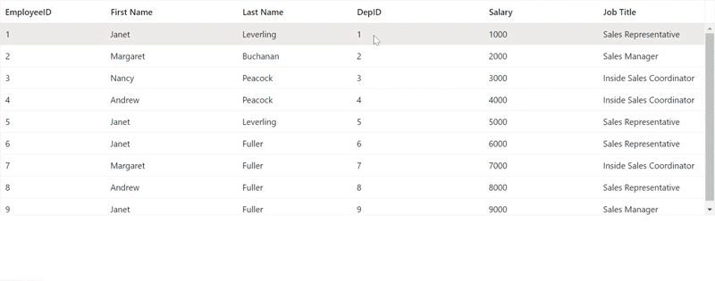

# Template Editing in Blazor DataGrid Component

## Inline template

N> Before adding an Inline template to the DataGrid, it is recommended to go through the [Template](./templates/#templates) section topic to configure the template.

The Inline template editing provides an option to customize the default behavior of Inline editing. Using the Inline template, you can render your editors by defining the [GridEditSettings](https://help.syncfusion.com/cr/aspnetcore-blazor/Syncfusion.Blazor.Grids.GridEditSettings.html) component's [Mode](https://help.syncfusion.com/cr/blazor/Syncfusion.Blazor.Grids.GridEditSettings.html#Syncfusion_Blazor_Grids_GridEditSettings_Mode) property as **Normal** and wrapping the HTML elements inside the [Template](https://help.syncfusion.com/cr/blazor/Syncfusion.Blazor.Grids.GridEditSettings.html#Syncfusion_Blazor_Grids_GridEditSettings_Template) property of [GridEditSettings](https://help.syncfusion.com/cr/aspnetcore-blazor/Syncfusion.Blazor.Grids.GridEditSettings.html).

N> Custom components inside the Inline Template must be specified with two-way (**@bind-Value**) binding to reflect the changes in DataGrid.

In some cases, you would need to add new field editors in the Inline editing which are not present in the column model. In that case, the Inline template editing will help you to customize the default editing.

The following sample code demonstrates DataGrid enabled with Inline template editing,

```cshtml
@using Syncfusion.Blazor.Grids
@using Syncfusion.Blazor.Calendars
@using Syncfusion.Blazor.DropDowns
@using Syncfusion.Blazor.Inputs

<SfGrid DataSource="@GridData" Toolbar="@(new string[] { "Add", "Edit", "Delete", "Update", "Cancel" })">
    <GridEditSettings AllowAdding="true" AllowEditing="true" AllowDeleting="true" Mode="@EditMode.Normal">
        <Template>
            @{
                var Order = (context as OrdersDetails);
                <table class="e-table e-inline-edit" cellspacing="0.25">
                    <colgroup>
                        <col style="width: 140px;">
                        <col style="width: 150px;">
                        <col style="width: 140px;">
                        <col style="width: 160px;">
                        <col style="width: 150px;">
                    </colgroup>
                    <tbody>
                        <tr>
                            <td style="text-align: center">
                                <SfNumericTextBox ID="OrderID" @bind-Value="@(Order.OrderID)" ShowSpinButton="false" Enabled="@((Order.OrderID == null)? true: false)"></SfNumericTextBox>
                            </td>
                            <td>
                                <SfAutoComplete ID="CustomerID" TItem="OrdersDetails" FloatLabelType="FloatLabelType.Auto" @bind-Value="@(Order.CustomerID)" TValue="string" DataSource="@GridData">
                                    <AutoCompleteFieldSettings Value="CustomerID"></AutoCompleteFieldSettings>
                                </SfAutoComplete>
                            </td>
                            <td style="text-align: right">
                                <SfNumericTextBox ID="Freight" @bind-Value="@(Order.Freight)" TValue="double?"></SfNumericTextBox>
                            </td>
                            <td>
                                <SfDatePicker ID="OrderDate" @bind-Value="@(Order.OrderDate)"></SfDatePicker>
                            </td>
                            <td>
                                <SfDropDownList ID="ShipCountry" TItem="OrdersDetails" @bind-Value="@(Order.ShipCountry)" TValue="string" DataSource="@GridData">
                                    <DropDownListFieldSettings Value="ShipCountry" Text="ShipCountry"></DropDownListFieldSettings>
                                </SfDropDownList>
                            </td>
                        </tr>
                    </tbody>
                </table>
            }
        </Template>
    </GridEditSettings>
    <GridColumns>
        <GridColumn Field=@nameof(OrdersDetails.OrderID) HeaderText="Order ID" IsPrimaryKey="true" TextAlign="@TextAlign.Center" HeaderTextAlign="@TextAlign.Center" Width="140"></GridColumn>
        <GridColumn Field=@nameof(OrdersDetails.CustomerID) HeaderText="Customer Name" Width="150"></GridColumn>
        <GridColumn Field=@nameof(OrdersDetails.Freight) HeaderText="Freight" Format="C2" Width="140" TextAlign="@TextAlign.Right" HeaderTextAlign="@TextAlign.Right"></GridColumn>
        <GridColumn Field=@nameof(OrdersDetails.OrderDate) HeaderText="Order Date" Format="d" Type="ColumnType.Date" Width="160"></GridColumn>
        <GridColumn Field=@nameof(OrdersDetails.ShipCountry) HeaderText="Ship Country" Width="150"></GridColumn>
    </GridColumns>
</SfGrid>


@code {
    public List<OrdersDetails> GridData = new List<OrdersDetails>
{
        new OrdersDetails() { OrderID = 10248, CustomerID = "VINET", Freight = 32.38, ShipCity = "Berlin", OrderDate = DateTime.Now.AddDays(-2), ShipName = "Vins et alcools Chevalier", ShipCountry = "Denmark", ShipAddress = "Kirchgasse 6" },
        new OrdersDetails() { OrderID = 10249, CustomerID = "TOMSP", Freight = 11.61, ShipCity = "Madrid", OrderDate = DateTime.Now.AddDays(-5), ShipName = "Toms Spezialitäten", ShipCountry = "Brazil", ShipAddress = "Avda. Azteca 123" },
        new OrdersDetails() { OrderID = 10250, CustomerID = "HANAR", Freight = 65.83, ShipCity = "Cholchester", OrderDate = DateTime.Now.AddDays(-12), ShipName = "Hanari Carnes", ShipCountry = "Germany", ShipAddress = "Carrera 52 con Ave. Bolívar #65-98 Llano Largo" },
        new OrdersDetails() { OrderID = 10251, CustomerID = "VICTE", Freight = 41.34, ShipCity = "Marseille", OrderDate = DateTime.Now.AddDays(-18), ShipName = "Victuailles en stock", ShipCountry = "Austria", ShipAddress = "Magazinweg 7" },
        new OrdersDetails() { OrderID = 10252, CustomerID = "SUPRD", Freight = 51.3, ShipCity = "Tsawassen", OrderDate = DateTime.Now.AddDays(-22), ShipName = "Suprêmes délices", ShipCountry = "Switzerland", ShipAddress = "1029 - 12th Ave. S." },
        new OrdersDetails() { OrderID = 10253, CustomerID = "HANAR", Freight = 58.17, ShipCity = "Tsawassen", OrderDate = DateTime.Now.AddDays(-26), ShipName = "Hanari Carnes", ShipCountry = "Switzerland", ShipAddress = "1029 - 12th Ave. S." },
        new OrdersDetails() { OrderID = 10254, CustomerID = "CHOPS", Freight = 22.98, ShipCity = "Berlin", OrderDate = DateTime.Now.AddDays(-34), ShipName = "Chop-suey Chinese", ShipCountry = "Denmark", ShipAddress = "Kirchgasse 6" },
        new OrdersDetails() { OrderID = 10255, CustomerID = "RICSU", Freight = 148.33, ShipCity = "Madrid", OrderDate = DateTime.Now.AddDays(-39), ShipName = "Richter Supermarket", ShipCountry = "Brazil", ShipAddress = "Avda. Azteca 123" },
        new OrdersDetails() { OrderID = 10256, CustomerID = "WELLI", Freight = 13.97, ShipCity = "Madrid", OrderDate = DateTime.Now.AddDays(-43), ShipName = "Wellington Importadora", ShipCountry = "Brazil", ShipAddress = "Avda. Azteca 123" },
        new OrdersDetails() { OrderID = 10257, CustomerID = "HILAA", Freight = 81.91, ShipCity = "Cholchester", OrderDate = DateTime.Now.AddDays(-48), ShipName = "HILARION-Abastos", ShipCountry = "Germany", ShipAddress = "Carrera 52 con Ave. Bolívar #65-98 Llano Largo" }
    };
    public class OrdersDetails
    {
        public int? OrderID { get; set; }
        public string CustomerID { get; set; }
        public double? Freight { get; set; }
        public string ShipCity { get; set; }
        public DateTime? OrderDate { get; set; }
        public string ShipName { get; set; }
        public string ShipCountry { get; set; }
        public string ShipAddress { get; set; }
    }
}
```

N> In the above sample code, the textbox rendered for **OrderID** column inside the Inline editing template is disabled using its `Enabled` property to prevent editing of the primary key column.

## Dialog template

N> Before adding dialog template to the datagrid, it is recommended to go through the [Template](./templates/#templates) section topic to configure the template.

To know about customizing the  **Dialog Template** in Blazor DataGrid Component, you can check this video.



The dialog template editing provides an option to customize the default behavior of dialog editing. Using the dialog template, you can render your editors by defining the [GridEditSettings](https://help.syncfusion.com/cr/aspnetcore-blazor/Syncfusion.Blazor.Grids.GridEditSettings.html) component's [Mode](https://help.syncfusion.com/cr/blazor/Syncfusion.Blazor.Grids.GridEditSettings.html#Syncfusion_Blazor_Grids_GridEditSettings_Mode) property as **Dialog** and wrapping the HTML elements inside the [Template](https://help.syncfusion.com/cr/blazor/Syncfusion.Blazor.Grids.GridEditSettings.html#Syncfusion_Blazor_Grids_GridEditSettings_Template) property of [GridEditSettings](https://help.syncfusion.com/cr/aspnetcore-blazor/Syncfusion.Blazor.Grids.GridEditSettings.html).

N> Custom components inside the Dialog Template must be specified with two-way (**@bind-Value**) binding to reflect the changes in DataGrid.

In some cases, you would need to add new field editors in the dialog which are not present in the column model. In that case, the dialog template will help you to customize the default edit dialog.

The following sample code demonstrates DataGrid enabled with dialog template editing,

```cshtml
@using Syncfusion.Blazor.Grids
@using Syncfusion.Blazor.Calendars
@using Syncfusion.Blazor.DropDowns
@using Syncfusion.Blazor.Inputs

<SfGrid DataSource="@GridData" Toolbar="@(new string[] {"Add", "Edit" ,"Delete","Update","Cancel" })">
    <GridEditSettings AllowAdding="true" AllowEditing="true" AllowDeleting="true" Mode="@EditMode.Dialog">
        <Template>
            @{
                var Order = (context as OrdersDetails);
                <div style="width:305px; height:380px;">
                    <label>Order ID</label>
                    <SfNumericTextBox ID="OrderID" @bind-Value="@(Order.OrderID)" Enabled="@((Order.OrderID == null) ? true : false)"></SfNumericTextBox>

                    <label>Customer Name</label>
                    <SfAutoComplete ID="customerID" TItem="OrdersDetails" @bind-Value="@(Order.CustomerID)" TValue="string" DataSource="@GridData">
                        <AutoCompleteFieldSettings Value="CustomerID"></AutoCompleteFieldSettings>
                    </SfAutoComplete>

                    <label>Freight</label>
                    <SfNumericTextBox ID="Freight" @bind-Value="@(Order.Freight)" TValue="double?"></SfNumericTextBox>

                    <label>Order Date</label>
                    <SfDatePicker ID="OrderDate" @bind-Value="@(Order.OrderDate)"></SfDatePicker>

                    <label>Ship Country</label>
                    <SfDropDownList ID="ShipCountry" @bind-Value="@(Order.ShipCountry)" TItem="OrdersDetails" TValue="string" DataSource="@GridData">
                        <DropDownListFieldSettings Value="ShipCountry" Text="ShipCountry"></DropDownListFieldSettings>
                    </SfDropDownList>

                    <label>Ship City</label>
                    <SfDropDownList ID="ShipCity" @bind-Value="@(Order.ShipCity)" TItem="OrdersDetails" TValue="string" DataSource="@GridData">
                        <DropDownListFieldSettings Value="ShipCity" Text="ShipCity"></DropDownListFieldSettings>
                    </SfDropDownList>

                    <label>Ship Address</label>
                    <SfTextBox ID="ShipAddress" @bind-Value="@(Order.ShipAddress)"></SfTextBox>
                </div>
            }
        </Template>
    </GridEditSettings>
    <GridColumns>
        <GridColumn Field=@nameof(OrdersDetails.OrderID) HeaderText="Order ID" IsPrimaryKey="true" TextAlign="@TextAlign.Center" HeaderTextAlign="@TextAlign.Center" Width="140"></GridColumn>
        <GridColumn Field=@nameof(OrdersDetails.CustomerID) HeaderText="Customer Name" Width="150"></GridColumn>
        <GridColumn Field=@nameof(OrdersDetails.Freight) HeaderText="Freight" Format="C2" Width="140" TextAlign="@TextAlign.Right" HeaderTextAlign="@TextAlign.Right"></GridColumn>
        <GridColumn Field=@nameof(OrdersDetails.OrderDate) HeaderText="Order Date" Format="d" Type="ColumnType.Date" Width="160"></GridColumn>
        <GridColumn Field=@nameof(OrdersDetails.ShipCountry) HeaderText="Ship Country" Width="150"></GridColumn>
    </GridColumns>
</SfGrid>

@code {
    public List<OrdersDetails> GridData = new List<OrdersDetails>
{
        new OrdersDetails() { OrderID = 10248, CustomerID = "VINET", Freight = 32.38, ShipCity = "Berlin", OrderDate = DateTime.Now.AddDays(-2), ShipName = "Vins et alcools Chevalier", ShipCountry = "Denmark", ShipAddress = "Kirchgasse 6" },
        new OrdersDetails() { OrderID = 10249, CustomerID = "TOMSP", Freight = 11.61, ShipCity = "Madrid", OrderDate = DateTime.Now.AddDays(-5), ShipName = "Toms Spezialitäten", ShipCountry = "Brazil", ShipAddress = "Avda. Azteca 123" },
        new OrdersDetails() { OrderID = 10250, CustomerID = "HANAR", Freight = 65.83, ShipCity = "Cholchester", OrderDate = DateTime.Now.AddDays(-12), ShipName = "Hanari Carnes", ShipCountry = "Germany", ShipAddress = "Carrera 52 con Ave. Bolívar #65-98 Llano Largo" },
        new OrdersDetails() { OrderID = 10251, CustomerID = "VICTE", Freight = 41.34, ShipCity = "Marseille", OrderDate = DateTime.Now.AddDays(-18), ShipName = "Victuailles en stock", ShipCountry = "Austria", ShipAddress = "Magazinweg 7" },
        new OrdersDetails() { OrderID = 10252, CustomerID = "SUPRD", Freight = 51.3, ShipCity = "Tsawassen", OrderDate = DateTime.Now.AddDays(-22), ShipName = "Suprêmes délices", ShipCountry = "Switzerland", ShipAddress = "1029 - 12th Ave. S." },
        new OrdersDetails() { OrderID = 10253, CustomerID = "HANAR", Freight = 58.17, ShipCity = "Tsawassen", OrderDate = DateTime.Now.AddDays(-26), ShipName = "Hanari Carnes", ShipCountry = "Switzerland", ShipAddress = "1029 - 12th Ave. S." },
        new OrdersDetails() { OrderID = 10254, CustomerID = "CHOPS", Freight = 22.98, ShipCity = "Berlin", OrderDate = DateTime.Now.AddDays(-34), ShipName = "Chop-suey Chinese", ShipCountry = "Denmark", ShipAddress = "Kirchgasse 6" },
        new OrdersDetails() { OrderID = 10255, CustomerID = "RICSU", Freight = 148.33, ShipCity = "Madrid", OrderDate = DateTime.Now.AddDays(-39), ShipName = "Richter Supermarket", ShipCountry = "Brazil", ShipAddress = "Avda. Azteca 123" },
        new OrdersDetails() { OrderID = 10256, CustomerID = "WELLI", Freight = 13.97, ShipCity = "Madrid", OrderDate = DateTime.Now.AddDays(-43), ShipName = "Wellington Importadora", ShipCountry = "Brazil", ShipAddress = "Avda. Azteca 123" },
        new OrdersDetails() { OrderID = 10257, CustomerID = "HILAA", Freight = 81.91, ShipCity = "Cholchester", OrderDate = DateTime.Now.AddDays(-48), ShipName = "HILARION-Abastos", ShipCountry = "Germany", ShipAddress = "Carrera 52 con Ave. Bolívar #65-98 Llano Largo" }
    };

    public class OrdersDetails
    {
        public int? OrderID { get; set; }
        public string CustomerID { get; set; }
        public double? Freight { get; set; }
        public string ShipCity { get; set; }
        public DateTime? OrderDate { get; set; }
        public string ShipName { get; set; }
        public string ShipCountry { get; set; }
        public string ShipAddress { get; set; }
    }
}
```

N> In the above sample code, the textbox rendered for **OrderID** column inside the dialog template is disabled using its `Enabled` property to prevent editing of the primary key column.

The following image represents the dialog template that is displayed on double-clicking a DataGrid cell,


### Disable components in dialog template

It is possible to disable particular components rendered inside the dialog template using the data source value. This can be achieved by utilizing the `Enabled` property of the components which specifies whether the component is enabled or disabled.

This is demonstrated in the following sample code, where if the `RequestType` argument value of the [OnActionBegin](https://help.syncfusion.com/cr/blazor/Syncfusion.Blazor.Grids.GridEvents-1.html#Syncfusion_Blazor_Grids_GridEvents_1_OnActionBegin) event is **BeginEdit** then the `Enabled` property of the **OrderID** Textbox is set to false.

```cshtml
@using Syncfusion.Blazor.Grids
@using Syncfusion.Blazor.Calendars
@using Syncfusion.Blazor.DropDowns
@using Syncfusion.Blazor.Inputs

<SfGrid DataSource="@GridData" Toolbar="@(new string[] {"Add", "Edit" ,"Delete","Update","Cancel" })">
    <GridEvents OnActionBegin="ActionBeginHandler" TValue="OrdersDetails"></GridEvents>
    <GridEditSettings AllowAdding="true" AllowEditing="true" AllowDeleting="true" Mode="@EditMode.Dialog">
        <Template>
            @{
                var Order = (context as OrdersDetails);
                <div style="width:305px; height:380px;">
                    <label>Order ID</label>
                    <SfNumericTextBox ID="OrderID" @bind-Value="@(Order.OrderID)" Enabled="@Enabled"></SfNumericTextBox>

                    <label>Customer Name</label>
                    <SfAutoComplete ID="CustomerID" TItem="OrdersDetails" @bind-Value="@(Order.CustomerID)" TValue="string" DataSource="@GridData">
                        <AutoCompleteFieldSettings Value="CustomerID"></AutoCompleteFieldSettings>
                    </SfAutoComplete>


                    <label>Freight</label>
                    <SfNumericTextBox ID="Freight" @bind-Value="@(Order.Freight)" TValue="double"></SfNumericTextBox>

                    <label>Order Date</label>
                    <SfDatePicker ID="OrderDate" @bind-Value="@(Order.OrderDate)"></SfDatePicker>

                    <label>Ship Country</label>
                    <SfDropDownList ID="ShipCountry" @bind-Value="@(Order.ShipCountry)" TItem="OrdersDetails" TValue="string" DataSource="@GridData">
                        <DropDownListFieldSettings Value="ShipCountry" Text="ShipCountry"></DropDownListFieldSettings>
                    </SfDropDownList>

                    <label>Ship City</label>
                    <SfDropDownList ID="ShipCity" @bind-Value="@(Order.ShipCity)" TItem="OrdersDetails" TValue="string" DataSource="@GridData">
                        <DropDownListFieldSettings Value="ShipCity" Text="ShipCity"></DropDownListFieldSettings>
                    </SfDropDownList>

                    <label>Ship Address</label>
                    <SfTextBox ID="ShipAddress" @bind-Value="@(Order.ShipAddress)"></SfTextBox>
                </div>
            }
        </Template>
    </GridEditSettings>
    <GridColumns>
        <GridColumn Field=@nameof(OrdersDetails.OrderID) HeaderText="Order ID" IsPrimaryKey="true" TextAlign="@TextAlign.Center" HeaderTextAlign="@TextAlign.Center" Width="140"></GridColumn>
        <GridColumn Field=@nameof(OrdersDetails.CustomerID) HeaderText="Customer Name" Width="150"></GridColumn>
        <GridColumn Field=@nameof(OrdersDetails.Freight) HeaderText="Freight" Format="C2" Width="140" TextAlign="@TextAlign.Right" HeaderTextAlign="@TextAlign.Right"></GridColumn>
        <GridColumn Field=@nameof(OrdersDetails.OrderDate) HeaderText="Order Date" Format="d" Type="ColumnType.Date" Width="160"></GridColumn>
        <GridColumn Field=@nameof(OrdersDetails.ShipCountry) HeaderText="Ship Country" Width="150"></GridColumn>
    </GridColumns>
</SfGrid>

@code {
    public bool Enabled = true;

    public List<OrdersDetails> GridData = new List<OrdersDetails>
{
        new OrdersDetails() { OrderID = 10248, CustomerID = "VINET", Freight = 32.38, ShipCity = "Berlin", OrderDate = DateTime.Now.AddDays(-2), ShipName = "Vins et alcools Chevalier", ShipCountry = "Denmark", ShipAddress = "Kirchgasse 6" },
        new OrdersDetails() { OrderID = 10249, CustomerID = "TOMSP", Freight = 11.61, ShipCity = "Madrid", OrderDate = DateTime.Now.AddDays(-5), ShipName = "Toms Spezialitäten", ShipCountry = "Brazil", ShipAddress = "Avda. Azteca 123" },
        new OrdersDetails() { OrderID = 10250, CustomerID = "HANAR", Freight = 65.83, ShipCity = "Cholchester", OrderDate = DateTime.Now.AddDays(-12), ShipName = "Hanari Carnes", ShipCountry = "Germany", ShipAddress = "Carrera 52 con Ave. Bolívar #65-98 Llano Largo" },
        new OrdersDetails() { OrderID = 10251, CustomerID = "VICTE", Freight = 41.34, ShipCity = "Marseille", OrderDate = DateTime.Now.AddDays(-18), ShipName = "Victuailles en stock", ShipCountry = "Austria", ShipAddress = "Magazinweg 7" },
        new OrdersDetails() { OrderID = 10252, CustomerID = "SUPRD", Freight = 51.3, ShipCity = "Tsawassen", OrderDate = DateTime.Now.AddDays(-22), ShipName = "Suprêmes délices", ShipCountry = "Switzerland", ShipAddress = "1029 - 12th Ave. S." },
        new OrdersDetails() { OrderID = 10253, CustomerID = "HANAR", Freight = 58.17, ShipCity = "Tsawassen", OrderDate = DateTime.Now.AddDays(-26), ShipName = "Hanari Carnes", ShipCountry = "Switzerland", ShipAddress = "1029 - 12th Ave. S." },
        new OrdersDetails() { OrderID = 10254, CustomerID = "CHOPS", Freight = 22.98, ShipCity = "Berlin", OrderDate = DateTime.Now.AddDays(-34), ShipName = "Chop-suey Chinese", ShipCountry = "Denmark", ShipAddress = "Kirchgasse 6" },
        new OrdersDetails() { OrderID = 10255, CustomerID = "RICSU", Freight = 148.33, ShipCity = "Madrid", OrderDate = DateTime.Now.AddDays(-39), ShipName = "Richter Supermarket", ShipCountry = "Brazil", ShipAddress = "Avda. Azteca 123" },
        new OrdersDetails() { OrderID = 10256, CustomerID = "WELLI", Freight = 13.97, ShipCity = "Madrid", OrderDate = DateTime.Now.AddDays(-43), ShipName = "Wellington Importadora", ShipCountry = "Brazil", ShipAddress = "Avda. Azteca 123" },
        new OrdersDetails() { OrderID = 10257, CustomerID = "HILAA", Freight = 81.91, ShipCity = "Cholchester", OrderDate = DateTime.Now.AddDays(-48), ShipName = "HILARION-Abastos", ShipCountry = "Germany", ShipAddress = "Carrera 52 con Ave. Bolívar #65-98 Llano Largo" }
    };

    public class OrdersDetails
    {
        public int OrderID { get; set; }
        public string CustomerID { get; set; }
        public double Freight { get; set; }
        public string ShipCity { get; set; }
        public DateTime? OrderDate { get; set; }
        public string ShipName { get; set; }
        public string ShipCountry { get; set; }
        public string ShipAddress { get; set; }
    }

    public void ActionBeginHandler(ActionEventArgs<OrdersDetails> args)
    {
        if (args.RequestType == Syncfusion.Blazor.Grids.Action.BeginEdit)
        {
            // The Textbox component is disabled using its Enabled property
            this.Enabled = false;
        }
        else
        {
            this.Enabled = true;
        }
    }
}
```

The following image represents the dialog template of the DataGrid component with disabled components,


### Set focus to editor

By default, the first input element in the dialog will be focused while opening it. If the first input element is in the a disabled or hidden state, you can set focus to the required input element in the corresponding components **Created** or **DataBound** event.

This is demonstrated in the following sample code, where the first input element is in disabled state. So the  **CustomerID** Autocomplete component is focused by invoking its [FocusIn](https://help.syncfusion.com/cr/blazor/Syncfusion.Blazor.DropDowns.SfDropDownList-2.html#Syncfusion_Blazor_DropDowns_SfDropDownList_2_FocusIn) method in the AutoComplete's [DataBound](https://help.syncfusion.com/cr/blazor/Syncfusion.Blazor.DropDowns.AutoCompleteEvents-2.html#Syncfusion_Blazor_DropDowns_AutoCompleteEvents_2_DataBound) event.

```cshtml
@using Syncfusion.Blazor.Grids
@using Syncfusion.Blazor.Calendars
@using Syncfusion.Blazor.DropDowns
@using Syncfusion.Blazor.Inputs

<SfGrid DataSource="@GridData" Toolbar="@(new string[] {"Add", "Edit" ,"Delete","Update","Cancel" })">
    <GridEditSettings AllowAdding="true" AllowEditing="true" AllowDeleting="true" Mode="@EditMode.Dialog">
        <Template>
            @{
                var Order = (context as OrdersDetails);
                <div style="width:305px; height:380px;">
                    <label>Order ID</label>
                    <SfNumericTextBox ID="OrderID" @bind-Value="@(Order.OrderID)" Enabled="@((Order.OrderID == null) ? true : false)"></SfNumericTextBox>

                    <label>Customer Name</label>
                    <SfAutoComplete ID="customerID" @ref="AutoComplete" TItem="OrdersDetails" @bind-Value="@(Order.CustomerID)" TValue="string" DataSource="@GridData">
                        <AutoCompleteFieldSettings Value="CustomerID"></AutoCompleteFieldSettings>
                        <AutoCompleteEvents TValue="string" TItem="OrdersDetails" DataBound="FocusAutoComplete"></AutoCompleteEvents>
                    </SfAutoComplete>

                    <label>Freight</label>
                    <SfNumericTextBox ID="Freight" @bind-Value="@(Order.Freight)" TValue="double?"></SfNumericTextBox>

                    <label>Order Date</label>
                    <SfDatePicker ID="OrderDate" @bind-Value="@(Order.OrderDate)"></SfDatePicker>

                    <label>Ship Country</label>
                    <SfDropDownList ID="ShipCountry" @bind-Value="@(Order.ShipCountry)" TItem="OrdersDetails" TValue="string" DataSource="@GridData">
                        <DropDownListFieldSettings Value="ShipCountry" Text="ShipCountry"></DropDownListFieldSettings>
                    </SfDropDownList>

                    <label>Ship City</label>
                    <SfDropDownList ID="ShipCity" @bind-Value="@(Order.ShipCity)" TItem="OrdersDetails" TValue="string" DataSource="@GridData">
                        <DropDownListFieldSettings Value="ShipCity" Text="ShipCity"></DropDownListFieldSettings>
                    </SfDropDownList>

                    <label>Ship Address</label>
                    <SfTextBox ID="ShipAddress" @bind-Value="@(Order.ShipAddress)"></SfTextBox>
                </div>
            }
        </Template>
    </GridEditSettings>
    <GridColumns>
        <GridColumn Field=@nameof(OrdersDetails.OrderID) HeaderText="Order ID" IsPrimaryKey="true" TextAlign="@TextAlign.Center" HeaderTextAlign="@TextAlign.Center" Width="140"></GridColumn>
        <GridColumn Field=@nameof(OrdersDetails.CustomerID) HeaderText="Customer Name" Width="150"></GridColumn>
        <GridColumn Field=@nameof(OrdersDetails.Freight) HeaderText="Freight" Format="C2" Width="140" TextAlign="@TextAlign.Right" HeaderTextAlign="@TextAlign.Right"></GridColumn>
        <GridColumn Field=@nameof(OrdersDetails.OrderDate) HeaderText="Order Date" Format="d" Type="ColumnType.Date" Width="160"></GridColumn>
        <GridColumn Field=@nameof(OrdersDetails.ShipCountry) HeaderText="Ship Country" Width="150"></GridColumn>
    </GridColumns>
</SfGrid>

@code {
    SfAutoComplete<string, OrdersDetails> AutoComplete { get; set; }
    public List<OrdersDetails> GridData = new List<OrdersDetails>
    {
    new OrdersDetails() { OrderID = 10248, CustomerID = "VINET", Freight = 32.38, ShipCity = "Berlin", OrderDate = DateTime.Now.AddDays(-2), ShipName = "Vins et alcools Chevalier", ShipCountry = "Denmark", ShipAddress = "Kirchgasse 6" },
    new OrdersDetails() { OrderID = 10249, CustomerID = "TOMSP", Freight = 11.61, ShipCity = "Madrid", OrderDate = DateTime.Now.AddDays(-5), ShipName = "Toms Spezialitäten", ShipCountry = "Brazil", ShipAddress = "Avda. Azteca 123" },
    new OrdersDetails() { OrderID = 10250, CustomerID = "HANAR", Freight = 65.83, ShipCity = "Cholchester", OrderDate = DateTime.Now.AddDays(-12), ShipName = "Hanari Carnes", ShipCountry = "Germany", ShipAddress = "Carrera 52 con Ave. Bolívar #65-98 Llano Largo" },
    new OrdersDetails() { OrderID = 10251, CustomerID = "VICTE", Freight = 41.34, ShipCity = "Marseille", OrderDate = DateTime.Now.AddDays(-18), ShipName = "Victuailles en stock", ShipCountry = "Austria", ShipAddress = "Magazinweg 7" },
    new OrdersDetails() { OrderID = 10252, CustomerID = "SUPRD", Freight = 51.3, ShipCity = "Tsawassen", OrderDate = DateTime.Now.AddDays(-22), ShipName = "Suprêmes délices", ShipCountry = "Switzerland", ShipAddress = "1029 - 12th Ave. S." },
    new OrdersDetails() { OrderID = 10253, CustomerID = "HANAR", Freight = 58.17, ShipCity = "Tsawassen", OrderDate = DateTime.Now.AddDays(-26), ShipName = "Hanari Carnes", ShipCountry = "Switzerland", ShipAddress = "1029 - 12th Ave. S." },
    new OrdersDetails() { OrderID = 10254, CustomerID = "CHOPS", Freight = 22.98, ShipCity = "Berlin", OrderDate = DateTime.Now.AddDays(-34), ShipName = "Chop-suey Chinese", ShipCountry = "Denmark", ShipAddress = "Kirchgasse 6" },
    new OrdersDetails() { OrderID = 10255, CustomerID = "RICSU", Freight = 148.33, ShipCity = "Madrid", OrderDate = DateTime.Now.AddDays(-39), ShipName = "Richter Supermarket", ShipCountry = "Brazil", ShipAddress = "Avda. Azteca 123" },
    new OrdersDetails() { OrderID = 10256, CustomerID = "WELLI", Freight = 13.97, ShipCity = "Madrid", OrderDate = DateTime.Now.AddDays(-43), ShipName = "Wellington Importadora", ShipCountry = "Brazil", ShipAddress = "Avda. Azteca 123" },
    new OrdersDetails() { OrderID = 10257, CustomerID = "HILAA", Freight = 81.91, ShipCity = "Cholchester", OrderDate = DateTime.Now.AddDays(-48), ShipName = "HILARION-Abastos", ShipCountry = "Germany", ShipAddress = "Carrera 52 con Ave. Bolívar #65-98 Llano Largo" }
};

    public class OrdersDetails
    {
        public int? OrderID { get; set; }
        public string CustomerID { get; set; }
        public double? Freight { get; set; }
        public string ShipCity { get; set; }
        public DateTime? OrderDate { get; set; }
        public string ShipName { get; set; }
        public string ShipCountry { get; set; }
        public string ShipAddress { get; set; }
    }
    private async Task FocusAutoComplete()
    {
        await this.AutoComplete.FocusAsync();
    }
}
```

The following image represents the AutoComplete component in focused state inside the dialog template of the DataGrid component,


### Complex data binding with dialog template

You can edit the complex objects in the [GridColumn](https://help.syncfusion.com/cr/blazor/Syncfusion.Blazor.Grids.GridColumn.html) using the dialog template in the following way.

In the following sample, **SfNumericTextBox** is rendered in the dialog template and changes can be updated in the `GridColumn` using the two-way(**@bind-Value**) binding.

N> Also, ensure to define **ID** property for the complex column as (`___`) replacing the (`.`) operator in the Field value.

```cshtml
@using Syncfusion.Blazor.Grids
@using Syncfusion.Blazor.Inputs

<SfGrid DataSource="@Employees" Height="315">
    <GridEditSettings AllowAdding="true" AllowEditing="true" AllowDeleting="true" Mode="@EditMode.Dialog">
        <Template>
            @{
                var order = (context as EmployeeData);
            }
            <div>
                <div class="mb-4"><SfNumericTextBox TValue="int?" ID="EmployeeID" Enabled="@((order.EmployeeID == null) ? true : false)" @bind-Value="order.EmployeeID"></SfNumericTextBox></div>
                <div class="mb-4"><SfNumericTextBox TValue="int?" ID="EmpDetails__DepartmentID" @bind-Value="order.EmpDetails.DepartmentID"></SfNumericTextBox></div>
                <div class="mb-4"><SfNumericTextBox TValue="int?" ID="EmpDetails__salarydetails__Salary" @bind-Value="order.EmpDetails.salarydetails.Salary"></SfNumericTextBox></div>
            </div>
        </Template>
    </GridEditSettings>
    <GridColumns>
        <GridColumn Field=@nameof(EmployeeData.EmployeeID) HeaderText="EmployeeID" IsPrimaryKey="true"  Width="120"></GridColumn>
        <GridColumn Field="EmpDetails.FirstName" HeaderText="First Name" Width="150"></GridColumn>
        <GridColumn Field="EmpDetails.LastName" HeaderText="Last Name" Width="130"></GridColumn>
        <GridColumn Field="EmpDetails.DepartmentID" HeaderText="DepID" Width="150"></GridColumn>
        <GridColumn Field="EmpDetails.salarydetails.Salary" HeaderText="Salary" Width="130"></GridColumn>
        <GridColumn Field=@nameof(EmployeeData.Title) HeaderText="Job Title" Width="120"></GridColumn>
    </GridColumns>
</SfGrid>

@code{
    public List<EmployeeData> Employees { get; set; }

    protected override void OnInitialized()
    {
        Employees = Enumerable.Range(1, 9).Select(x => new EmployeeData()
        {
            EmployeeID = x,
            EmpDetails = new EmployeeDetails()
            {
                FirstName = (new string[] { "Nancy", "Andrew", "Janet", "Margaret", "Steven" })[new Random().Next(5)],
                LastName = (new string[] { "Davolio", "Fuller", "Leverling", "Peacock", "Buchanan" })[new Random().Next(5)],
                DepartmentID = x,
                salarydetails = new SalaryDetails()
                {
                    Salary = x * 1000
                }
            },
            Title = (new string[] { "Sales Representative", "Vice President, Sales", "Sales Manager",
                                          "Inside Sales Coordinator" })[new Random().Next(4)],
        }).ToList();
    }

    public class EmployeeData
    {
        public int? EmployeeID { get; set; }
        public EmployeeDetails EmpDetails { get; set; }
        public string Title { get; set; }
    }

    public class EmployeeDetails
    {
        public int? DepartmentID { get; set; }
        public string FirstName { get; set; }
        public string LastName { get; set; }
        public SalaryDetails salarydetails { get; set; }
    }

    public class SalaryDetails
    {
        public int? Salary { get; set; }
    }
}
```



### Use FileUploader in Grid dialog edit template

You can upload an image while adding or editing the column and show that image in the grid column using the Column Template and Dialog Template features of the grid. The Column Template feature is used to display the image in a grid column, and the Dialog Template feature is used to render the `SfUploader` component for uploading the image while performing dialog editing.

In the following sample, the add and edit operations of dialog editing are performed using the [OnActionBegin](https://help.syncfusion.com/cr/blazor/Syncfusion.Blazor.Grids.GridEvents-1.html#Syncfusion_Blazor_Grids_GridEvents_1_OnActionBegin) and [OnActionComplete](https://help.syncfusion.com/cr/blazor/Syncfusion.Blazor.Grids.GridEvents-1.html#Syncfusion_Blazor_Grids_GridEvents_1_OnActionComplete) events of the grid. The image file selecting and uploading actions are performed using the [FileSelected](https://help.syncfusion.com/cr/blazor/Syncfusion.Blazor.Inputs.UploaderEvents.html#Syncfusion_Blazor_Inputs_UploaderEvents_FileSelected) and [ValueChange](https://help.syncfusion.com/cr/blazor/Syncfusion.Blazor.Inputs.UploaderEvents.html#Syncfusion_Blazor_Inputs_UploaderEvents_ValueChange) events of the `SfUploader`.

```cshtml
@using Syncfusion.Blazor.Grids
@using Syncfusion.Blazor.Inputs
@using System.IO 

<SfGrid AllowPaging="true" @ref="MyGrid" DataSource="@Orders" Toolbar="@(new List<string>() { "Add", "Edit", "Delete", "Cancel", "Update" })">
    <GridEvents OnActionBegin="BeginHandler" OnActionComplete="ActionComplete" TValue="Order"></GridEvents>
    <GridEditSettings AllowEditing="true" AllowDeleting="true" AllowAdding="true" Mode="EditMode.Dialog">
           <Template>
                @{
                    var Order = (context as Order);
                }
                <div>
                    <table>
                        <tbody>
                            <tr>
                                <td>
                                    <span>Employee Name</span>
                                </td>
                                <td>
                                    <b style="margin-left: -50px;">@Order.CustomerID</b><br>
                                </td>
                            </tr>
                            <tr>
                                <td>
                                    <span>Employee Image</span>
                                </td>
                                <td>
                                    <div class="image"></div>
                                </td>
                            </tr>
                            <tr>
                                <div class="image" style="margin-top: 10px; width: 300px">
                                    <SfUploader ID="uploadFiles" AllowedExtensions=".jpg,.png,.jpeg">
                                    <UploaderEvents  ValueChange="OnChange" FileSelected="Selected"></UploaderEvents>
                                    <UploaderTemplates>
                                        <Template Context="HttpContext">
                                        @{ 
                                            <table>
                                            <tr>
                                                <td>
                                                    <span>Updated Employee Image</span>
                                                </td>
                                                <td>
                                                    0 ? files.Where(item=>item.Name == HttpContext.Name)?.FirstOrDefault()?.Path : string.Empty)">    
                                                </td>
                                            </tr>
                                            </table>
                                        }
                                        </Template>
                                    </UploaderTemplates>
                                    </SfUploader>
                                </div>
                            </tr>
                        </tbody>
                    </table>
                </div>
            </Template>
    </GridEditSettings>
    <GridColumns>
        <GridColumn Field=@nameof(Order.OrderID) HeaderText="Employee ID" IsPrimaryKey="true" TextAlign="@TextAlign.Center" Width="140"></GridColumn>
        <GridColumn Field=@nameof(Order.CustomerID) HeaderText="Employee Name"  Width="140"></GridColumn>
        <GridColumn Field="Imagesrc" HeaderText="Employee Image" Width="200">
        <Template>
                @{
                    var imageUrl = (context as Order).Imagesrc;
                    <div class="image">
                                  
                    </div>
                }
            </Template>
        </GridColumn>
    </GridColumns>
</SfGrid>
<style>
    .image img {
        height: 55px;
        width: 55px;
        border-radius: 50px;
        box-shadow: inset 0 0 1px #e0e0e0, inset 0 0 14px rgba(0, 0, 0, 0.2);
    }
</style>

@code{

    public List<fileInfo> files = new List<fileInfo>();
    public SfGrid<Order> MyGrid { get; set; }
    public string UploadedFile { get; set; }
    public List<Order> Orders { get; set; }

    public void ActionComplete(ActionEventArgs<Order> args)
    {
        if (args.RequestType.Equals(Syncfusion.Blazor.Grids.Action.Add) || args.RequestType.Equals(Syncfusion.Blazor.Grids.Action.BeginEdit))
        {
            MyGrid.PreventRender(false);
        }
    }

    public void OnChange(UploadChangeEventArgs args)
    {
        files = new List<fileInfo>();
        foreach (var file in args.Files)
        {
            var path = Path.GetFullPath("wwwroot//scripts//Images//Employees//") + file.FileInfo.Name;
            FileStream filestream = new FileStream(path, FileMode.Create, FileAccess.Write);
            file.Stream.WriteTo(filestream);
            filestream.Close();
            file.Stream.Close();
            files.Add(new fileInfo() { Path = "scripts/Images/Employees/" + file.FileInfo.Name , Name = file.FileInfo.Name, Size = file.FileInfo.Size });         
        }
    }
  
    public void BeginHandler(ActionEventArgs<Order> Args)
    {
        if (Args.RequestType == Syncfusion.Blazor.Grids.Action.Save && Args.Action == "Add")
        {
            Args.Data.Imagesrc = "scripts/Images/Employees/"+UploadedFile;
        } else if (Args.RequestType == Syncfusion.Blazor.Grids.Action.Save && Args.Action == "Edit")
        {
            Args.Data.Imagesrc = "scripts/Images/Employees/" + UploadedFile;
        }

    }

    public void Selected(SelectedEventArgs Args)
    {
        UploadedFile = Args.FilesData[0].Name;
       
    }

    protected override void OnInitialized()
    {
        Orders = Enumerable.Range(1, 9).Select(x => new Order()
        {
            OrderID = 1000 + x,
            EmployeeID = x,
            CustomerID = (new string[] { "ALFKI", "ANANTR", "ANTON", "BLONP", "BOLID" })[new Random().Next(5)],
            Imagesrc = "scripts/Images/Employees/" + x + ".png",
            Freight = 2.1 * x,
            OrderDate = DateTime.Now.AddDays(-x),
        }).ToList();
    }

    public class Order
    {
        public int? OrderID { get; set; }
        public int EmployeeID { get; set; }
        public string CustomerID { get; set; }
        public DateTime? OrderDate { get; set; }
        public string Imagesrc { get; set; }
        public double? Freight { get; set; }
    }

    public class fileInfo
    {
        public string Path { get; set; }
        public string Name { get; set; }
        public double Size { get; set; }
    }
}
```

N> You can find the fully working sample [here](https://github.com/SyncfusionExamples/blazor-datagrid-crud-dialog-fileuploader)

## See Also

* [Display validation message in dialog template](https://blazor.syncfusion.com/documentation/datagrid/column-validation#display-validation-message-in-dialog-template)