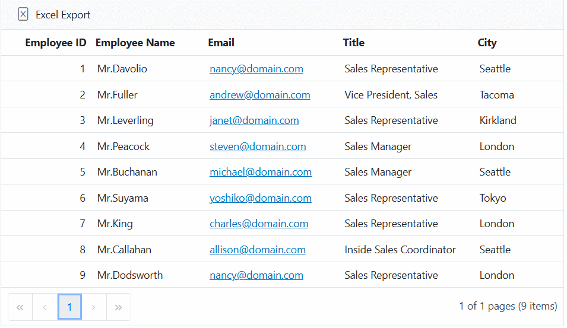
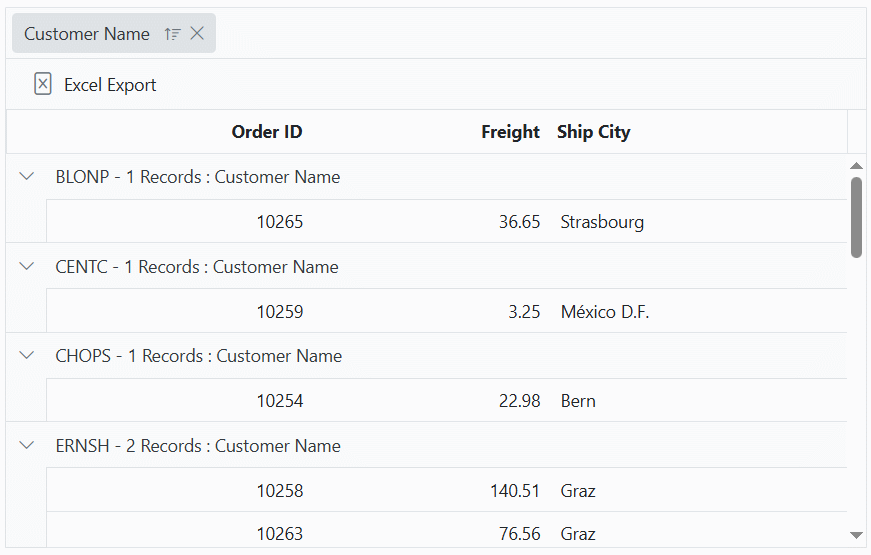
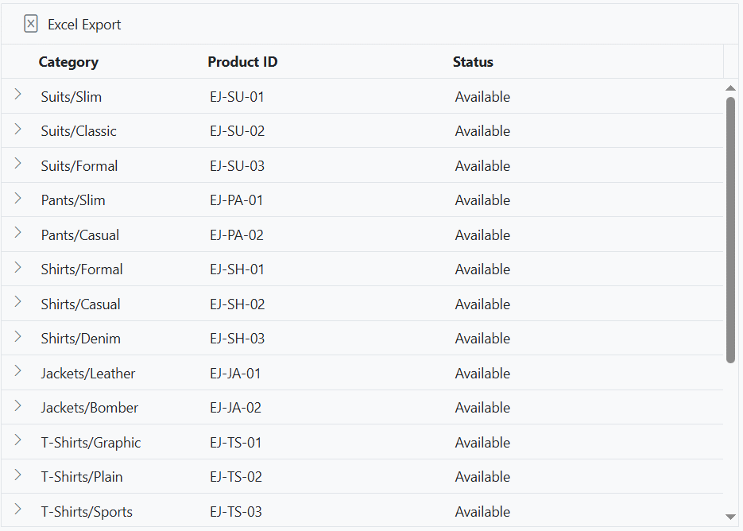
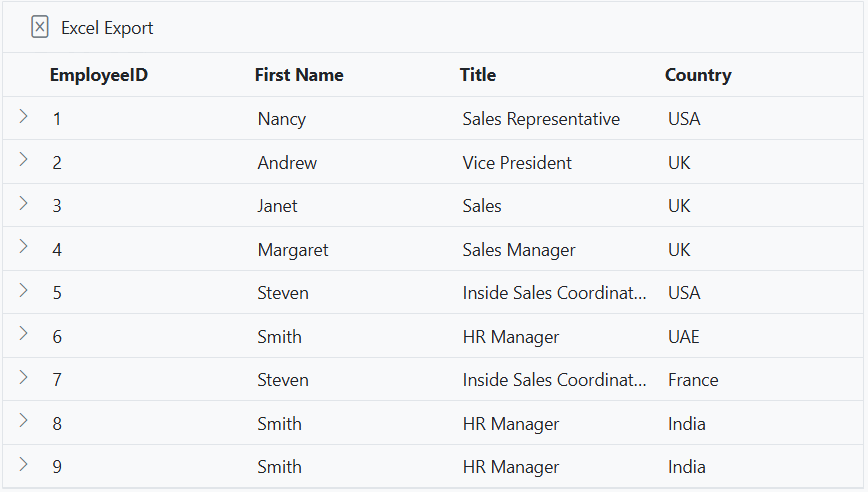

# Exporting grid with templates in Syncfusion Blazor DataGrid

The Syncfusion&reg; Blazor DataGrid supports exporting template content to Excel, enabling rich formatting in exported documents. The following template types are supported:

* [Column Template](https://blazor.syncfusion.com/documentation/datagrid/column-template): Custom cell content such as formatted text, images, or hyperlinks.
* [Caption Template](https://blazor.syncfusion.com/documentation/datagrid/caption-template): Group caption rows with customized display elements.
* [Detail Template](https://blazor.syncfusion.com/documentation/datagrid/detail-template): Expanded row content that can include nested data or custom layouts.

These templates are preserved during export, allowing the resulting Excel file to reflect the visual and structural formatting defined in the Grid.

## Exporting with column template

The Excel export functionality in Syncfusion&reg; Blazor DataGrid supports exporting columns that use templates containing images, hyperlinks, and custom text.

To export template columns to an Excel document:

1. Set the [IncludeTemplateColumn](https://help.syncfusion.com/cr/blazor/Syncfusion.Blazor.Grids.ExcelExportProperties.html#Syncfusion_Blazor_Grids_ExcelExportProperties_IncludeTemplateColumn) property of [ExcelExportProperties](https://help.syncfusion.com/cr/blazor/Syncfusion.Blazor.Grids.ExcelExportProperties.html) to **true**.
2. Pass the configured `ExcelExportProperties` to the [ExportToExcelAsync](https://help.syncfusion.com/cr/blazor/Syncfusion.Blazor.Grids.SfGrid-1.html#Syncfusion_Blazor_Grids_SfGrid_1_ExportToExcelAsync_Syncfusion_Blazor_Grids_ExcelExportProperties_) or [ExportToCsvAsync](https://help.syncfusion.com/cr/blazor/Syncfusion.Blazor.Grids.SfGrid-1.html#Syncfusion_Blazor_Grids_SfGrid_1_ExportToCsvAsync_Syncfusion_Blazor_Grids_ExcelExportProperties_) method inside the [OnToolbarClick](https://help.syncfusion.com/cr/blazor/Syncfusion.Blazor.Grids.GridEvents-1.html#Syncfusion_Blazor_Grids_GridEvents_1_OnToolbarClick) event.
3. Handle the [ExcelQueryCellInfoEvent](https://help.syncfusion.com/cr/blazor/Syncfusion.Blazor.Grids.GridEvents-1.html#Syncfusion_Blazor_Grids_GridEvents_1_ExcelQueryCellInfoEvent) event to customize the exported content of template columns.

> * To customize the exported content of template columns, use the `ExcelQueryCellInfo` event. 
> * Excel export supports base64 strings for exporting images.

The **FirstName** and **EmailID** columns are rendered using templates and exported with customized values.




@using Syncfusion.Blazor.Grids

<SfGrid ID="Grid" @ref="DefaultGrid" DataSource="@EmployeeData.GetAllRecords()" Toolbar="@(new List<string>() { "ExcelExport" })" AllowExcelExport="true" AllowPaging="true">
    <GridEvents ExcelQueryCellInfoEvent="ExcelQueryCellInfoHandler" OnToolbarClick="ToolbarClickHandler" TValue="EmployeeData"></GridEvents>
    <GridColumns>
        <GridColumn Field=@nameof(EmployeeData.EmployeeID) HeaderText="Employee ID" TextAlign="TextAlign.Right" Width="120"></GridColumn>
        <GridColumn Field=@nameof(EmployeeData.FirstName) HeaderText="Employee Name" Width="150">
            <Template>
                @{
                    var con = (context as EmployeeData);
                }
                Mr.@con.FirstName
            </Template>
        </GridColumn>
        <GridColumn Field=@nameof(EmployeeData.EmailID) HeaderText="Email" Width="180">
            <Template>
                @{
                    var employee = (context as EmployeeData);
                }
                <a href="mailto:@employee.EmailID">@employee.EmailID</a>
            </Template>
        </GridColumn>
        <GridColumn Field=@nameof(EmployeeData.Title) HeaderText="Title" Width="180"></GridColumn>
        <GridColumn Field=@nameof(EmployeeData.City) HeaderText="City" Width="120"></GridColumn>
    </GridColumns>
</SfGrid>

@code {
    private SfGrid<EmployeeData> DefaultGrid;
    public List<EmployeeData> Orders { get; set; }
    public bool OrderDateVisible { get; set; } = false;
    protected override void OnInitialized()
    {
        Orders = EmployeeData.GetAllRecords();
    }

    public async Task ToolbarClickHandler(Syncfusion.Blazor.Navigations.ClickEventArgs args)
    {
        if (args.Item.Id == "Grid_excelexport")  // Id is the combination of Grid's ID and item name.
        {
            ExcelExportProperties ExportProperties = new ExcelExportProperties();
            ExportProperties.IncludeTemplateColumn = true;
            await this.DefaultGrid.ExportToExcelAsync(ExportProperties);
        }
    }

    public void ExcelQueryCellInfoHandler(ExcelQueryCellInfoEventArgs<EmployeeData> args)
    {
        if (args.Column.Field == "FirstName")
        {
            args.Cell.Value = "Mr." + args.Data.FirstName;
        }
        else if (args.Column.Field == "EmailID")
       {
           var email = args.Data.EmailID;
           args.Cell.Value = $"<a href='mailto:{email}'>{email}</a>";
       }
    }
}





public class EmployeeData
{
    public static List<EmployeeData> Employees = new List<EmployeeData>();

    public EmployeeData(int employeeID, string firstName, string emailID, string title, string city)
    {
        EmployeeID = employeeID;
        FirstName = firstName;
        EmailID = emailID;
        Title = title;
        City = city;
    }

    public static List<EmployeeData> GetAllRecords()
    {
        if (Employees.Count == 0)
        {
            Employees.Add(new EmployeeData(1, "Davolio", "nancy@domain.com", "Sales Representative", "Seattle"));
            Employees.Add(new EmployeeData(2, "Fuller", "andrew@domain.com", "Vice President, Sales", "Tacoma"));
            Employees.Add(new EmployeeData(3, "Leverling", "janet@domain.com", "Sales Representative", "Kirkland"));
            Employees.Add(new EmployeeData(4, "Peacock", "steven@domain.com", "Sales Manager", "London"));
            Employees.Add(new EmployeeData(5, "Buchanan", "michael@domain.com", "Sales Manager", "Seattle"));
            Employees.Add(new EmployeeData(6, "Suyama", "yoshiko@domain.com", "Sales Representative", "Tokyo"));
            Employees.Add(new EmployeeData(7, "King", "charles@domain.com", "Sales Representative", "London"));
            Employees.Add(new EmployeeData(8, "Callahan", "allison@domain.com", "Inside Sales Coordinator", "Seattle"));
            Employees.Add(new EmployeeData(9, "Dodsworth", "nancy@domain.com", "Sales Representative", "London"));
        }
        return Employees;
    }

    public int EmployeeID { get; set; }
    public string FirstName { get; set; }
    public string EmailID { get; set; }
    public string Title { get; set; }
    public string City { get; set; }
}






## Exporting with group caption template

The Syncfusion&reg; Blazor DataGrid supports exporting grouped data along with a custom caption template to an Excel document. This feature is useful for adding meaningful group captions such as record counts or group keys to the exported file.

To customize group caption text in the exported Excel document:

1. Handle the [OnToolbarClick](https://help.syncfusion.com/cr/blazor/Syncfusion.Blazor.Grids.GridEvents-1.html#Syncfusion_Blazor_Grids_GridEvents_1_OnToolbarClick event to trigger the export.
2. Use the [ExportToExcelAsync](https://help.syncfusion.com/cr/blazor/Syncfusion.Blazor.Grids.SfGrid-1.html#Syncfusion_Blazor_Grids_SfGrid_1_ExportToExcelAsync_Syncfusion_Blazor_Grids_ExcelExportProperties_) method to export the Grid.
3. Handle the [ExcelGroupCaptionTemplateInfo](https://help.syncfusion.com/cr/blazor/Syncfusion.Blazor.Grids.GridEvents-1.html#Syncfusion_Blazor_Grids_GridEvents_1_ExcelGroupCaptionTemplateInfo) event to customize the group caption text.
4. Use the **args.Cell.Value** property to define the caption using values like group key, record count, and header text.

> * To customize group caption text during Excel export, use the `ExcelGroupCaptionTemplateInfo` event.




@using Syncfusion.Blazor.Grids

<SfGrid ID="Grid" @ref="Grid" DataSource="@GridData" AllowGrouping="true" Height="315px" Toolbar="@(new List<string>() { "ExcelExport" })" AllowExcelExport="true">
    <GridEvents OnToolbarClick="ToolbarClickHandler" ExcelGroupCaptionTemplateInfo="ExcelGroupCaptionInfoHandler" TValue="OrderData"></GridEvents>
    <GridColumns>
        <GridColumn Field=@nameof(OrderData.OrderID) HeaderText="Order ID" TextAlign="TextAlign.Right" Width="90"></GridColumn>
        <GridColumn Field=@nameof(OrderData.CustomerID) HeaderText="Customer Name" TextAlign="TextAlign.Right" Width="100"></GridColumn>
        <GridColumn Field=@nameof(OrderData.Freight) HeaderText="Freight" Width="80"></GridColumn>
        <GridColumn Field=@nameof(OrderData.ShipCity) HeaderText="Ship City" Width="100"></GridColumn>
    </GridColumns>
    <GridGroupSettings Columns=@(new string[] { "CustomerID" })>
        <CaptionTemplate>
            @{
                var order = (context as CaptionTemplateContext);
                @order.Key - @order.Count Records : @order.HeaderText
            }
        </CaptionTemplate>
    </GridGroupSettings>
</SfGrid>

@code {
    private SfGrid<OrderData> Grid;
    public List<OrderData> GridData { get; set; }

    protected override void OnInitialized()
    {
        GridData = OrderData.GetAllRecords(); // Replace with your actual data logic.
    }

    public async Task ToolbarClickHandler(Syncfusion.Blazor.Navigations.ClickEventArgs args)
    {
        if (args.Item.Id == "Grid_excelexport")  // Id is the combination of Grid's ID and item name.
        {
            if (args.Item.Id == "Grid_excelexport")
            {
                await Grid.ExportToExcelAsync();
            }
        }
    }

    public void ExcelGroupCaptionInfoHandler(ExcelCaptionTemplateArgs args)
    {
        args.Cell.Value = args.Key + "-" + args.Count + " Records: " + args.HeaderText; 
    } 
}





public class OrderData
{
    public OrderData(int orderID, string customerID, double freight, string shipCity)
    {
        this.OrderID = orderID;
        this.CustomerID = customerID;
        this.Freight = freight;
        this.ShipCity = shipCity;
    }

    public static List<OrderData> GetAllRecords()
    {
        return new List<OrderData>
        {
            new OrderData(10248, "VINET", 32.38, "Reims"),
            new OrderData(10249, "TOMSP", 11.61, "Münster"),
            new OrderData(10250, "HANAR", 65.83, "Rio de Janeiro"),
            new OrderData(10251, "VICTE", 41.34, "Lyon"),
            new OrderData(10252, "SUPRD", 51.30, "Charleroi"),
            new OrderData(10253, "HANAR", 58.17, "Rio de Janeiro"),
            new OrderData(10254, "CHOPS", 22.98, "Bern"),
            new OrderData(10255, "RICSU", 148.33, "Genève"),
            new OrderData(10256, "WELLI", 13.97, "Resende"),
            new OrderData(10257, "HILAA", 81.91, "San Cristóbal"),
            new OrderData(10258, "ERNSH", 140.51, "Graz"),
            new OrderData(10259, "CENTC", 3.25, "México D.F."),
            new OrderData(10260, "OTTIK", 55.09, "Köln"),
            new OrderData(10261, "QUEDE", 3.05, "Rio de Janeiro"),
            new OrderData(10262, "RATTC", 48.29, "Albuquerque"),
            new OrderData(10263, "ERNSH", 76.56, "Graz"),
            new OrderData(10264, "FOLKO", 67.10, "Bräcke"),
            new OrderData(10265, "BLONP", 36.65, "Strasbourg"),
            new OrderData(10266, "WARTH", 27.19, "Stavanger"),
            new OrderData(10267, "FRANK", 65.83, "München")
        };
    }

    public int OrderID { get; set; }
    public string CustomerID { get; set; }
    public double Freight { get; set; }
    public string ShipCity { get; set; }
}






## Exporting with detail template

The Syncfusion&reg; Blazor DataGrid supports exporting both parent and child (detail) records including nested data to an Excel document.

By default, the Grid exports only the parent rows along with expanded detail rows. To customize this behavior, configure the [ExcelDetailRowMode](https://help.syncfusion.com/cr/blazor/Syncfusion.Blazor.Grids.ExcelExportProperties.html#Syncfusion_Blazor_Grids_ExcelExportProperties_ExcelDetailRowMode) property of [ExcelExportProperties](https://help.syncfusion.com/cr/blazor/Syncfusion.Blazor.Grids.ExcelExportProperties.html) inside the [OnToolbarClick](https://help.syncfusion.com/cr/blazor/Syncfusion.Blazor.Grids.GridEvents-1.html#Syncfusion_Blazor_Grids_GridEvents_1_OnToolbarClick) event, and pass it to the [ExportToExcelAsync](https://help.syncfusion.com/cr/blazor/Syncfusion.Blazor.Grids.SfGrid-1.html#Syncfusion_Blazor_Grids_SfGrid_1_ExportToExcelAsync_Syncfusion_Blazor_Grids_ExcelExportProperties_) or [ExportToCsvAsync](https://help.syncfusion.com/cr/blazor/Syncfusion.Blazor.Grids.SfGrid-1.html#Syncfusion_Blazor_Grids_SfGrid_1_ExportToCsvAsync_Syncfusion_Blazor_Grids_ExcelExportProperties_) method.

**Available Modes**

| Mode | Behavior |
|-------|----------|
| Expand | Exports parent rows with expanded detail rows.
| Collapse | Exports parent rows with collapsed detail rows.
| None | Exports only the parent rows.

To format and customize the detail rows in the exported Excel document:

1. Handle the [ExcelDetailTemplateExporting](https://help.syncfusion.com/cr/blazor/Syncfusion.Blazor.Grids.GridEvents-1.html#Syncfusion_Blazor_Grids_GridEvents_1_ExcelDetailTemplateExporting)  event.
2. Use the [Headers](https://help.syncfusion.com/cr/blazor/Syncfusion.Blazor.Grids.ExcelDetailTemplateRowSettings.html#Syncfusion_Blazor_Grids_ExcelDetailTemplateRowSettings_Headers) and [Rows](https://help.syncfusion.com/cr/blazor/Syncfusion.Blazor.Grids.ExcelDetailTemplateRowSettings.html#Syncfusion_Blazor_Grids_ExcelDetailTemplateRowSettings_Rows) properties of `ExcelDetailTemplateRowSettings` to define the structure of detail rows.
3. Apply styles to specific cells using the [Style](https://help.syncfusion.com/cr/blazor/Syncfusion.Blazor.Grids.ExcelDetailTemplateCell.html#Syncfusion_Blazor_Grids_ExcelDetailTemplateCell_Style) property.

> * To customize detail rows during Excel export, use the `ExcelDetailTemplateExporting` event.




@using Syncfusion.Blazor.Grids

<SfGrid @ref="Grid" ID="Grid" DataSource="@Employees" Toolbar="@(new List<string>() { "ExcelExport" })" AllowExcelExport="true" Height="450px">
    <GridTemplates>
        <DetailTemplate>
            @{
                var employee = (context as ProductData);
                <table class="detailtable" width="100%">
                    <colgroup>
                        <col width="40%" />
                        <col width="60%" />
                    </colgroup>
                    <thead>
                        <tr>
                            <th colspan="2" style="font-weight: 500;text-align: center;background-color: #ADD8E6;">
                                Product Details
                            </th>
                        </tr>
                    </thead>
                    <tbody>
                        <tr>
                            <td style="text-align: center;">
                                @employee.ProductDesc
                            </td>
                            <td>
                                
                                    Contact: <a href="mailto:${@employee.Contact}">@employee.Contact</a>
                                
                            </td>
                        </tr>
                        <tr>
                            <td style="text-align: center;">
                                 @employee.Cost
                            </td>
                            <td>
                                Available: @employee.Available 
                            </td>
                        </tr>
                        <tr>
                            <td style="text-align: center;">
                                 @employee.Status
                            </td>
                            <td>
                                @employee.ReturnPolicy
                            </td>
                        </tr>
                        <tr>
                            <td style="text-align: center;">
                                Offers: @employee.Offers 
                            </td>

                            <td>
                                @employee.Cancellation
                            </td>
                        </tr>
                        <tr>
                            <td style="text-align: center;">
                                 Ratings: @employee.Ratings
                            </td>
                            <td>
                                @employee.Delivery
                            </td>
                        </tr>
                    </tbody>
                </table>
            }
        </DetailTemplate>
    </GridTemplates>
    <GridEvents ExcelDetailTemplateExporting="ExcelDetailTemplateHandler" OnToolbarClick="ToolbarClickHandler" TValue="ProductData"></GridEvents>
    <GridColumns>
        <GridColumn Field=@nameof(ProductData.Category) HeaderText="Category" Width="110"> </GridColumn>
        <GridColumn Field=@nameof(ProductData.ProductID) HeaderText="Product ID" Width="160"> </GridColumn>
        <GridColumn Field=@nameof(ProductData.Status) HeaderText="Status" Width="180"></GridColumn>
    </GridColumns>
</SfGrid>

@code {
    private SfGrid<ProductData> Grid;
    public List<ProductData> Employees { get; set; }

    protected override void OnInitialized()
    {
        Employees = ProductData.GetAllRecords();
    }

    public async Task ToolbarClickHandler(Syncfusion.Blazor.Navigations.ClickEventArgs args)
    {
        if (args.Item.Id == "Grid_excelexport")  // Id is the combination of Grid's ID and item name.
        {
            ExcelExportProperties ExportProperties = new ExcelExportProperties();
            ExportProperties.ExcelDetailRowMode = ExcelDetailRowMode.Expand;
            await Grid.ExportToExcelAsync(ExportProperties);
        }
    }

    public void ExcelDetailTemplateHandler(ExcelDetailTemplateEventArgs<ProductData> args)
    {
        // Initialize a list to hold detail template rows for the Excel export.
        var excelRows = new List<ExcelDetailTemplateRow>();

        // Get the parent row's data.
        var data = args.ParentRow.Data;

        // Set the header row for the detail template.
        args.RowInfo.Headers = new List<ExcelDetailTemplateRow>() { 
            new ExcelDetailTemplateRow() { 
                Cells = new List<ExcelDetailTemplateCell>() { 
                    new ExcelDetailTemplateCell() { 
                        Index = 0, 
                        CellValue = "Product Details", 
                        ColumnSpan = 2,
                        Style = new ExcelStyle() { 
                        Bold = true, BackColor = "#ADD8E6" 
                        } 
                    } 
                } 
            } 
        };

        // Add the first row with product description and contact as a hyperlink.
        excelRows.Add(new ExcelDetailTemplateRow()
        {
            Cells = new List<ExcelDetailTemplateCell>()
            {
                new ExcelDetailTemplateCell()
                {
                    CellValue = data.ProductDesc, Index = 0
                },
                new ExcelDetailTemplateCell()
                {
                    Index = 1, Hyperlink = new Hyperlink() { DisplayText = data.Contact, Target = data.Contact }
                }
            }
        });
        excelRows.Add( new ExcelDetailTemplateRow()
        {
            Cells = new List<ExcelDetailTemplateCell>()
            {
                new ExcelDetailTemplateCell()
                {
                    CellValue = data.Cost, Index = 0
                },
                new ExcelDetailTemplateCell()
                {
                    Index = 1, CellValue = "Available :" + data.Available 
                }
            }
        });

        // Add the second row with product cost and availability status.
        excelRows.Add(new ExcelDetailTemplateRow()
        {
            Cells = new List<ExcelDetailTemplateCell>()
            {
                new ExcelDetailTemplateCell()
                {
                    CellValue = data.Status, Index = 0,
                    Style = new ExcelStyle()
                    {
                        FontColor = data.Status == "Available" ? "#00FF00" : "#FF0000"
                    }
                },
                new ExcelDetailTemplateCell()
                {
                    Index = 1, CellValue = data.ReturnPolicy 
                }
            }
        });

        // Add the third row with product status and return policy.
        excelRows.Add(new ExcelDetailTemplateRow()
        {
            Cells = new List<ExcelDetailTemplateCell>()
            {
                new ExcelDetailTemplateCell()
                {
                    CellValue = "Offers :" + data.Offers, Index = 0, Style = new ExcelStyle()
                    {
                        FontColor = "#0A76FF", FontSize = 12
                    }
                },
                new ExcelDetailTemplateCell()
                {
                    Index = 1, CellValue = data.Cancellation
                }
            }
        });

         // Add the fifth row with product ratings and delivery information.
        excelRows.Add(new ExcelDetailTemplateRow()
        {
            Cells = new List<ExcelDetailTemplateCell>()
            {
                new ExcelDetailTemplateCell()
                {
                    CellValue = "Ratings: " + data.Ratings, Index = 0, Style = new ExcelStyle()
                    {
                      FontColor = "#0A76FF", FontSize = 12
                    }
                },
                new ExcelDetailTemplateCell()
                {
                    Index = 1, CellValue = data.Delivery, Style = new ExcelStyle()
                    {
                      FontColor = "#0A76FF", FontSize = 12
                    }
                }
            }
        });

        // Assign the customized detail rows to the RowInfo.
        args.RowInfo.Rows = excelRows;
    }
}





public class ProductData
{
    public static List<ProductData> Products = new List<ProductData>();

    public ProductData(string category, string offers, string cost, string available, string itemID, string productID,
                       string contact, string status, string productDesc, string returnPolicy,
                       string delivery, string cancellation, string ratings)
    {
        Category = category;
        Offers = offers;
        Cost = cost;
        Available = available;
        ItemID = itemID;
        ProductID = productID;
        Contact = contact;
        Status = status;
        ProductDesc = productDesc;
        ReturnPolicy = returnPolicy;
        Delivery = delivery;
        Cancellation = cancellation;
        Ratings = ratings;
    }

    public string Category { get; set; }
    public string Offers { get; set; }
    public string Cost { get; set; }
    public string Available { get; set; }
    public string ItemID { get; set; }
    public string ProductID { get; set; }
    public string Contact { get; set; }
    public string Status { get; set; }
    public string ProductDesc { get; set; }
    public string ReturnPolicy { get; set; }
    public string Delivery { get; set; }
    public string Cancellation { get; set; }
    public string Ratings { get; set; }

    public static List<ProductData> GetAllRecords()
    {
        if (Products.Count == 0)
        {
            Products.Add(new ProductData("Suits/Slim", "5%", "199.99$", "10", "Suit-001", "EJ-SU-01", "nancy@domain.com", "Available", "Slim Fit Suit", "No Returns Applicable", "** FREE Delivery **", "Cancellation upto 12 hrs", "4.5"));
            Products.Add(new ProductData("Suits/Classic", "12%", "249.99$", "8", "Suit-002", "EJ-SU-02", "andrew@domain.com", "Available", "Classic Fit Suit", "No Returns Applicable", "** FREE Delivery **", "Cancellation upto 24 hrs", "4.8"));
            Products.Add(new ProductData("Suits/Formal", "5%", "149.99$", "15", "Suit-003", "EJ-SU-03", "janet@domain.com", "Available", "Formal Fit Suit", "No Returns Applicable", "** FREE Delivery **", "Cancellation upto 12 hrs", "4.7"));
            Products.Add(new ProductData("Pants/Slim", "10%", "19.99$", "50", "Pant-001", "EJ-PA-01", "margaret@domain.com", "Available", "Slim Fit Pants", "No Returns Applicable", "** FREE Delivery **", "Cancellation upto 12 hrs", "4.2"));
            Products.Add(new ProductData("Pants/Casual", "15%", "25.99$", "35", "Pant-002", "EJ-PA-02", "steven@domain.com", "Available", "Casual Cotton Pants", "Return within 7 days", "** FREE Delivery **", "Cancellation upto 24 hrs", "4.4"));
            Products.Add(new ProductData("Shirts/Formal", "8%", "39.99$", "20", "Shirt-001", "EJ-SH-01", "michael@domain.com", "Available", "Formal Cotton Shirt", "No Returns Applicable", "** FREE Delivery **", "Cancellation upto 24 hrs", "4.6"));
            Products.Add(new ProductData("Shirts/Casual", "10%", "29.99$", "60", "Shirt-002", "EJ-SH-02", "robert@domain.com", "Available", "Casual Check Shirt", "Return within 15 days", "** FREE Delivery **", "Cancellation upto 48 hrs", "4.3"));
            Products.Add(new ProductData("Shirts/Denim", "6%", "49.99$", "25", "Shirt-003", "EJ-SH-03", "laura@domain.com", "Available", "Denim Shirt", "Return within 10 days", "** FREE Delivery **", "Cancellation upto 24 hrs", "4.1"));
            Products.Add(new ProductData("Jackets/Leather", "18%", "199.99$", "5", "Jacket-001", "EJ-JA-01", "anne@domain.com", "Available", "Leather Jacket", "No Returns Applicable", "** FREE Delivery **", "Cancellation upto 6 hrs", "4.9"));
            Products.Add(new ProductData("Jackets/Bomber", "20%", "129.99$", "12", "Jacket-002", "EJ-JA-02", "paul@domain.com", "Available", "Bomber Jacket", "Return within 7 days", "** FREE Delivery **", "Cancellation upto 12 hrs", "4.6"));

            Products.Add(new ProductData("T-Shirts/Graphic", "10%", "19.99$", "80", "TShirt-001", "EJ-TS-01", "nancy@domain.com", "Available", "Graphic Tee", "Return within 15 days", "** FREE Delivery **", "Cancellation upto 24 hrs", "4.5"));
            Products.Add(new ProductData("T-Shirts/Plain", "5%", "14.99$", "90", "TShirt-002", "EJ-TS-02", "andrew@domain.com", "Available", "Plain T-Shirt", "Return within 10 days", "** FREE Delivery **", "Cancellation upto 24 hrs", "4.2"));
            Products.Add(new ProductData("T-Shirts/Sports", "12%", "24.99$", "70", "TShirt-003", "EJ-TS-03", "janet@domain.com", "Available", "Sports Tee", "Return within 7 days", "** FREE Delivery **", "Cancellation upto 12 hrs", "4.7"));
            Products.Add(new ProductData("Jeans/Skinny", "15%", "59.99$", "30", "Jeans-001", "EJ-JE-01", "margaret@domain.com", "Available", "Skinny Fit Jeans", "Return within 15 days", "** FREE Delivery **", "Cancellation upto 24 hrs", "4.6"));
            Products.Add(new ProductData("Jeans/Straight", "8%", "54.99$", "40", "Jeans-002", "EJ-JE-02", "steven@domain.com", "Available", "Straight Cut Jeans", "Return within 10 days", "** FREE Delivery **", "Cancellation upto 24 hrs", "4.4"));
            Products.Add(new ProductData("Sweaters/Wool", "10%", "34.99$", "18", "Sweater-001", "EJ-SW-01", "michael@domain.com", "Available", "Woolen Sweater", "No Returns Applicable", "** FREE Delivery **", "Cancellation upto 6 hrs", "4.3"));
            Products.Add(new ProductData("Sweaters/Cotton", "7%", "29.99$", "22", "Sweater-002", "EJ-SW-02", "robert@domain.com", "Available", "Cotton Sweater", "Return within 10 days", "** FREE Delivery **", "Cancellation upto 12 hrs", "4.2"));
            Products.Add(new ProductData("Blazers/Formal", "14%", "89.99$", "10", "Blazer-001", "EJ-BL-01", "laura@domain.com", "Available", "Formal Blazer", "Return within 5 days", "** FREE Delivery **", "Cancellation upto 6 hrs", "4.7"));
            Products.Add(new ProductData("Blazers/Casual", "10%", "79.99$", "14", "Blazer-002", "EJ-BL-02", "anne@domain.com", "Available", "Casual Blazer", "No Returns Applicable", "** FREE Delivery **", "Cancellation upto 12 hrs", "4.5"));
            Products.Add(new ProductData("Hoodies/Zip", "0%", "39.99$", "0", "Hoodie-001", "EJ-HO-01", "paul@domain.com", "Unavailable", "Zip-up Hoodie", "Return within 10 days", "** FREE Delivery **", "Cancellation upto 24 hrs", "4.6"));
        }
        return Products;
    }
}






## Exporting hierarchical Grid using detail template

The Syncfusion&reg; Blazor DataGrid supports exporting hierarchical data to Excel using the detail template feature. This is useful when parent rows contain nested child records, such as employee details with related orders.

To export hierarchical Grid data to an Excel document:

1. Define a [DetailTemplate](https://help.syncfusion.com/cr/blazor/Syncfusion.Blazor.Grids.GridTemplates.html#Syncfusion_Blazor_Grids_GridTemplates_DetailTemplate) in the Grid to render child content under each parent row.
2. In the [OnToolbarClick](https://help.syncfusion.com/cr/blazor/Syncfusion.Blazor.Grids.GridEvents-1.html#Syncfusion_Blazor_Grids_GridEvents_1_OnToolbarClick)  event, create an instance of [ExcelExportProperties](https://help.syncfusion.com/cr/blazor/Syncfusion.Blazor.Grids.ExcelExportProperties.html) and set the [ExcelExportProperties.ExcelDetailRowMode](https://help.syncfusion.com/cr/blazor/Syncfusion.Blazor.Grids.ExcelDetailRowMode.html) property to **Expand**.
3. Handle the [ExcelDetailTemplateExporting](https://help.syncfusion.com/cr/blazor/Syncfusion.Blazor.Grids.GridEvents-1.html#Syncfusion_Blazor_Grids_GridEvents_1_ExcelDetailTemplateExporting) event to format the detail rows using the [Headers](https://help.syncfusion.com/cr/blazor/Syncfusion.Blazor.Grids.ExcelDetailTemplateRowSettings.html#Syncfusion_Blazor_Grids_ExcelDetailTemplateRowSettings_Headers) and [Rows](https://help.syncfusion.com/cr/blazor/Syncfusion.Blazor.Grids.ExcelDetailTemplateRowSettings.html#Syncfusion_Blazor_Grids_ExcelDetailTemplateRowSettings_Rows)properties.
4. If nested child levels are present, use the [ChildRowInfo](https://help.syncfusion.com/cr/blazor/Syncfusion.Blazor.Grids.ExcelDetailTemplateRow.html#Syncfusion_Blazor_Grids_ExcelDetailTemplateRow_ChildRowInfo) property.
5. Call the [ExportToExcelAsync](https://help.syncfusion.com/cr/blazor/Syncfusion.Blazor.Grids.SfGrid-1.html#Syncfusion_Blazor_Grids_SfGrid_1_ExportToExcelAsync_Syncfusion_Blazor_Grids_ExcelExportProperties_) method and pass the configured `ExcelExportProperties`.

> * To format detail rows during export, use the [ExcelDetailTemplateExporting](https://help.syncfusion.com/cr/blazor/Syncfusion.Blazor.Grids.GridEvents-1.html#Syncfusion_Blazor_Grids_GridEvents_1_ExcelDetailTemplateExporting) event.




@using Syncfusion.Blazor.Grids
@using Syncfusion.Blazor.Data

<SfGrid @ref="Grid" ID="Grid" DataSource="@Employees" AllowExcelExport="true" Toolbar="@(new List<string>() { "ExcelExport"})">
    <GridTemplates>
        <DetailTemplate>
            @{
                var employee = (context as EmployeeData);
            }
            <SfGrid DataSource="@Orders" Query="@(new Query().Where("EmployeeID", "equal", employee.EmployeeID))">
                <GridTemplates>
                    <DetailTemplate Context="CustomerContext">
                        @{
                            var customer = (CustomerContext as Order);
                        }
                        <SfGrid DataSource="@OrderInfo" TValue="OrderDetails" Query="@(new Query().Where("OrderID", "equal", customer.OrderID))">
                            <GridColumns>
                                <GridColumn Field=@nameof(OrderDetails.CustomerID) HeaderText="Customer ID" TextAlign="TextAlign.Right" Width="110"> </GridColumn>
                                <GridColumn Field=@nameof(OrderDetails.Title) HeaderText="Title" Width="110"></GridColumn>
                                <GridColumn Field=@nameof(OrderDetails.Address) HeaderText="Address" TextAlign="TextAlign.Right" Width="90" Format="C2"></GridColumn>
                                <GridColumn Field=@nameof(OrderDetails.Country) HeaderText="Country" Width="110"></GridColumn>
                            </GridColumns>
                        </SfGrid>
                    </DetailTemplate>
                </GridTemplates>
                <GridColumns>
                    <GridColumn Field=@nameof(Order.OrderID) HeaderText="Order ID" TextAlign="TextAlign.Right" Width="110"> </GridColumn>
                    <GridColumn Field=@nameof(Order.CustomerID) HeaderText="Customer Name" Width="110"></GridColumn>
                    <GridColumn Field=@nameof(Order.Freight) HeaderText="Freight" TextAlign="TextAlign.Right" Width="90" Format="C2"></GridColumn>
                    <GridColumn Field=@nameof(Order.ShipCity) HeaderText="Ship City" Width="110"></GridColumn>
                </GridColumns>
            </SfGrid>
        </DetailTemplate>
    </GridTemplates>
    <GridEvents ExcelDetailTemplateExporting="ExcelDetailTemplateHandler" OnToolbarClick="ToolbarClickHandler" TValue="EmployeeData"></GridEvents>
    <GridColumns>
        <GridColumn Field=@nameof(EmployeeData.EmployeeID) HeaderText="EmployeeID" Width="110"> </GridColumn>
        <GridColumn Field=@nameof(EmployeeData.FirstName) HeaderText="First Name" Width="110"> </GridColumn>
        <GridColumn Field=@nameof(EmployeeData.Title) HeaderText="Title" Width="110"></GridColumn>
        <GridColumn Field=@nameof(EmployeeData.Country) HeaderText="Country" Width="110"></GridColumn>
    </GridColumns>
</SfGrid>

@code {
    private SfGrid<EmployeeData> Grid;
    public List<EmployeeData> Employees { get; set; }
    public List<OrderDetails> OrderInfo { get; set; }
    public static List<Order> Orders { get; set; }

    protected override void OnInitialized()
    {
        Employees = EmployeeData.GetAllRecords();
        Orders = Order.GetAllRecords();
        OrderInfo = OrderDetails.GetAllRecords();
    }

    // Handles toolbar click event (for Excel export).
    public async Task ToolbarClickHandler(Syncfusion.Blazor.Navigations.ClickEventArgs args)
    {
        // Id is the combination of Grid's ID and item name.
        if (args.Item.Id == "Grid_excelexport")
        {
            ExcelExportProperties ExportProperties = new ExcelExportProperties();

            // Specify that detailed rows should be expanded.
            ExportProperties.ExcelDetailRowMode = ExcelDetailRowMode.Expand;

            // Export the data to Excel document.
            await Grid.ExportToExcelAsync(ExportProperties);
        }
    }

    // Customizes the Excel detail export for each employee.
    public void ExcelDetailTemplateHandler(ExcelDetailTemplateEventArgs<EmployeeData> args)
    {
        var excelRows = new List<ExcelDetailTemplateRow>();

        // Fetch all orders for the current employee.
        var data = Orders.ToList().Where(_ => _.EmployeeID == args.ParentRow.Data.EmployeeID).ToList();

        for (var i = 0; i < data.Count(); i++)
        {
            var row = data[i];

            // Fetch all order details for the current order.
            var childData = OrderInfo.ToList().Where(_ => _.OrderID == row.OrderID).ToList();

            var excelchildRows = new List<ExcelDetailTemplateRow>();

            // For each order (parent row), create a new Excel row with specific columns.
            var excelRow = ProcessExcelRow(new List<string>() { 
                row.OrderID.ToString(), 
                row.CustomerID.ToString(), 
                row.Freight.ToString(), 
                row.ShipCity 
            });

            // For each order detail (child row), create an Excel row with the following details.
            for (var j = 0; j < childData.Count; j++)
            {
                var childRow = childData[j];
                excelchildRows.Add(ProcessExcelRow(new List<string>() { 
                    childRow.CustomerID.ToString(), 
                    childRow.Title.ToString(), 
                    childRow.Address.ToString(), 
                    childRow.Country 
                }));
            }

            // Add the child rows under the parent row.
            excelRow.ChildRowInfo = new ExcelDetailTemplateRowSettings()
            {
                // Set headers for child rows (order details).
                Headers = new List<ExcelDetailTemplateRow>()
                {
                    ProcessExcelRow(new List<string>() { "Customer Name", "Title", "Address", "Country" })
                },
                // Set the child rows (the actual order details).
                Rows = excelchildRows
            };

            // Add the row to the list of rows for this employee's orders.
            excelRows.Add(excelRow);
        }

        // Set the parent row headers (order-related information).
        args.RowInfo.Headers = new List<ExcelDetailTemplateRow>()
        {
            ProcessExcelRow(new List<string>() { "Order ID", "Customer ID", "Freight", "Ship City" })
        };

        // Set the final row data (parent and child rows) for the Excel export.
        args.RowInfo.Rows = excelRows;
    }

    // Converts a list of cell values into an Excel row.
    ExcelDetailTemplateRow ProcessExcelRow(List<string> value)
    {
        var cells = new List<ExcelDetailTemplateCell>();
        
        // Populate each cell with the corresponding value.
        for (var j = 0; j < value.Count(); j++)
        {
            cells.Add(new ExcelDetailTemplateCell { 
                CellValue = $"{value[j]}", 
                Index = j  // Set the index of each cell.
            });
        }
        
        // Return the Excel row with its cells.
        return new ExcelDetailTemplateRow { Cells = cells };
    }
}





public class EmployeeData
{
    public EmployeeData(int employeeID, string firstName, string title, string city, string country)
    {
        this.EmployeeID = employeeID;
        this.FirstName = firstName;
        this.Title = title;
        this.City = city;
        this.Country = country;
    }

    public static List<EmployeeData> GetAllRecords()
    {
        return new List<EmployeeData>
        {
            new EmployeeData(1, "Nancy", "Sales Representative", "Texas", "USA"),
            new EmployeeData(2, "Andrew", "Vice President", "London", "UK"),
            new EmployeeData(3, "Janet", "Sales", "London", "UK"),
            new EmployeeData(4, "Margaret", "Sales Manager", "London", "UK"),
            new EmployeeData(5, "Steven", "Inside Sales Coordinator", "Vegas", "USA"),
            new EmployeeData(6, "Smith", "HR Manager", "Dubai", "UAE"),
            new EmployeeData(7, "Steven", "Inside Sales Coordinator", "Paris", "France"),
            new EmployeeData(8, "Smith", "HR Manager", "Mumbai", "India"),
            new EmployeeData(9, "Smith", "HR Manager", "Chennai", "India")
        };
    }

    public int EmployeeID { get; set; }
    public string FirstName { get; set; }
    public string Title { get; set; }
    public string City { get; set; }
    public string Country { get; set; }
}





public class Order
{
    public Order(int employeeID, int orderID, string customerID, string shipCity, double freight)
    {
        this.EmployeeID = employeeID;
        this.OrderID = orderID;
        this.CustomerID = customerID;
        this.ShipCity = shipCity;
        this.Freight = freight;
    }

    public static List<Order> GetAllRecords()
    {
        return new List<Order>
        {
            new Order(1, 1001, "Nancy", "Texas", 2.1 * 1),
            new Order(2, 1002, "Andrew", "London", 2.1 * 2),
            new Order(3, 1003, "Janet", "London", 2.1 * 3),
            new Order(4, 1004, "Margaret", "London", 2.1 * 4),
            new Order(5, 1005, "Steven", "Vegas", 2.1 * 5),
            new Order(6, 1006, "Smith", "Dubai", 2.1 * 6),
            new Order(7, 1007, "Steven", "Paris", 2.1 * 7),
            new Order(8, 1008, "Smith", "Mumbai", 2.1 * 8),
            new Order(9, 1009, "Smith", "Chennai", 2.1 * 9),
            new Order(2, 1010, "Smith", "Chennai", 2.1 * 9),
            new Order(3, 1011, "Smith", "Chennai", 2.1 * 9),
            new Order(3, 1012, "Smith", "Chennai", 2.1 * 9)
        };
    }

    public int EmployeeID { get; set; }
    public int OrderID { get; set; }
    public string CustomerID { get; set; }
    public string ShipCity { get; set; }
    public double Freight { get; set; }
}





public class OrderDetails
{
    public OrderDetails(int orderID, string title, string customerID, string country, string address)
    {
        this.OrderID = orderID;
        this.Title = title;
        this.CustomerID = customerID;
        this.Country = country;
        this.Address = address;
    }

    public static List<OrderDetails> GetAllRecords()
    {
        return new List<OrderDetails>
        {
            new OrderDetails(1001, "Sales Representative", "Nancy", "Germany", "Obere Str. 57"),
            new OrderDetails(1002, "HR Manager", "Andrew", "Mexico", "Avda. de la Constitución 2222"),
            new OrderDetails(1003, "Vice President", "Janet", "Mexico", "Mataderos 2312"),
            new OrderDetails(1004, "Inside Sales Coordinator", "Margaret", "Mexico", "Mataderos 2312"),
            new OrderDetails(1005, "HR Manager", "Steven", "Spain", "C/ Araquil, 67"),
            new OrderDetails(1006, "Vice President", "Smith", "Mexico", "Avda. de la Constitución 2222"),
            new OrderDetails(1007, "Sales", "Steven", "France", "24, place Kléber"),
            new OrderDetails(1008, "HR Manager", "Smith", "Spain", "C/ Araquil, 67"),
            new OrderDetails(1009, "Sales", "Smith", "Mexico", "Mataderos 2312"),
            new OrderDetails(1010, "Vice President", "Smith", "Spain", "C/ Araquil, 67"),
            new OrderDetails(1011, "Inside Sales Coordinator", "Smith", "Mexico", "Mataderos 2312"),
            new OrderDetails(1012, "HR Manager", "Smith", "India", "45A")
        };
    }

    public int OrderID { get; set; }
    public string Title { get; set; }
    public string CustomerID { get; set; }
    public string Country { get; set; }
    public string Address { get; set; }
}






