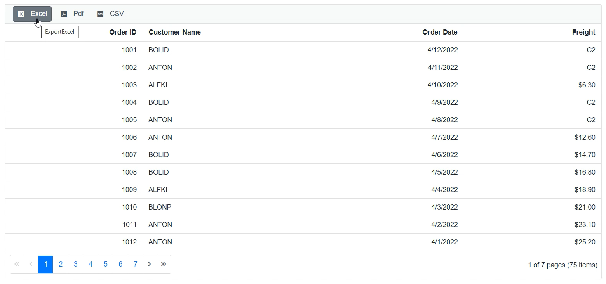

# Toolbar in Blazor DataGrid Component

The toolbar in the Syncfusion Blazor Data
Grid component offers several general use cases to enhance data manipulation and overall experience. Actions such as adding, editing, and deleting records within the grid can be performed, providing efficient data manipulation capabilities. The toolbar also facilitates data export and import functionality, allowing you to generate downloadable files in formats like Excel, CSV, or PDF.

 This service provides the necessary methods to interact with the toolbar items. The toolbar can be customized with built-in toolbar items or custom toolbar items using the [Toolbar](https://help.syncfusion.com/cr/blazor/Syncfusion.Blazor.Grids.SfGrid-1.html#Syncfusion_Blazor_Grids_SfGrid_1_Toolbar) property. The `Toolbar` property accepts an array of strings representing the built-in toolbar items or an array of [ItemModel](https://help.syncfusion.com/cr/blazor/Syncfusion.Blazor.Navigations.ItemModel.html#Syncfusion_Blazor_Navigations_ItemModel__ctor) objects for custom toolbar items.

 The following example demonstrates how to enable toolbar items in the grid.

 ```cshtml
 @using Syncfusion.Blazor.Grids

<SfGrid DataSource="@Orders" AllowPaging="true" Height="200" Toolbar=@Tool>
    <GridColumns>
        <GridColumn Field=@nameof(Order.OrderID) HeaderText="Order ID" TextAlign="TextAlign.Right" Width="120"></GridColumn>
        <GridColumn Field=@nameof(Order.CustomerID) HeaderText="Customer Name" Width="150"></GridColumn>
        <GridColumn Field=@nameof(Order.ShipCity) HeaderText="Ship City" TextAlign="TextAlign.Right" Width="130"></GridColumn>
        <GridColumn Field=@nameof(Order.ShipName) HeaderText="Ship Name" TextAlign="TextAlign.Right" Width="120"></GridColumn>
    </GridColumns>
</SfGrid>

@code {
    public List<string> Tool = new List<string>() { "Search", "Print" };
    public List<Order> Orders { get; set; }
    protected override void OnInitialized()
    {
        Orders = Enumerable.Range(1, 75).Select(x => new Order()
            {
                OrderID = 10247 + x,
                CustomerID = (new string[] { "VINET", "TOMSP", "HANAR", "SUPRD", "CHOPS" })[new Random().Next(5)],
                ShipCity = (new string[] { "Reims", "Münster", "Rio de Janeiro", "Lyon", "Charleroi" })[new Random().Next(5)],
                ShipName = (new string[] { "Suprêmes délices", "Que Delícia", "Ernst Handel", "HILARION-Abastos", "Hanari Carnes" })[new Random().Next(5)],
            }).ToList();
    }

    public class Order
    {
        public int? OrderID { get; set; }
        public string CustomerID { get; set; }
        public string ShipCity { get; set; }
        public string ShipName { get; set; }
    }
}
```


## Enable or disable toolbar items

Enabling or disabling toolbar items dynamically in Syncfusion Angular Grid is to provide control over the availability of specific functionality based on application logic. This feature allows you to customize the toolbar based on various conditions or individuals interactions.

You can enable or disable toolbar items dynamically by using the [EnableToolbarItemsAsync](https://help.syncfusion.com/cr/blazor/Syncfusion.Blazor.Grids.SfGrid-1.html#Syncfusion_Blazor_Grids_SfGrid_1_EnableToolbarItemsAsync_System_Collections_Generic_List_System_String__System_Boolean_) method. This method allows you to control the availability of specific toolbar items based on your application logic.

In the following example, the [Blazor Toggle Switch](https://help.syncfusion.com/cr/blazor/Syncfusion.Blazor.Buttons.SfSwitch-1.html) Button component is added to enable and disable the toolbar items using `EnableToolbarItemsAsync` method. When the switch is toggled, the [ValueChange](https://help.syncfusion.com/cr/blazor/Syncfusion.Blazor.Inputs.UploaderEvents.html#Syncfusion_Blazor_Inputs_UploaderEvents_ValueChange) event is triggered and the toolbar items are updated accordingly.

```Cshtml
<label>Enable or disable toolbar items</label>
<SfSwitch ValueChange="Change" TChecked="bool"></SfSwitch>
<SfGrid id="Grid" DataSource="@Orders" AllowPaging="true" Height="200" @ref="Grid" AllowGrouping="true" Toolbar=@Tool>

    <GridGroupSettings Columns=@GroupCol></GridGroupSettings>
    <GridEvents OnToolbarClick="ToolbarClickHandler" TValue="Order"></GridEvents>
    <GridColumns>
        <GridColumn Field=@nameof(Order.OrderID) HeaderText="Order ID" TextAlign="TextAlign.Right" Width="120"></GridColumn>
        <GridColumn Field=@nameof(Order.CustomerID) HeaderText="Customer Name" Width="150"></GridColumn>
        <GridColumn Field=@nameof(Order.ShipCity) HeaderText="Ship City" TextAlign="TextAlign.Right" Width="130"></GridColumn>
        <GridColumn Field=@nameof(Order.ShipName) HeaderText="Ship Name" TextAlign="TextAlign.Right" Width="120"></GridColumn>
    </GridColumns>
</SfGrid>

<style>
    .e-expand::before {
        content: '\e82e';
    }

    .e-collapse::before {
        content: '\e834';
    }
</style>

@code {
    public string[] Tool = new string[] { "Expand", "Collapse" };
    private SfGrid<Order> Grid;
    public List<Order> Orders { get; set; }
    private string[] GroupCol = (new string[] { "CustomerID" });
     
    protected override void OnInitialized()
    {
        Orders = Enumerable.Range(1, 75).Select(x => new Order()
            {
                OrderID = 10247 + x,
                CustomerID = (new string[] { "VINET", "TOMSP", "CHOPS", "SUPRD", "CENTC" })[new Random().Next(5)],
                ShipCity = (new string[] { "Reims", "Münster", "Rio de Janeiro", "Lyon", "Charleroi" })[new Random().Next(5)],
                ShipName = (new string[] { "Que Delícia", "Toms Spezialitäten", "Hanari Carnes", "Suprêmes délices", "Ernst Handel" })[new Random().Next(5)],
             }).ToList();
    }


    public class Order
    {
        public int? OrderID { get; set; }
        public string CustomerID { get; set; }
        public string ShipCity { get; set; }
        public string ShipName { get; set; }
    }
    private void Change(Syncfusion.Blazor.Buttons.ChangeEventArgs<bool> args)
    {
        if (args.Checked)
        {
            this.Grid.EnableToolbarItems(new List<string>() { "Grid_Expand", "Grid_Collapse" }, false);
        }
        else
        {
            this.Grid.EnableToolbarItems(new List<string>() { "Grid_Expand", "Grid_Collapse" }, true);
        }
        
    }

    public async Task ToolbarClickHandler(Syncfusion.Blazor.Navigations.ClickEventArgs args)
    {
        if (args.Item.Text == "Expand")
        {
            await this.Grid.GroupExpandAll();
        }
        if (args.Item.Text == "Collapse")
        {
            await this.Grid.GroupCollapseAll();
        }
    }
}
```


## Customize Toolbar buttons using CSS

Customizing Toolbar buttons in Syncfusion Blazor Grid using CSS involves modifying the appearance of built-in toolbar buttons by applying CSS styles. This provides a flexible and customizable way to enhance the visual presentation of the toolbar and create a cohesive interface.

The appearance of the built-in Toolbar buttons can be modified by applying the following CSS styles.

```csharp
.e-grid .e-toolbar .e-tbar-btn .e-icons,
.e-grid .e-toolbar .e-toolbar-items .e-toolbar-item .e-tbar-btn {
    background: #add8e6;   
}
```
The following example demonstrates how to change the background color of the `Add`, `Edit`, `Delete`, `Update` and `Cancel` toolbar buttons by applying CSS styles

```cshtml
@using Syncfusion.Blazor.Grids

<SfGrid DataSource="@Orders" AllowPaging="true" Height="200" Toolbar=@Tool>
    <GridEditSettings AllowAdding="true" AllowEditing="true" AllowDeleting="true"></GridEditSettings>
    <GridColumns>
        <GridColumn Field=@nameof(Order.OrderID) HeaderText="Order ID" TextAlign="TextAlign.Right" IsPrimaryKey="true" Width="120"></GridColumn>
        <GridColumn Field=@nameof(Order.CustomerID) HeaderText="Customer Name" Width="150"></GridColumn>
        <GridColumn Field=@nameof(Order.ShipCity) HeaderText="Ship City" TextAlign="TextAlign.Right" Width="130"></GridColumn>
        <GridColumn Field=@nameof(Order.ShipName) HeaderText="Ship Name" TextAlign="TextAlign.Right" Width="120"></GridColumn>
    </GridColumns>
</SfGrid>
<style>
    .e-grid .e-toolbar .e-tbar-btn .e-icons,
    .e-grid .e-toolbar .e-toolbar-items .e-toolbar-item .e-tbar-btn {
        background: #add8e6;
    }
</style>


@code {
    public string[] Tool = new string[] { "Add", "Edit","Delete","Update","Cancel" };
    public List<Order> Orders { get; set; }
    private string[] GroupCol = (new string[] { "CustomerID" });
     
    protected override void OnInitialized()
    {
        Orders = Enumerable.Range(1, 75).Select(x => new Order()
            {
                OrderID = 10247 + x,
                CustomerID = (new string[] { "VINET", "TOMSP", "CHOPS", "SUPRD", "CENTC" })[new Random().Next(5)],
                ShipCity = (new string[] { "Reims", "Münster", "Rio de Janeiro", "Lyon", "Charleroi" })[new Random().Next(5)],
                ShipName = (new string[] { "Que Delícia", "Toms Spezialitäten", "Hanari Carnes", "Suprêmes délices", "Ernst Handel" })[new Random().Next(5)],
             }).ToList();
    }


    public class Order
    {
        public int? OrderID { get; set; }
        public string CustomerID { get; set; }
        public string ShipCity { get; set; }
        public string ShipName { get; set; }
    }
    
}
```


## Customize Toolbar text

You can able to customize the toolbar text by using the [ItemModel](https://help.syncfusion.com/cr/blazor/Syncfusion.Blazor.Navigations.ItemModel.html#Syncfusion_Blazor_Navigations_ItemModel__ctor) properties.

```csharp

@using Syncfusion.Blazor.Grids
@using Syncfusion.Blazor.Navigations

<SfGrid ID="Grid" DataSource="@Orders" AllowPaging="true" Toolbar=@ToolbarItems>
    <GridEditSettings AllowAdding="true" AllowDeleting="true" AllowEditing="true"></GridEditSettings>
    <GridColumns>
        <GridColumn Field=@nameof(Order.OrderID) IsPrimaryKey="true" HeaderText="Order ID" TextAlign="TextAlign.Right" Width="120"></GridColumn>
        <GridColumn Field=@nameof(Order.CustomerID) HeaderText="Customer Name" Width="150"></GridColumn>
        <GridColumn Field=@nameof(Order.OrderDate) HeaderText=" Order Date" Format="d" Type="ColumnType.Date" TextAlign="TextAlign.Right" Width="130"></GridColumn>
        <GridColumn Field=@nameof(Order.Freight) HeaderText="Freight" Format="C2" TextAlign="TextAlign.Right" Width="120"></GridColumn>
    </GridColumns>
</SfGrid>

@code{
    public List<Order> Orders { get; set; }
    private List<object> ToolbarItems = new List<object>() {
        new ItemModel() { Text = "Add Record", PrefixIcon = "e-add", Id = "Grid_add"},//Here Grid is SfGrid ID
        new ItemModel(){ Text = "Edit Record", PrefixIcon= "e-edit", Id="Grid_edit"},
        new ItemModel(){ Text = "Delete Record", PrefixIcon= "e-delete", Id="Grid_delete"},
        new ItemModel(){ Text = "Update Record", PrefixIcon= "e-update", Id="Grid_update"},
        new ItemModel(){ Text = "Cancel Changes", PrefixIcon= "e-cancel", Id="Grid_cancel"}
    };
    protected override void OnInitialized()
    {
        Orders = Enumerable.Range(1, 75).Select(x => new Order()
        {
            OrderID = 1000 + x,
            CustomerID = (new string[] { "ALFKI", "ANANTR", "ANTON", "BLONP", "BOLID" })[new Random().Next(5)],
            Freight = 2.1 * x,
            OrderDate = DateTime.Now.AddDays(-x),
        }).ToList();
    }

    public class Order
    {
        public int? OrderID { get; set; }
        public string CustomerID { get; set; }
        public DateTime? OrderDate { get; set; }
        public double? Freight { get; set; }
    }
}

```

The following screenshots represent a datagrid by customizing toolbar text.


## Customizing the toolbar items tooltip text

You can customize the toolbar items tooltip text by adding toolbar items externally by setting [ItemModel.TooltipText](https://help.syncfusion.com/cr/blazor/Syncfusion.Blazor.Navigations.ItemModel.html#Syncfusion_Blazor_Navigations_ItemModel__ctor) property.

```csharp

@using Syncfusion.Blazor.Grids
@using Syncfusion.Blazor.Navigations

<SfGrid ID="Grid" DataSource="@Orders" @ref="DefaultGrid" AllowPaging="true" ShowColumnChooser="true"  AllowExcelExport="true" AllowPdfExport="true" Toolbar=@ToolbarItems>
    <GridEvents OnToolbarClick="ToolbarClickHandler" TValue="Order"></GridEvents>
    <GridEditSettings AllowAdding="true" AllowDeleting="true" AllowEditing="true"></GridEditSettings>
    <GridColumns>
        <GridColumn Field=@nameof(Order.OrderID) IsPrimaryKey="true" HeaderText="Order ID" TextAlign="TextAlign.Right" Width="120"></GridColumn>
        <GridColumn Field=@nameof(Order.CustomerID) HeaderText="Customer Name" Width="150"></GridColumn>
        <GridColumn Field=@nameof(Order.OrderDate) HeaderText=" Order Date" Format="d" Type="ColumnType.Date" TextAlign="TextAlign.Right" Width="130"></GridColumn>
        <GridColumn Field=@nameof(Order.Freight) HeaderText="Freight" Format="C2" TextAlign="TextAlign.Right" Width="120"></GridColumn>
    </GridColumns>
</SfGrid>

@code{
    public List<Order> Orders { get; set; }
    SfGrid<Order> DefaultGrid;
    
    private List<object> ToolbarItems = new List<object>() {
        new ItemModel() { Text = "Excel",TooltipText="Export to Excel", PrefixIcon = "e-excelexport", Id = "Grid_excelexport"}, //Here Grid is SfGrid ID
        new ItemModel(){ Text = "Pdf",TooltipText="Export to PDF", PrefixIcon= "e-pdfexport", Id="Grid_pdfexport"},
        new ItemModel(){ Text = "CSV",TooltipText="Export to CSV", PrefixIcon= "e-csvexport", Id="Grid_csvexport"},
    };
    
    public async Task ToolbarClickHandler(Syncfusion.Blazor.Navigations.ClickEventArgs args)
    {
        if (args.Item.Id == "Grid_excelexport") //Id is combination of Grid's ID and itemname
        {
            await this.DefaultGrid.ExcelExport();
        }
        else if (args.Item.Id == "Grid_pdfexport")  //Id is combination of Grid's ID and itemname
        {
            await this.DefaultGrid.PdfExport();
        }
        
        else
        {
           await this.DefaultGrid.CsvExport();
        }
    }
    
    protected override void OnInitialized()
    {
        Orders = Enumerable.Range(1, 75).Select(x => new Order()
        {
            OrderID = 1000 + x,
            CustomerID = (new string[] { "ALFKI", "ANANTR", "ANTON", "BLONP", "BOLID" })[new Random().Next(5)],
            Freight = 2.1 * x,
            OrderDate = DateTime.Now.AddDays(-x),
        }).ToList();
    }

    public class Order
    {
        public int? OrderID { get; set; }
        public string CustomerID { get; set; }
        public DateTime? OrderDate { get; set; }
        public double? Freight { get; set; }
    }
```



[View Sample in GitHub](https://github.com/SyncfusionExamples/Customizing-the-toolbar-items-tooltip-text-in-Blazor-Grid)

N> You can refer to our [Blazor DataGrid](https://www.syncfusion.com/blazor-components/blazor-datagrid) feature tour page for its groundbreaking feature representations. You can also explore our [Blazor DataGrid example](https://blazor.syncfusion.com/demos/datagrid/overview?theme=bootstrap4) to understand how to present and manipulate data.
