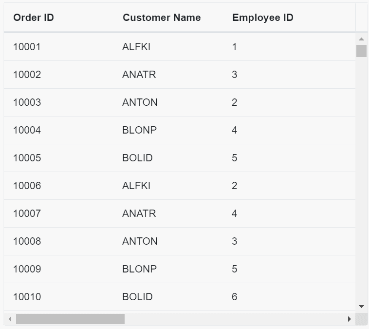
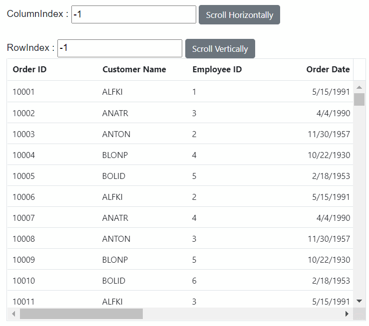

# Virtualization in Blazor DataGrid Component

DataGrid allows you to load large amount of data without [performance](https://www.syncfusion.com/blazor-components/blazor-datagrid/performance) degradation.

## Row virtualization

Row virtualization allows you to load and render rows only in the content viewport. It is an alternative way of paging in which the data will be loaded while scrolling vertically. To setup the row virtualization, you need to define
[EnableVirtualization](https://help.syncfusion.com/cr/blazor/Syncfusion.Blazor.Grids.SfGrid-1.html#Syncfusion_Blazor_Grids_SfGrid_1_EnableVirtualization) as true and content height by [Height](https://help.syncfusion.com/cr/blazor/Syncfusion.Blazor.Grids.SfGrid-1.html#Syncfusion_Blazor_Grids_SfGrid_1_Height) property.

The number of records displayed in the DataGrid is determined implicitly by height of the content area. Also, you have an option to define a visible number of records by
the [PageSize](https://help.syncfusion.com/cr/blazor/Syncfusion.Blazor.Grids.SfGrid-1.html#Syncfusion_Blazor_Grids_SfGrid_1_Height) property of [GridPageSettings](https://help.syncfusion.com/cr/blazor/Syncfusion.Blazor.Grids.SfGrid-1.html#Syncfusion_Blazor_Grids_SfGrid_1_PageSettings) component. The loaded data will be cached and reused when it is needed for next time.

```csharp

@using Syncfusion.Blazor.Grids

<SfGrid DataSource="@GridData" Height="600" EnableVirtualization="true">
    <GridColumns>
        <GridColumn Field=@nameof(Order.OrderID) HeaderText="Order ID" IsPrimaryKey="true" Width="150"></GridColumn>
        <GridColumn Field=@nameof(Order.CustomerID) HeaderText="Customer Name" Width="150"></GridColumn>
        <GridColumn Field=@nameof(Order.EmployeeID) HeaderText="Employee ID" Width="150"></GridColumn>
        <GridColumn Field=@nameof(Order.OrderDate) HeaderText=" Order Date" Format="d" Type="ColumnType.Date" TextAlign="TextAlign.Right" Width="130"></GridColumn>
        <GridColumn Field=@nameof(Order.Freight) HeaderText="Freight" Format="C2" TextAlign="TextAlign.Right" Width="120"></GridColumn>
        <GridColumn Field=@nameof(Order.ShipCountry) HeaderText="Ship Country" Width="150"></GridColumn>
        <GridColumn Field=@nameof(Order.ShipCity) HeaderText="Ship City" Width="150"></GridColumn>
        <GridColumn Field=@nameof(Order.ShipAddress) HeaderText="Ship Address" Width="150"></GridColumn>
        <GridColumn Field=@nameof(Order.ShippedDate) HeaderText="Shipped Date" Width="150"></GridColumn>
    </GridColumns>
</SfGrid>

@code{
    public List<Order> GridData { get; set; }
    protected override void OnInitialized()
    {
        List<Order> Order = new List<Order>();
        int Code = 10000;
        for (int i = 1; i < 10000; i++)
        {
            Order.Add(new Order(Code + 1, "ALFKI", i + 0, 2.3 * i, false, new DateTime(1991, 05, 15), "Berlin", "Denmark", new DateTime(1996, 7, 16), "Kirchgasse 6"));
            Order.Add(new Order(Code + 2, "ANATR", i + 2, 3.3 * i, true, new DateTime(1990, 04, 04), "Madrid", "Brazil", new DateTime(1996, 9, 11), "Avda. Azteca 123"));
            Order.Add(new Order(Code + 3, "ANTON", i + 1, 4.3 * i, true, new DateTime(1957, 11, 30), "Cholchester", "Germany", new DateTime(1996, 10, 7), "Carrera 52 con Ave. Bolívar #65-98 Llano Largo"));
            Order.Add(new Order(Code + 4, "BLONP", i + 3, 5.3 * i, false, new DateTime(1930, 10, 22), "Marseille", "Austria", new DateTime(1996, 12, 30), "Magazinweg 7"));
            Order.Add(new Order(Code + 5, "BOLID", i + 4, 6.3 * i, true, new DateTime(1953, 02, 18), "Tsawassen", "Switzerland", new DateTime(1997, 12, 3), "1029 - 12th Ave. S."));
            Code += 5;
        }
        GridData = Order;
    }

    public class Order
    {
        public Order(int OrderID, string CustomerID, int EmployeeID, double Freight, bool Verified, DateTime OrderDate, string ShipCity, string ShipCountry, DateTime ShippedDate, string ShipAddress)
        {
            this.OrderID = OrderID;
            this.CustomerID = CustomerID;
            this.EmployeeID = EmployeeID;
            this.Freight = Freight;
            this.Verified = Verified;
            this.OrderDate = OrderDate;
            this.ShipCity = ShipCity;
            this.ShipCountry = ShipCountry;
            this.ShippedDate = ShippedDate;
            this.ShipAddress = ShipAddress;
        }
        public int? OrderID { get; set; }
        public string CustomerID { get; set; }
        public int? EmployeeID { get; set; }
        public double? Freight { get; set; }
        public DateTime? OrderDate { get; set; }
        public bool Verified { get; set; }
        public DateTime? ShippedDate { get; set; }
        public string ShipCountry { get; set; }
        public string ShipCity { get; set; }
        public string ShipAddress { get; set; }
    }
}

```

### Render buffered data using Overscan count

The [OverscanCount](https://help.syncfusion.com/cr/blazor/Syncfusion.Blazor.Grids.SfGrid-1.html#Syncfusion_Blazor_Grids_SfGrid_1_OverscanCount) property plays a crucial role in optimizing scrolling performance. It allows for the rendering of extra records before and after the viewport of the grid. It effectively reduce the frequency of data fetch requests while scrolling vertically. 
In the following demonstration, the `OverscanCount` property value is set as 5, showcasing its impact on scroll efficiency.

```csharp

@using Syncfusion.Blazor.Grids

<SfGrid DataSource="@GridData" Height="600" Width="300" OverscanCount="5" EnableVirtualization="true" EnableColumnVirtualization="true">
    <GridColumns>
        <GridColumn Field=@nameof(Order.OrderID) HeaderText="Order ID" IsPrimaryKey="true" Width="150"></GridColumn>
        <GridColumn Field=@nameof(Order.CustomerID) HeaderText="Customer Name" Width="150"></GridColumn>
        <GridColumn Field=@nameof(Order.EmployeeID) HeaderText="Employee ID" Width="150"></GridColumn>
        <GridColumn Field=@nameof(Order.OrderDate) HeaderText=" Order Date" Format="d" Type="ColumnType.Date" TextAlign="TextAlign.Right" Width="130"></GridColumn>
        <GridColumn Field=@nameof(Order.Freight) HeaderText="Freight" Format="C2" TextAlign="TextAlign.Right" Width="120"></GridColumn>
        <GridColumn Field=@nameof(Order.ShipCountry) HeaderText="Ship Country" Width="150"></GridColumn>
        <GridColumn Field=@nameof(Order.ShipCity) HeaderText="Ship City" Width="150"></GridColumn>
        <GridColumn Field=@nameof(Order.ShipAddress) HeaderText="Ship Address" Width="150"></GridColumn>
        <GridColumn Field=@nameof(Order.ShippedDate) HeaderText="Shipped Date" Width="150"></GridColumn>
        <GridColumn Field=@nameof(Order.Verified) HeaderText="Verified" Type="ColumnType.Boolean"  Width="150"></GridColumn>
    </GridColumns>
</SfGrid>

@code{
    public List<Order> GridData { get; set; }
    protected override void OnInitialized()
    {
        List<Order> Order = new List<Order>();
        int Code = 10000;
        for (int i = 1; i < 10000; i++)
        {
            Order.Add(new Order(Code + 1, "ALFKI", i + 0, 2.3 * i, false, new DateTime(1991, 05, 15), "Berlin", "Denmark", new DateTime(1996, 7, 16), "Kirchgasse 6"));
            Order.Add(new Order(Code + 2, "ANATR", i + 2, 3.3 * i, true, new DateTime(1990, 04, 04), "Madrid", "Brazil", new DateTime(1996, 9, 11), "Avda. Azteca 123"));
            Order.Add(new Order(Code + 3, "ANTON", i + 1, 4.3 * i, true, new DateTime(1957, 11, 30), "Cholchester", "Germany", new DateTime(1996, 10, 7), "Carrera 52 con Ave. Bolívar #65-98 Llano Largo"));
            Order.Add(new Order(Code + 4, "BLONP", i + 3, 5.3 * i, false, new DateTime(1930, 10, 22), "Marseille", "Austria", new DateTime(1996, 12, 30), "Magazinweg 7"));
            Order.Add(new Order(Code + 5, "BOLID", i + 4, 6.3 * i, true, new DateTime(1953, 02, 18), "Tsawassen", "Switzerland", new DateTime(1997, 12, 3), "1029 - 12th Ave. S."));
            Code += 5;
        }
        GridData = Order;
    }

    public class Order
    {
    public Order(int OrderID, string CustomerID, int EmployeeID, double Freight, bool Verified, DateTime OrderDate, string ShipCity, string ShipCountry, DateTime ShippedDate, string ShipAddress)
        {
            this.OrderID = OrderID;
            this.CustomerID = CustomerID;
            this.EmployeeID = EmployeeID;
            this.Freight = Freight;
            this.Verified = Verified;
            this.OrderDate = OrderDate;
            this.ShipCity = ShipCity;
            this.ShipCountry = ShipCountry;
            this.ShippedDate = ShippedDate;
            this.ShipAddress = ShipAddress;
        }
        public int? OrderID { get; set; }
        public string CustomerID { get; set; }
        public int? EmployeeID { get; set; }
        public double? Freight { get; set; }
        public DateTime? OrderDate { get; set; }
        public bool Verified { get; set; }
        public DateTime? ShippedDate { get; set; }
        public string ShipCountry { get; set; }
        public string ShipCity { get; set; }
        public string ShipAddress { get; set; }
    }
}
```
N> The `OverscanCount` property supports both local and remote data.

## Column virtualization

Column virtualization allows you to virtualize columns. It will render columns which are in the viewport. You can scroll horizontally to view more columns.

To setup the column virtualization, set the [EnableColumnVirtualization](https://help.syncfusion.com/cr/blazor/Syncfusion.Blazor.Grids.SfGrid-1.html#Syncfusion_Blazor_Grids_SfGrid_1_EnableColumnVirtualization) property as **true**.

### Column Virtualization With Row Virtualization

In this demo, we have set [EnableColumnVirtualization](https://help.syncfusion.com/cr/blazor/Syncfusion.Blazor.Grids.SfGrid-1.html#Syncfusion_Blazor_Grids_SfGrid_1_EnableColumnVirtualization) and [EnableVirtualization](https://help.syncfusion.com/cr/blazor/Syncfusion.Blazor.Grids.SfGrid-1.html#Syncfusion_Blazor_Grids_SfGrid_1_EnableVirtualization) properties as true

```csharp

@using Syncfusion.Blazor.Grids

<SfGrid DataSource="@GridData" Height="600" Width="300" EnableVirtualization="true" EnableColumnVirtualization="true">
    <GridColumns>
        <GridColumn Field=@nameof(Order.OrderID) HeaderText="Order ID" IsPrimaryKey="true" Width="150"></GridColumn>
        <GridColumn Field=@nameof(Order.CustomerID) HeaderText="Customer Name" Width="150"></GridColumn>
        <GridColumn Field=@nameof(Order.EmployeeID) HeaderText="Employee ID" Width="150"></GridColumn>
        <GridColumn Field=@nameof(Order.OrderDate) HeaderText=" Order Date" Format="d" Type="ColumnType.Date" TextAlign="TextAlign.Right" Width="130"></GridColumn>
        <GridColumn Field=@nameof(Order.Freight) HeaderText="Freight" Format="C2" TextAlign="TextAlign.Right" Width="120"></GridColumn>
        <GridColumn Field=@nameof(Order.ShipCountry) HeaderText="Ship Country" Width="150"></GridColumn>
        <GridColumn Field=@nameof(Order.ShipCity) HeaderText="Ship City" Width="150"></GridColumn>
        <GridColumn Field=@nameof(Order.ShipAddress) HeaderText="Ship Address" Width="150"></GridColumn>
        <GridColumn Field=@nameof(Order.ShippedDate) HeaderText="Shipped Date" Width="150"></GridColumn>
        <GridColumn Field=@nameof(Order.Verified) HeaderText="Verified" Type="ColumnType.Boolean"  Width="150"></GridColumn>
    </GridColumns>
</SfGrid>

@code{
    public List<Order> GridData { get; set; }
    protected override void OnInitialized()
    {
        List<Order> Order = new List<Order>();
        int Code = 10000;
        for (int i = 1; i < 10000; i++)
        {
            Order.Add(new Order(Code + 1, "ALFKI", i + 0, 2.3 * i, false, new DateTime(1991, 05, 15), "Berlin", "Denmark", new DateTime(1996, 7, 16), "Kirchgasse 6"));
            Order.Add(new Order(Code + 2, "ANATR", i + 2, 3.3 * i, true, new DateTime(1990, 04, 04), "Madrid", "Brazil", new DateTime(1996, 9, 11), "Avda. Azteca 123"));
            Order.Add(new Order(Code + 3, "ANTON", i + 1, 4.3 * i, true, new DateTime(1957, 11, 30), "Cholchester", "Germany", new DateTime(1996, 10, 7), "Carrera 52 con Ave. Bolívar #65-98 Llano Largo"));
            Order.Add(new Order(Code + 4, "BLONP", i + 3, 5.3 * i, false, new DateTime(1930, 10, 22), "Marseille", "Austria", new DateTime(1996, 12, 30), "Magazinweg 7"));
            Order.Add(new Order(Code + 5, "BOLID", i + 4, 6.3 * i, true, new DateTime(1953, 02, 18), "Tsawassen", "Switzerland", new DateTime(1997, 12, 3), "1029 - 12th Ave. S."));
            Code += 5;
        }
        GridData = Order;
    }

    public class Order
    {
    public Order(int OrderID, string CustomerID, int EmployeeID, double Freight, bool Verified, DateTime OrderDate, string ShipCity, string ShipCountry, DateTime ShippedDate, string ShipAddress)
        {
            this.OrderID = OrderID;
            this.CustomerID = CustomerID;
            this.EmployeeID = EmployeeID;
            this.Freight = Freight;
            this.Verified = Verified;
            this.OrderDate = OrderDate;
            this.ShipCity = ShipCity;
            this.ShipCountry = ShipCountry;
            this.ShippedDate = ShippedDate;
            this.ShipAddress = ShipAddress;
        }
        public int? OrderID { get; set; }
        public string CustomerID { get; set; }
        public int? EmployeeID { get; set; }
        public double? Freight { get; set; }
        public DateTime? OrderDate { get; set; }
        public bool Verified { get; set; }
        public DateTime? ShippedDate { get; set; }
        public string ShipCountry { get; set; }
        public string ShipCity { get; set; }
        public string ShipAddress { get; set; }
    }
}
```

### Column virtualization with paging

In this demo, we have set [EnableColumnVirtualization](https://help.syncfusion.com/cr/blazor/Syncfusion.Blazor.Grids.SfGrid-1.html#Syncfusion_Blazor_Grids_SfGrid_1_EnableColumnVirtualization) and [AllowPaging](https://help.syncfusion.com/cr/blazor/Syncfusion.Blazor.Grids.SfGrid-1.html#Syncfusion_Blazor_Grids_SfGrid_1_AllowPaging) properties as true

```csharp

@using Syncfusion.Blazor.Grids

<SfGrid DataSource="@GridData" Height="400" Width="300" AllowPaging ="true" EnableColumnVirtualization="true">
    <GridColumns>
        <GridColumn Field=@nameof(Order.OrderID) HeaderText="Order ID" IsPrimaryKey="true" Width="150"></GridColumn>
        <GridColumn Field=@nameof(Order.CustomerID) HeaderText="Customer Name" Width="150"></GridColumn>
        <GridColumn Field=@nameof(Order.EmployeeID) HeaderText="Employee ID" Width="150"></GridColumn>
        <GridColumn Field=@nameof(Order.OrderDate) HeaderText=" Order Date" Format="d" Type="ColumnType.Date" TextAlign="TextAlign.Right" Width="130"></GridColumn>
        <GridColumn Field=@nameof(Order.Freight) HeaderText="Freight" Format="C2" TextAlign="TextAlign.Right" Width="120"></GridColumn>
        <GridColumn Field=@nameof(Order.ShipCountry) HeaderText="Ship Country" Width="150"></GridColumn>
        <GridColumn Field=@nameof(Order.ShipCity) HeaderText="Ship City" Width="150"></GridColumn>
        <GridColumn Field=@nameof(Order.ShipAddress) HeaderText="Ship Address" Width="150"></GridColumn>
        <GridColumn Field=@nameof(Order.ShippedDate) HeaderText="Shipped Date" Width="150"></GridColumn>
        <GridColumn Field=@nameof(Order.Verified) HeaderText="Verified" Type="ColumnType.Boolean"  Width="150"></GridColumn>
    </GridColumns>
</SfGrid>

@code{
    public List<Order> GridData { get; set; }
    protected override void OnInitialized()
    {
        List<Order> Order = new List<Order>();
        int Code = 10000;
        for (int i = 1; i < 200; i++)
        {
            Order.Add(new Order(Code + 1, "ALFKI", i + 0, 2.3 * i, false, new DateTime(1991, 05, 15), "Berlin", "Denmark", new DateTime(1996, 7, 16), "Kirchgasse 6"));
            Order.Add(new Order(Code + 2, "ANATR", i + 2, 3.3 * i, true, new DateTime(1990, 04, 04), "Madrid", "Brazil", new DateTime(1996, 9, 11), "Avda. Azteca 123"));
            Order.Add(new Order(Code + 3, "ANTON", i + 1, 4.3 * i, true, new DateTime(1957, 11, 30), "Cholchester", "Germany", new DateTime(1996, 10, 7), "Carrera 52 con Ave. Bolívar #65-98 Llano Largo"));
            Order.Add(new Order(Code + 4, "BLONP", i + 3, 5.3 * i, false, new DateTime(1930, 10, 22), "Marseille", "Austria", new DateTime(1996, 12, 30), "Magazinweg 7"));
            Order.Add(new Order(Code + 5, "BOLID", i + 4, 6.3 * i, true, new DateTime(1953, 02, 18), "Tsawassen", "Switzerland", new DateTime(1997, 12, 3), "1029 - 12th Ave. S."));
            Code += 5;
        }
        GridData = Order;
    }

    public class Order
    {
    public Order(int OrderID, string CustomerID, int EmployeeID, double Freight, bool Verified, DateTime OrderDate, string ShipCity, string ShipCountry, DateTime ShippedDate, string ShipAddress)
        {
            this.OrderID = OrderID;
            this.CustomerID = CustomerID;
            this.EmployeeID = EmployeeID;
            this.Freight = Freight;
            this.Verified = Verified;
            this.OrderDate = OrderDate;
            this.ShipCity = ShipCity;
            this.ShipCountry = ShipCountry;
            this.ShippedDate = ShippedDate;
            this.ShipAddress = ShipAddress;
        }
        public int? OrderID { get; set; }
        public string CustomerID { get; set; }
        public int? EmployeeID { get; set; }
        public double? Freight { get; set; }
        public DateTime? OrderDate { get; set; }
        public bool Verified { get; set; }
        public DateTime? ShippedDate { get; set; }
        public string ShipCountry { get; set; }
        public string ShipCity { get; set; }
        public string ShipAddress { get; set; }
    }
}
```

N> Column's [Width](https://help.syncfusion.com/cr/blazor/Syncfusion.Blazor.Grids.SfGrid-1.html#Syncfusion_Blazor_Grids_SfGrid_1_Width) is required for column virtualization. If column's width is not defined then DataGrid will consider its value as **200px**.

N> The collapsed/expanded state will persist only for local dataSource while scrolling.

## Enable Cell placeholder during Virtualization

This enable cell placeholder during virtualization feature much of a muchness of row virtualization and column virtualization feature and the difference is loading placeholder indicator was shown on the cells while loading the new data. Also same set of DOM elements is reused to improve performance.

To setup the enable cell placeholder during virtualization, you need to define [EnableVirtualMaskRow](https://help.syncfusion.com/cr/blazor/Syncfusion.Blazor.Grids.SfGrid-1.html#Syncfusion_Blazor_Grids_SfGrid_1_EnableVirtualMaskRow) as true along with [EnableVirtualization](https://help.syncfusion.com/cr/blazor/Syncfusion.Blazor.Grids.SfGrid-1.html#Syncfusion_Blazor_Grids_SfGrid_1_EnableVirtualization)/[EnableColumnVirtualization](https://help.syncfusion.com/cr/blazor/Syncfusion.Blazor.Grids.SfGrid-1.html#Syncfusion_Blazor_Grids_SfGrid_1_EnableColumnVirtualization)  property.

```csharp

@using Syncfusion.Blazor.Grids

<SfGrid DataSource="@GridData" Height="600" Width="300" RowHeight="38" EnableVirtualMaskRow="true" EnableVirtualization="true" EnableColumnVirtualization="true">
    <GridPageSettings PageSize="32"></GridPageSettings>
    <GridColumns>
        <GridColumn Field=@nameof(Order.OrderID) HeaderText="Order ID" IsPrimaryKey="true" Width="150"></GridColumn>
        <GridColumn Field=@nameof(Order.CustomerID) HeaderText="Customer Name" Width="150"></GridColumn>
        <GridColumn Field=@nameof(Order.EmployeeID) HeaderText="Employee ID" Width="150"></GridColumn>
        <GridColumn Field=@nameof(Order.OrderDate) HeaderText=" Order Date" Format="d" Type="ColumnType.Date" TextAlign="TextAlign.Right" Width="130"></GridColumn>
        <GridColumn Field=@nameof(Order.Freight) HeaderText="Freight" Format="C2" TextAlign="TextAlign.Right" Width="120"></GridColumn>
        <GridColumn Field=@nameof(Order.ShipCountry) HeaderText="Ship Country" Width="150"></GridColumn>
        <GridColumn Field=@nameof(Order.ShipCity) HeaderText="Ship City" Width="150"></GridColumn>
        <GridColumn Field=@nameof(Order.ShipAddress) HeaderText="Ship Address" Width="150"></GridColumn>
        <GridColumn Field=@nameof(Order.ShippedDate) HeaderText="Shipped Date" Width="150"></GridColumn>
        <GridColumn Field=@nameof(Order.Verified) HeaderText="Ship Name" Type="ColumnType.Boolean"  Width="150"></GridColumn>
    </GridColumns>
</SfGrid>

@code{
    public List<Order> GridData { get; set; }
    protected override void OnInitialized()
    {
        List<Order> Order = new List<Order>();
        int Code = 10000;
        for (int i = 1; i < 10000; i++)
        {
            Order.Add(new Order(Code + 1, "ALFKI", i + 0, 2.3 * i, false, new DateTime(1991, 05, 15), "Berlin", "Denmark", new DateTime(1996, 7, 16), "Kirchgasse 6"));
            Order.Add(new Order(Code + 2, "ANATR", i + 2, 3.3 * i, true, new DateTime(1990, 04, 04), "Madrid", "Brazil", new DateTime(1996, 9, 11), "Avda. Azteca 123"));
            Order.Add(new Order(Code + 3, "ANTON", i + 1, 4.3 * i, true, new DateTime(1957, 11, 30), "Cholchester", "Germany", new DateTime(1996, 10, 7), "Carrera 52 con Ave. Bolívar #65-98 Llano Largo"));
            Order.Add(new Order(Code + 4, "BLONP", i + 3, 5.3 * i, false, new DateTime(1930, 10, 22), "Marseille", "Austria", new DateTime(1996, 12, 30), "Magazinweg 7"));
            Order.Add(new Order(Code + 5, "BOLID", i + 4, 6.3 * i, true, new DateTime(1953, 02, 18), "Tsawassen", "Switzerland", new DateTime(1997, 12, 3), "1029 - 12th Ave. S."));
            Code += 5;
        }
        GridData = Order;
    }

    public class Order
    {
    public Order(int OrderID, string CustomerID, int EmployeeID, double Freight, bool Verified, DateTime OrderDate, string ShipCity, string ShipCountry, DateTime ShippedDate, string ShipAddress)
        {
            this.OrderID = OrderID;
            this.CustomerID = CustomerID;
            this.EmployeeID = EmployeeID;
            this.Freight = Freight;
            this.Verified = Verified;
            this.OrderDate = OrderDate;
            this.ShipCity = ShipCity;
            this.ShipCountry = ShipCountry;
            this.ShippedDate = ShippedDate;
            this.ShipAddress = ShipAddress;
        }
        public int? OrderID { get; set; }
        public string CustomerID { get; set; }
        public int? EmployeeID { get; set; }
        public double? Freight { get; set; }
        public DateTime? OrderDate { get; set; }
        public bool Verified { get; set; }
        public DateTime? ShippedDate { get; set; }
        public string ShipCountry { get; set; }
        public string ShipCity { get; set; }
        public string ShipAddress { get; set; }
    }
}
```

The following GIF represents a datagrid with Mask row virtualization:



N> For a better experience, the [PageSize](https://help.syncfusion.com/cr/blazor/Syncfusion.Blazor.Grids.GridPageSettings.html#Syncfusion_Blazor_Grids_GridPageSettings_PageSize) property of the [GridPageSettings](https://help.syncfusion.com/cr/blazor/Syncfusion.Blazor.Grids.GridPageSettings.html) class and the [RowHeight](https://help.syncfusion.com/cr/blazor/Syncfusion.Blazor.Grids.SfGrid-1.html#Syncfusion_Blazor_Grids_SfGrid_1_RowHeight) property should be defined.

## Frozen columns virtualization

This feature virtualize the row and movable column data. Column virtualization allows you to virtualize the movable columns and cell placeholder renders before new columns loading the viewport.

Row virtualization allows you to virtualize the vertical data with cell placeholder. This placeholder renders before new row data loading in the viewport.

To setup the frozen right/left columns, you need to define Column property of **Freeze** as Right/Left along with enabling the column property of [IsFrozen](https://help.syncfusion.com/cr/blazor/Syncfusion.Blazor.Grids.GridColumn.html#Syncfusion_Blazor_Grids_GridColumn_IsFrozen).

```cshtml
@using Syncfusion.Blazor.Grids

<SfGrid DataSource="@GridData" Height="400" Width="500"  EnableHover="false" RowHeight="38" EnableVirtualization="true" EnableColumnVirtualization="true" EnableVirtualMaskRow="true">
    <GridPageSettings PageSize="40"></GridPageSettings>
    <GridColumns>
        <GridColumn Field="Field1" HeaderText="Player Name" IsFrozen="true" Freeze="FreezeDirection.Left" Width="120"></GridColumn>
        <GridColumn Field="Field2" HeaderText="Year" TextAlign="TextAlign.Right" Width="150"></GridColumn>
        <GridColumn Field="Field3" HeaderText="Stint" TextAlign="TextAlign.Right" Width="150"></GridColumn>
        <GridColumn Field="Field4" HeaderText="TMID" TextAlign="TextAlign.Right" Width="150"></GridColumn>
        <GridColumn Field="Field5" HeaderText="LGID" TextAlign="TextAlign.Right" Width="150"></GridColumn>
        <GridColumn Field="Field6" HeaderText="Game Paused" TextAlign="TextAlign.Right" Width="150"></GridColumn>
        <GridColumn Field="Field7" HeaderText="Game Started" TextAlign="TextAlign.Right" Width="150"></GridColumn>
        <GridColumn Field="Field8" HeaderText="Minutes" TextAlign="TextAlign.Right" Width="150"></GridColumn>
        <GridColumn Field="Field9" HeaderText="Points"  IsFrozen="true" Freeze="FreezeDirection.Right" TextAlign="TextAlign.Right"  Width="150"></GridColumn>
        <GridColumn Field="Field10" HeaderText="Offensive Rebounds" TextAlign="TextAlign.Right" Width="150"></GridColumn>
        <GridColumn Field="Field11" HeaderText="Defensive Rebounds" TextAlign="TextAlign.Right" Width="150"></GridColumn>
        <GridColumn Field="Field12" HeaderText="Rebounds" TextAlign="TextAlign.Right" Width="150"></GridColumn>
        <GridColumn Field="Field13" HeaderText="Assists" TextAlign="TextAlign.Right" Width="150"></GridColumn>
        <GridColumn Field="Field14" HeaderText="Steals" TextAlign="TextAlign.Right" Width="150"></GridColumn>
        <GridColumn Field="Field15" HeaderText="Blocks" TextAlign="TextAlign.Right" Width="150"></GridColumn>
        <GridColumn Field="Field16" HeaderText="TurnOvers" TextAlign="TextAlign.Right" Width="150"></GridColumn>
        <GridColumn Field="Field17" HeaderText="Power Forward" TextAlign="TextAlign.Right" Width="150"></GridColumn>
        <GridColumn Field="Field18" HeaderText="fgAttempted" TextAlign="TextAlign.Right" Width="150"></GridColumn>
        <GridColumn Field="Field19" HeaderText="fgMade" TextAlign="TextAlign.Right" Width="150"></GridColumn>
        <GridColumn Field="Field20" HeaderText="ftAttempted" TextAlign="TextAlign.Right" Width="150"></GridColumn>
    </GridColumns>
</SfGrid>

@code{
    public List<VirtualData> GridData { get; set; } = new List<VirtualData>();

    protected override void OnInitialized()
    {
        List<VirtualData> data = new List<VirtualData>();
        Random Random = new Random();
        string[] Name = new string[] {"hardire", "abramjo01", "aubucch01", "Hook", "Rumpelstiltskin", "Belle", "Emma", "Regina", "Aurora", "Elsa",
          "Anna", "Snow White", "Prince Charming", "Cora", "Zelena", "August", "Mulan", "Graham", "Discord", "Will", "Robin Hood",
          "Jiminy Cricket", "Henry", "Neal", "Red", "Aaran", "Aaren", "Aarez", "Aarman", "Aaron", "Aaron-James", "Aarron", "Aaryan", "Aaryn",
          "Aayan", "Aazaan", "Abaan", "Abbas", "Abdallah", "Abdalroof", "Abdihakim", "Abdirahman", "Abdisalam", "Abdul", "Abdul-Aziz",
          "Abdulbasir", "Abdulkadir", "Abdulkarem", "Abdulkhader", "Abdullah", "Abdul-Majeed", "Abdulmalik", "Abdul-Rehman", "Abdur",
          "Abdurraheem", "Abdur-Rahman", "Abdur-Rehmaan", "Abel", "Abhinav", "Abhisumant", "Abid", "Abir", "Abraham", "Abu", "Abubakar",
          "Ace", "Adain", "Adam", "Adam-James", "Addison", "Addisson", "Adegbola", "Adegbolahan", "Aden", "Adenn", "Adie", "Adil", "Aditya",
          "Adnan", "Adrian", "Adrien", "Aedan", "Aedin", "Aedyn", "Aeron", "Afonso", "Ahmad", "Ahmed", "Ahmed-Aziz", "Ahoua", "Ahtasham",
          "Aiadan", "Aidan", "Aiden", "Aiden-Jack", "Aiden-Vee" };
        GridData = Enumerable.Range(1, 1000).Select(x => new VirtualData()
        {
            Field1 = Name[Random.Next(96)],
            Field2 = 1967 + (x % 10),
            Field3 = (int)Math.Floor(Random.NextDouble() * 200),
            Field4 = (int)Math.Floor(Random.NextDouble() * 100),
            Field5 = (int)Math.Floor(Random.NextDouble() * 2000),
            Field6 = (int)Math.Floor(Random.NextDouble() * 1000),
            Field7 = (int)Math.Floor(Random.NextDouble() * 100),
            Field8 = (int)Math.Floor(Random.NextDouble() * 10),
            Field9 = (int)Math.Floor(Random.NextDouble() * 10),
            Field10 = (int)Math.Floor(Random.NextDouble() * 100),
            Field11 = (int)Math.Floor(Random.NextDouble() * 100),
            Field12 = (int)Math.Floor(Random.NextDouble() * 1000),
            Field13 = (int)Math.Floor(Random.NextDouble() * 10),
            Field14 = (int)Math.Floor(Random.NextDouble() * 10),
            Field15 = (int)Math.Floor(Random.NextDouble() * 1000),
            Field16 = (int)Math.Floor(Random.NextDouble() * 200),
            Field17 = (int)Math.Floor(Random.NextDouble() * 300),
            Field18 = (int)Math.Floor(Random.NextDouble() * 400),
            Field19 = (int)Math.Floor(Random.NextDouble() * 500),
            Field20 = (int)Math.Floor(Random.NextDouble() * 700)

        }).ToList();
    }

    public class VirtualData
    {
        public string Field1 { get; set; }
        public int Field2 { get; set; }
        public int Field3 { get; set; }
        public int Field4 { get; set; }
        public int Field5 { get; set; }
        public int Field6 { get; set; }
        public int Field7 { get; set; }
        public int Field8 { get; set; }
        public int Field9 { get; set; }
        public int Field10 { get; set; }
        public int Field11 { get; set; }
        public int Field12 { get; set; }
        public int Field13 { get; set; }
        public int Field14 { get; set; }
        public int Field15 { get; set; }
        public int Field16 { get; set; }
        public int Field17 { get; set; }
        public int Field18 { get; set; }
        public int Field19 { get; set; }
        public int Field20 { get; set; }
    }
}
```

The following GIF represent a datagrid with Frozen columns/row virtualization.


## Scroll the content by external button

This section shows you how to invoke a [ScrollIntoViewAsync](https://help.syncfusion.com/cr/blazor/Syncfusion.Blazor.Grids.SfGrid-1.html#Syncfusion_Blazor_Grids_SfGrid_1_ScrollIntoViewAsync_System_Int32_System_Int32_System_Int32_) method to scroll the grid content into view externally by passing column index or row index as parameter.
To scroll the grid content in horizontal direction set the [`EnableVirtualization`](https://help.syncfusion.com/cr/blazor/Syncfusion.Blazor.Grids.SfGrid-1.html#Syncfusion_Blazor_Grids_SfGrid_1_EnableVirtualization) and [`EnableColumnVirtualization`](https://help.syncfusion.com/cr/blazor/Syncfusion.Blazor.Grids.SfGrid-1.html#Syncfusion_Blazor_Grids_SfGrid_1_EnableColumnVirtualization)  properties as **true**. 
To scroll the grid content in vertical direction, set `EnableVirtualization` property as **true**.

 ```cshtml
@using Syncfusion.Blazor.Grids
@using Syncfusion.Blazor.Buttons

ColumnIndex : <input @bind-value = "@ColumnIndex" />
<SfButton @onclick="Scroll" Content="Scroll Horizontally"></SfButton>

RowIndex : <input @bind-value = "@RowIndex" />
<SfButton @onclick="Scroll" Content="Scroll Vertically"></SfButton>

<SfGrid DataSource="@GridData" @ref="Grid" Height="500" RowHeight="35" Width="600" EnableVirtualization="true" EnableColumnVirtualization="true">
    <GridColumns>
        <GridColumn Field=@nameof(Order.OrderID) HeaderText="Order ID" Width="150"></GridColumn>
        <GridColumn Field=@nameof(Order.CustomerID) HeaderText="Customer Name" Width="150"></GridColumn>
        <GridColumn Field=@nameof(Order.EmployeeID) HeaderText="Employee ID" Width="150"></GridColumn>
        <GridColumn Field=@nameof(Order.OrderDate) HeaderText=" Order Date" Format="d" Type="ColumnType.Date" TextAlign="TextAlign.Right" Width="130"></GridColumn>
        <GridColumn Field=@nameof(Order.Freight) HeaderText="Freight" Format="C2" TextAlign="TextAlign.Right" Width="120"></GridColumn>
        <GridColumn Field=@nameof(Order.ShipCountry) HeaderText="Ship Country" Width="160" TextAlign="TextAlign.Right"></GridColumn>
        <GridColumn Field=@nameof(Order.ShipCity) HeaderText="Ship City" Width="150"></GridColumn>
        <GridColumn Field=@nameof(Order.ShipAddress) HeaderText="Ship Address" Width="150"></GridColumn>
        <GridColumn Field=@nameof(Order.ShippedDate) HeaderText="Shipped Date" TextAlign="TextAlign.Right"  Width="150"></GridColumn>
        <GridColumn Field=@nameof(Order.Verified) HeaderText="Verified" Width="200"></GridColumn>
    </GridColumns>
</SfGrid>

@code{
    public List<Order> GridData { get; set; }
    SfGrid<Order> Grid { get; set; }
    public int ColumnIndex { get; set; } = -1;
    public int RowIndex { get; set; } = -1;
    public int RowHeight { get; set; } = -1;

    protected override void OnInitialized()
    {
        List<Order> Order = new List<Order>();
        int Code = 10000;
        for (int i = 1; i < 10000; i++)
        {
            Order.Add(new Order(Code + 1, "ALFKI", i + 0, 2.3 * i, false, new DateTime(1991, 05, 15), "Berlin", "Denmark", new DateTime(1996, 7, 16), "Kirchgasse 6"));
            Order.Add(new Order(Code + 2, "ANATR", i + 2, 3.3 * i, true, new DateTime(1990, 04, 04), "Madrid", "Brazil", new DateTime(1996, 9, 11), "Avda. Azteca 123"));
            Order.Add(new Order(Code + 3, "ANTON", i + 1, 4.3 * i, true, new DateTime(1957, 11, 30), "Cholchester", "Germany", new DateTime(1996, 10, 7), "Carrera 52 con Ave. Bolívar #65-98 Llano Largo"));
            Order.Add(new Order(Code + 4, "BLONP", i + 3, 5.3 * i, false, new DateTime(1930, 10, 22), "Marseille", "Austria", new DateTime(1996, 12, 30), "Magazinweg 7"));
            Order.Add(new Order(Code + 5, "BOLID", i + 4, 6.3 * i, true, new DateTime(1953, 02, 18), "Tsawassen", "Switzerland", new DateTime(1997, 12, 3), "1029 - 12th Ave. S."));
            Code += 5;
        }
        GridData = Order;
    }

    public async Task Scroll()
    {
        await Grid.ScrollIntoViewAsync(ColumnIndex, RowIndex, RowHeight);
    }

    public class Order
    {
        public Order(int OrderID, string CustomerID, int EmployeeID, double Freight, bool Verified, DateTime OrderDate, string ShipCity, string ShipCountry, DateTime ShippedDate, string ShipAddress)
        {
            this.OrderID = OrderID;
            this.CustomerID = CustomerID;
            this.EmployeeID = EmployeeID;
            this.Freight = Freight;
            this.Verified = Verified;
            this.OrderDate = OrderDate;
            this.ShipCity = ShipCity;
            this.ShipCountry = ShipCountry;
            this.ShippedDate = ShippedDate;
            this.ShipAddress = ShipAddress;
        }
        public int? OrderID { get; set; }
        public string CustomerID { get; set; }
        public int? EmployeeID { get; set; }
        public double? Freight { get; set; }
        public DateTime? OrderDate { get; set; }
        public bool Verified { get; set; }
        public DateTime? ShippedDate { get; set; }
        public string ShipCountry { get; set; }
        public string ShipCity { get; set; }
        public string ShipAddress { get; set; }
    }
}
```



## Refresh virtualized grid externally

The [UpdatePageSizeAsync](https://help.syncfusion.com/cr/blazor/Syncfusion.Blazor.Grids.SfGrid-1.html#Syncfusion_Blazor_Grids_SfGrid_1_UpdatePageSizeAsync_System_Int32_System_Int32_) method refresh the virtualized grid [`PageSize`](https://help.syncfusion.com/cr/blazor/Syncfusion.Blazor.Grids.SfGrid-1.html#Syncfusion_Blazor_Grids_SfGrid_1_Height) externally by using the given grid height/grid container height and row height. This method calculates the grid `PageSize` programmatically and refreshes the virtualized grid with the newly calculated `PageSize`.

To refresh virtualized grid externally, set the [`EnableVirtualization`](https://help.syncfusion.com/cr/blazor/Syncfusion.Blazor.Grids.SfGrid-1.html#Syncfusion_Blazor_Grids_SfGrid_1_EnableVirtualization) as true.

```cshtml
@using Syncfusion.Blazor.Grids
@using Syncfusion.Blazor.Buttons
<SfButton Content="Refresh" OnClick="UpdatePageSize"></SfButton>
<SfGrid DataSource="@GridData" Height="500" @ref="Grid" EnableVirtualization="true">
    <GridColumns>
        <GridColumn Field=@nameof(Order.OrderID) HeaderText="Order ID" Width="150"></GridColumn>
        <GridColumn Field=@nameof(Order.CustomerID) HeaderText="Customer Name" Width="150"></GridColumn>
        <GridColumn Field=@nameof(Order.EmployeeID) HeaderText="Employee ID" Width="150"></GridColumn>
        <GridColumn Field=@nameof(Order.OrderDate) HeaderText=" Order Date" Format="d" Type="ColumnType.Date" TextAlign="TextAlign.Right" Width="130"></GridColumn>
        <GridColumn Field=@nameof(Order.Freight) HeaderText="Freight" Format="C2" TextAlign="TextAlign.Right" Width="120"></GridColumn>
        <GridColumn Field=@nameof(Order.ShipCountry) HeaderText="Ship Country" Width="150"></GridColumn>
        <GridColumn Field=@nameof(Order.ShipCity) HeaderText="Ship City" Width="150"></GridColumn>
        <GridColumn Field=@nameof(Order.ShipAddress) HeaderText="Ship Address" Width="150"></GridColumn>
        <GridColumn Field=@nameof(Order.ShippedDate) HeaderText="Shipped Date" Width="150"></GridColumn>
    </GridColumns>
</SfGrid>
@code{
    public List<Order> GridData { get; set; }
    public SfGrid<Order> Grid { get; set; }
    protected override void OnInitialized()
    {
        List<Order> Order = new List<Order>();
        int Code = 10000;
        for (int i = 1; i < 10000; i++)
        {
            Order.Add(new Order(Code + 1, "ALFKI", i + 0, 2.3 * i, false, new DateTime(1991, 05, 15), "Berlin", "Denmark", new DateTime(1996, 7, 16), "Kirchgasse 6"));
            Order.Add(new Order(Code + 2, "ANATR", i + 2, 3.3 * i, true, new DateTime(1990, 04, 04), "Madrid", "Brazil", new DateTime(1996, 9, 11), "Avda. Azteca 123"));
            Order.Add(new Order(Code + 3, "ANTON", i + 1, 4.3 * i, true, new DateTime(1957, 11, 30), "Cholchester", "Germany", new DateTime(1996, 10, 7), "Carrera 52 con Ave. Bolívar #65-98 Llano Largo"));
            Order.Add(new Order(Code + 4, "BLONP", i + 3, 5.3 * i, false, new DateTime(1930, 10, 22), "Marseille", "Austria", new DateTime(1996, 12, 30), "Magazinweg 7"));
            Order.Add(new Order(Code + 5, "BOLID", i + 4, 6.3 * i, true, new DateTime(1953, 02, 18), "Tsawassen", "Switzerland", new DateTime(1997, 12, 3), "1029 - 12th Ave. S."));
            Code += 5;
        }
        GridData = Order;
    }
    public class Order
    {
        public Order(int OrderID, string CustomerID, int EmployeeID, double Freight, bool Verified, DateTime OrderDate, string ShipCity, string ShipCountry, DateTime ShippedDate, string ShipAddress)
        {
            this.OrderID = OrderID;
            this.CustomerID = CustomerID;
            this.EmployeeID = EmployeeID;
            this.Freight = Freight;
            this.Verified = Verified;
            this.OrderDate = OrderDate;
            this.ShipCity = ShipCity;
            this.ShipCountry = ShipCountry;
            this.ShippedDate = ShippedDate;
            this.ShipAddress = ShipAddress;
        }
        public int? OrderID { get; set; }
        public string CustomerID { get; set; }
        public int? EmployeeID { get; set; }
        public double? Freight { get; set; }
        public DateTime? OrderDate { get; set; }
        public bool Verified { get; set; }
        public DateTime? ShippedDate { get; set; }
        public string ShipCountry { get; set; }
        public string ShipCity { get; set; }
        public string ShipAddress { get; set; }
    }
     public async Task UpdatePageSize()
    {
        await Grid.UpdatePageSizeAsync(800, 32);
    }
}
```

N> If <b>rowHeight</b> is given, then the page size is calculated by given row height. Otherwise, rowHeight will be considered from the offset height of the grid row element.

## Limitations for Virtualization

* While using column virtualization, column width should be in the pixel. Percentage values are not accepted.
* Due to the element height limitation in browsers, the maximum number of records loaded by the datagrid is limited by the browser capability.
* Cell selection will not be persisted in both row and column virtualization.
* Virtual scrolling is not compatible with detail template, and hierarchy features
* Group expand and collapse state will not be persisted.
* Since data is virtualized in datagrid, the aggregated information and total group items are displayed based on the current view items.
* The page size provided must be two times larger than the number of visible rows in the datagrid. If the page size is failed to meet this condition then the size will be determined by datagrid.
* The height of the datagrid content is calculated using the row height and total number of records in the data source and hence features which changes row height such as text wrapping are not supported. If you want to increase the row height to accommodate the content then you can specify the row height using **RowHeight** property to ensure all the table rows are in same height.
* Programmatic selection using the **SelectRows** method is not supported in virtual scrolling.

## See also

* [Row virtualization with Lazy load grouping in DataGrid](https://blazor.syncfusion.com/documentation/datagrid/lazy-load-grouping#lazy-load-grouping-with-virtual-scrolling)

N> You can refer to our [Blazor DataGrid](https://www.syncfusion.com/blazor-components/blazor-datagrid) feature tour page for its groundbreaking feature representations. You can also explore our [Blazor DataGrid example](https://blazor.syncfusion.com/demos/datagrid/overview?theme=bootstrap5) to understand how to present and manipulate data.
