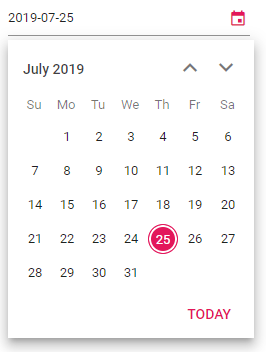

# Date Format

Date format is a way of representing the date value in different string formats in text box.

By default, the DatePicker's format is based on the culture. You can also set the own
custom format by using the
[Format](https://help.syncfusion.com/cr/blazor/Syncfusion.Blazor.Calendars.SfDatePicker-1.html#Syncfusion_Blazor_Calendars_SfDatePicker_1_Format)
property.

> Once the date format property has been defined, it will be common for all the cultures.

The following code demonstrates the DatePicker with the custom format (`yyyy-MM-dd`).

```csharp
@using Syncfusion.Blazor.Calendars

<SfDatePicker TValue="DateTime?" Value='@DateValue' Format='yyyy-MM-dd'></SfDatePicker>

@code {
    public DateTime? DateValue {get;set;} = DateTime.Now;
}
```

The output will be as follows.


