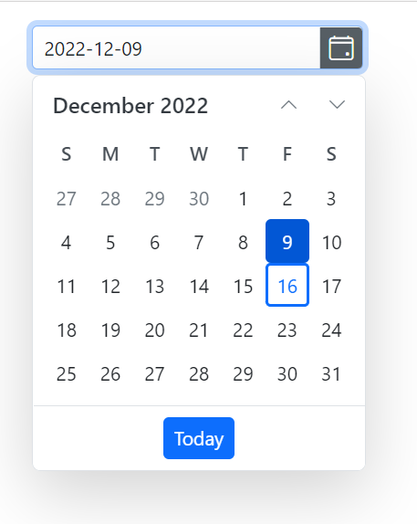

# Date Format in Blazor DatePicker Component

This article describes how to control the display and input formats in the Blazor DatePicker component using the Format and InputFormats properties, along with .NET standard and custom date-time format strings.

## Display Format

The display format specifies how a date value is rendered in the DatePicker input. This controls the visual representation of the selected value (for example, dd-MM-yyyy, MM/dd/yyyy, or MMM dd, yyyy).

By default, the DatePicker display format is based on the current culture. A custom or standard .NET date and time format string can be applied using the [Custom Format](https://learn.microsoft.com/en-us/dotnet/standard/base-types/custom-date-and-time-format-strings) or [Standard Format](https://learn.microsoft.com/en-us/dotnet/standard/base-types/standard-date-and-time-format-strings) options via the [Format](https://help.syncfusion.com/cr/blazor/Syncfusion.Blazor.Calendars.SfDatePicker-1.html#Syncfusion_Blazor_Calendars_SfDatePicker_1_Format) property.

Note: When a display format is set, it consistently controls how the value is shown, regardless of culture-specific date order or separators. The underlying value type remains DateTime/DateTime?, and localized month/day names still follow the active culture where applicable.

```cshtml
@using Syncfusion.Blazor.Calendars

<p>Selected date (display format): @DateValue</p>

<SfDatePicker TValue="DateTime?"
              Value="@DateValue"
              Format="MMM dd, yyyy">
</SfDatePicker>

@code {
    public DateTime? DateValue { get; set; } = new DateTime(DateTime.Now.Year, DateTime.Now.Month, 15);
}
```

Preview:
- The input renders the selected date in the form “Sep 15, 2025” (based on the chosen format), while the bound value remains a DateTime?.



## Input Formats

The input format defines how typed dates are parsed into a valid DatePicker value. Typed input is interpreted according to the current culture and any configured input patterns. After input is confirmed (for example, by pressing Enter or Tab, or when the input loses focus), the value is reformatted using the display format.

Multiple input patterns can be accepted by specifying [.NET custom](https://learn.microsoft.com/en-us/dotnet/standard/base-types/custom-date-and-time-format-strings) or [standard](https://learn.microsoft.com/en-us/dotnet/standard/base-types/standard-date-and-time-format-strings) patterns in the [InputFormats](https://help.syncfusion.com/cr/blazor/Syncfusion.Blazor.Calendars.SfDatePicker-1.html#Syncfusion_Blazor_Calendars_SfDatePicker_1_InputFormats) property (for example, d-M-yy, d/M/yyyy, yyyy-MM-dd).

```cshtml
@using Syncfusion.Blazor.Calendars

<p>Selected date (input formats): @DateValue</p>

<SfDatePicker TValue="DateTime?"
              Value="@DateValue"
              Format="dd-MM-yyyy"
              InputFormats="@(new string[] { "d-M-yy", "d/M/yyyy", "yyyy-MM-dd" })">
</SfDatePicker>

@code {
    public DateTime? DateValue { get; set; } = DateTime.Today;
}
```
Preview:
- The input accepts dates typed as “1-9-25”, “01/09/2025”, or “2025-09-01”. After confirmation, the value is reformatted and displayed as “01-09-2025” according to the configured Format “dd-MM-yyyy”.
