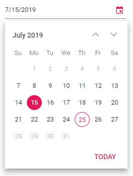

# Date Range in Blazor DatePicker Component

The DatePicker supports selecting a date within a specified range using the [Min](https://help.syncfusion.com/cr/blazor/Syncfusion.Blazor.Calendars.CalendarBase-1.html#Syncfusion_Blazor_Calendars_CalendarBase_1_Min) and [Max](https://help.syncfusion.com/cr/blazor/Syncfusion.Blazor.Calendars.CalendarBase-1.html#Syncfusion_Blazor_Calendars_CalendarBase_1_Max) properties. Min must be less than Max. The `Value` must fall within this range, and its behavior when out of range depends on the [StrictMode](https://help.syncfusion.com/cr/blazor/Syncfusion.Blazor.Calendars.SfDatePicker-1.html#Syncfusion_Blazor_Calendars_SfDatePicker_1_StrictMode) property. When StrictMode is disabled, the component can hold an out-of-range value and the input is highlighted with an error style. When StrictMode is enabled, invalid or out-of-range input results in a `null` model value and an error style. For details, see the [Strict Mode](./strict-mode) section.

The following code allows selecting a date within the range from 7th to 27th in a month.

```cshtml
@using Syncfusion.Blazor.Calendars

<SfDatePicker TValue="DateTime?" Min='@MinDate' Max='@MaxDate' Value='@DateValue'></SfDatePicker>

@code {
    public DateTime MinDate {get;set;} = new DateTime(DateTime.Now.Year,DateTime.Now.Month,07);
    public DateTime MaxDate {get;set;} = new DateTime(DateTime.Now.Year, DateTime.Now.Month, 27);
    public DateTime? DateValue {get;set;} = new DateTime(DateTime.Now.Year, DateTime.Now.Month, 15);
}
```



When the Min and Max properties are configured and the selected date is out of range or invalid, the model value and UI state behave as follows: with StrictMode disabled, the model can contain the out-of-range date and the input is highlighted with an `error` class; with StrictMode enabled, the model value becomes `null` and the input is highlighted to indicate the invalid selection.

```cshtml
@using Syncfusion.Blazor.Calendars

<SfDatePicker TValue="DateTime?" Min='@MinDate' Max='@MaxDate' Value='@DateValue'></SfDatePicker>

@code {
    public DateTime MinDate {get;set;} = new DateTime(DateTime.Now.Year,DateTime.Now.Month,07);
    public DateTime MaxDate {get;set;} = new DateTime(DateTime.Now.Year, DateTime.Now.Month, 27);
    public DateTime? DateValue {get;set;} = new DateTime(DateTime.Now.Year, DateTime.Now.Month, 28);
}
```


N> If the values of `Min` or `Max` are changed in code-behind at runtime, the `Value` property must also be updated to remain within the defined range. Disabled dates cannot be selected, and keyboard navigation respects the configured minimum and maximum.