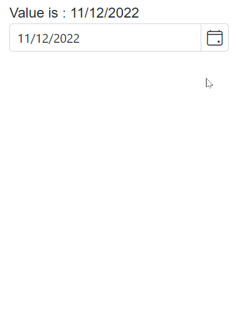

# DateOnly Support in Blazor DatePicker Component

The [DateOnly](https://learn.microsoft.com/en-us/dotnet/api/system.dateonly?view=net-7.0) type was introduced in .NET 6 to represent a date without a time component. To use DateOnly with the Blazor DatePicker component, set the generic type parameter to `DateOnly`.

> The Blazor DatePicker component supports the `DateOnly` type in .NET 7 and later. Although DateOnly was introduced in .NET 6, full support in Blazor requires .NET 7 due to serialization and model binding changes.

Key points when using DateOnly:
- Set the component’s TValue to `DateOnly` (or `DateOnly?` for nullable scenarios and clearing values).
- Use `@bind-Value` for two-way binding with a DateOnly model property.
- Ensure related properties (such as Min, Max, and Value) use compatible types when working with DateOnly.
- Formatting and parsing follow the current culture; DateOnly represents dates only and does not include time.







