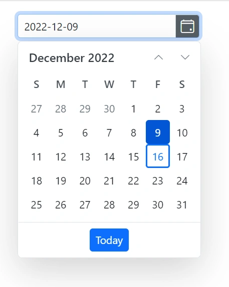

# DateOnly Support in Blazor DatePicker

The [DateOnly](https://learn.microsoft.com/en-us/dotnet/api/system.dateonly) type, introduced in .NET 6, represents a date without a time component. To bind a `DateOnly` value with the Blazor DatePicker, set the `TValue` parameter to `DateOnly`. The component also supports the nullable form `DateOnly?` when the input has no initial value. The `Min`, `Max`, and `Value` properties accept `DateOnly` values consistently with the chosen `TValue`.

> The Syncfusion Blazor DatePicker added support for the `DateOnly` type starting with .NET 7. Although `DateOnly` was introduced in .NET 6, earlier targets are not supported by this component.







## See also

* [TValue](https://help.syncfusion.com/cr/blazor/Syncfusion.Blazor.Calendars.SfDatePicker-1.html)
* [Date Format](date-format)
* [Date Range](date-range)