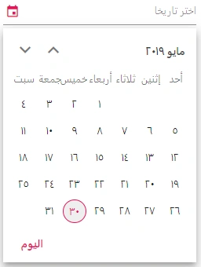

# Globalization in Blazor DatePicker Component

The [Blazor DatePicker](https://www.syncfusion.com/blazor-components/blazor-datepicker) supports globalization so that the calendar can render in different cultures and layouts. For localizing Syncfusion Blazor component strings (such as button labels), refer to the [Blazor Localization](https://blazor.syncfusion.com/documentation/common/localization) topic.

## Right-To-Left

The DatePicker supports right-to-left (RTL) rendering for languages such as Arabic and Hebrew. Use the [`EnableRtl`](https://help.syncfusion.com/cr/blazor/Syncfusion.Blazor.Calendars.SfDatePicker-1.html#Syncfusion_Blazor_Calendars_SfDatePicker_1_EnableRtl) property to set the RTL direction. The application culture (set globally via the Syncfusion localization helper, e.g., `SetCulture("ar")`) provides the localized strings and culture data used by the component.

The following example configures the DatePicker with the Arabic culture and RTL layout.

```cshtml
@using Syncfusion.Blazor.Calendars
@inject HttpClient Http;

<SfDatePicker TValue="DateTime?" EnableRtl="true"></SfDatePicker>

@code {
    [Inject]
    protected IJSRuntime JsRuntime { get; set; }
    protected override async Task OnInitializedAsync()
    {
        this.JsRuntime.Sf().LoadLocaleData(await Http.GetJsonAsync<object>("blazor-locale/src/ar.json")).SetCulture("ar");
    }
}
```



## See also

* [Blazor Localization](../common/localization)
* [EnableRtl](https://help.syncfusion.com/cr/blazor/Syncfusion.Blazor.Calendars.SfDatePicker-1.html#Syncfusion_Blazor_Calendars_SfDatePicker_1_EnableRtl) property
* [Date Format](date-format)