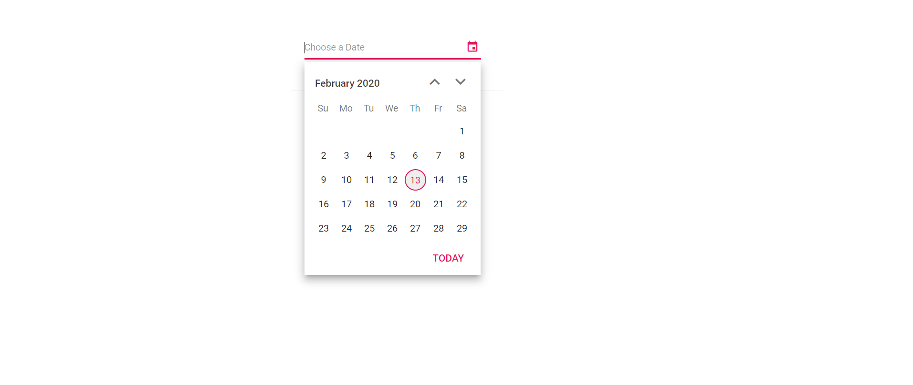
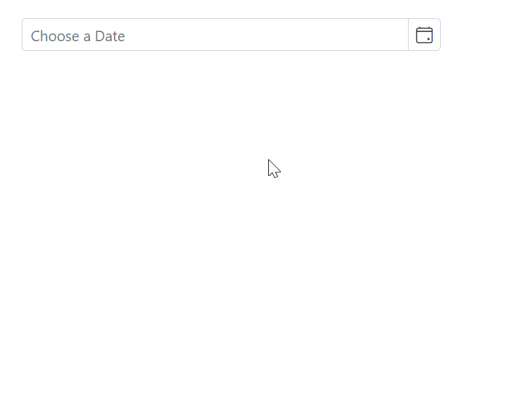

# Open the Blazor DatePicker popup on Focus

Open the DatePicker popup when the input receives focus. This can be done by calling `ShowPopupAsync` from the input’s focus event, or by enabling the built-in `OpenOnFocus` property as shown below.

The DatePicker popup can be opened on input focus by calling the [`ShowPopupAsync`](https://help.syncfusion.com/cr/blazor/Syncfusion.Blazor.Calendars.SfDatePicker-1.html#Syncfusion_Blazor_Calendars_SfDatePicker_1_ShowPopupAsync) method in the input `focus` event.

The following example demonstrates how to open the DatePicker popup when the input is focused.

```cshtml
@using Syncfusion.Blazor.Calendars

<SfDatePicker TValue="DateTime?" @ref="@DateObj">
    <DatePickerEvents TValue="DateTime?" Focus="FocusHandler"></DatePickerEvents>
</SfDatePicker>

@code{
    SfDatePicker<DateTime?> DateObj;
    public async void FocusHandler(Syncfusion.Blazor.Calendars.FocusEventArgs args)    {
        await this.DateObj.ShowPopupAsync();
    }
}
```



## Open the Blazor DatePicker popup on Focus

The DatePicker popup can also be opened on input focus by setting the [OpenOnFocus](https://help.syncfusion.com/cr/blazor/Syncfusion.Blazor.Calendars.SfDatePicker-1.html#Syncfusion_Blazor_Calendars_SfDatePicker_1_OpenOnFocus) property to `true`. This is the built-in option and does not require handling the focus event manually.

The following example demonstrates how to open the DatePicker popup when the input is focused.

```cshtml
@using Syncfusion.Blazor.Calendars

<SfDatePicker TValue="DateTime?" Placeholder="Choose a Date" OpenOnFocus="true" FullScreen="true" ShowClearButton="true"></SfDatePicker>
```

