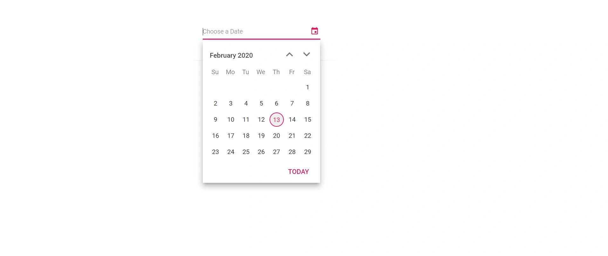
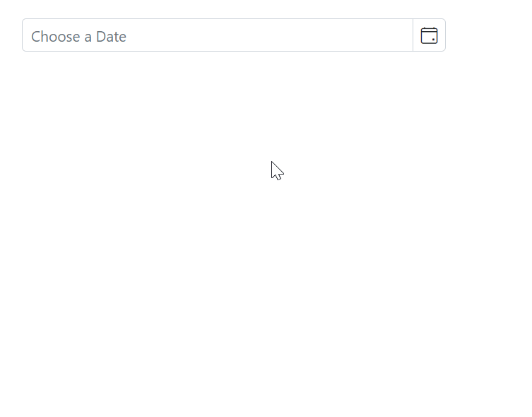

# Open the Blazor DatePicker popup on Focus

You can open the DatePicker popup when the input receives focus by handling the [Focus](https://help.syncfusion.com/cr/blazor/Syncfusion.Blazor.Calendars.DatePickerEvents-1.html) event of `DatePickerEvents` and calling the `ShowPopupAsync` method.

The following example demonstrates how to open the DatePicker popup when the input is focused.

```cshtml
@using Syncfusion.Blazor.Calendars

<SfDatePicker TValue="DateTime?" @ref="@DateObj">
    <DatePickerEvents TValue="DateTime?" Focus="FocusHandler"></DatePickerEvents>
</SfDatePicker>

@code{
    SfDatePicker<DateTime?> DateObj;
    public async void FocusHandler(Syncfusion.Blazor.Calendars.FocusEventArgs args)    {
        await this.DateObj.ShowPopupAsync();
    }
}
```



## Open the Blazor DatePicker popup on Focus

You can also open the DatePicker popup on input focus by setting the [OpenOnFocus](https://help.syncfusion.com/cr/blazor/Syncfusion.Blazor.Calendars.SfDatePicker-1.html#Syncfusion_Blazor_Calendars_SfDatePicker_1_OpenOnFocus) property to `true`. The default value of `OpenOnFocus` is `false`.

The following example demonstrates how to open the DatePicker popup when the input is focused.

```cshtml
@using Syncfusion.Blazor.Calendars

<SfDatePicker TValue="DateTime?" Placeholder="Choose a Date" OpenOnFocus="true" FullScreen="true" ShowClearButton="true"></SfDatePicker>

```


