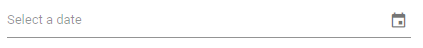

# Set the Placeholder in Blazor DatePicker Component

The following example demonstrates how to set the `Placeholder` in the DatePicker component.

Using the [Placeholder](https://help.syncfusion.com/cr/blazor/Syncfusion.Blazor.Calendars.SfDatePicker-1.html#Syncfusion_Blazor_Calendars_SfDatePicker_1_Placeholder) property, a short hint can be displayed in the input element to guide users before a value is selected.

```cshtml
@using Syncfusion.Blazor.Calendars

<SfDatePicker TValue="DateTime?" Placeholder="Select a date"></SfDatePicker>
```

