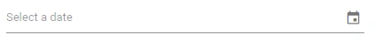

# How to set the Placeholder in Blazor DatePicker

Using [Placeholder](https://help.syncfusion.com/cr/blazor/Syncfusion.Blazor.Calendars.SfDatePicker-1.html#Syncfusion_Blazor_Calendars_SfDatePicker_1_Placeholder), you can display a short hint in the input element. The default value of `Placeholder` is `string.Empty`. How the placeholder is rendered depends on the [FloatLabelType](https://help.syncfusion.com/cr/blazor/Syncfusion.Blazor.Calendars.SfDatePicker-1.html#Syncfusion_Blazor_Calendars_SfDatePicker_1_FloatLabelType) property.

The following example demonstrates how to set `Placeholder` in the DatePicker component.

```cshtml
@using Syncfusion.Blazor.Calendars

<SfDatePicker TValue="DateTime?" Placeholder="Select a date"></SfDatePicker>
```


