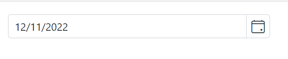
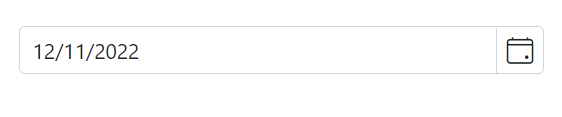

# Mask Support in Blazor DatePicker Component

The masking feature allows users to enter a date in the correct format, as specified by the [Format](https://help.syncfusion.com/cr/blazor/Syncfusion.Blazor.Calendars.SfDatePicker-1.html#Syncfusion_Blazor_Calendars_SfDatePicker_1_Format) property. This helps to ensure that the date is entered correctly and can also make it easier for users to understand how to enter the date. The [EnableMask](https://help.syncfusion.com/cr/blazor/Syncfusion.Blazor.Calendars.SfDatePicker-1.html#Syncfusion_Blazor_Calendars_SfDatePicker_1_EnableMask) property in the DatePicker component allows you to enable or disable the masking functionality. When enabled, the input field will be displayed as masked with a specific date format pattern for entering the date.







## MaskPlaceholder

The [DatePickerMaskPlaceholder](https://help.syncfusion.com/cr/blazor/Syncfusion.Blazor.Calendars.DatePickerMaskPlaceholder.html) directive allows you to set custom placeholder text for each segment of the date format in a `DatePicker` component. This can be used to provide additional context or instructions to the user about the expected format for the input. To use the directive, include it in the component's configuration along with the [EnableMask](https://help.syncfusion.com/cr/blazor/Syncfusion.Blazor.Calendars.SfDatePicker-1.html#Syncfusion_Blazor_Calendars_SfDatePicker_1_EnableMask) property.

The `DatePickerMaskPlaceholder` tag directive has the following properties:

* [Day](https://help.syncfusion.com/cr/blazor/Syncfusion.Blazor.Calendars.MaskPlaceholder.html#Syncfusion_Blazor_Calendars_MaskPlaceholder_Day) : Specifies the placeholder text for the day (`dd`) segment of the date value.

* [Month](https://help.syncfusion.com/cr/blazor/Syncfusion.Blazor.Calendars.MaskPlaceholder.html#Syncfusion_Blazor_Calendars_MaskPlaceholder_Month) : Specifies the placeholder text for the month (`MM`) segment of the date value.

* [Year](https://help.syncfusion.com/cr/blazor/Syncfusion.Blazor.Calendars.MaskPlaceholder.html#Syncfusion_Blazor_Calendars_MaskPlaceholder_Year) : Specifies the placeholder text for the year (`yy`) segment of the date value.

The `DatePicker` component uses placeholder text from the current culture's resources file for each segment of the date format by default. If you want to use custom placeholder text instead, you can specify it using the `DatePickerMaskPlaceholder` directive and its properties. 







> If you do not specify custom placeholder text for any segment of the date format, the component will use the default placeholder text from the current culture based resources file for not specified segments.