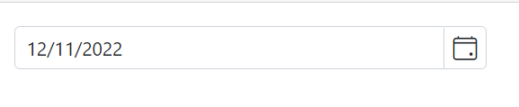
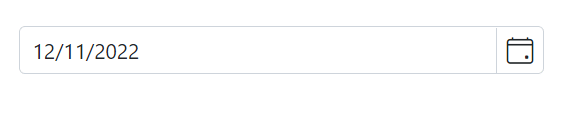

# Mask Support in Blazor DatePicker Component

The masking feature helps users enter a date in the correct format by rendering the input as a mask that follows the configured [Format](https://help.syncfusion.com/cr/blazor/Syncfusion.Blazor.Calendars.SfDatePicker-1.html#Syncfusion_Blazor_Calendars_SfDatePicker_1_Format) property. Set [EnableMask](https://help.syncfusion.com/cr/blazor/Syncfusion.Blazor.Calendars.SfDatePicker-1.html#Syncfusion_Blazor_Calendars_SfDatePicker_1_EnableMask) to `true` to enable masking. The default value of `EnableMask` is `false`.







## MaskPlaceholder

The [DatePickerMaskPlaceholder](https://help.syncfusion.com/cr/blazor/Syncfusion.Blazor.Calendars.DatePickerMaskPlaceholder.html) directive sets the placeholder text for each segment (day, month, year) of the masked input.

The `DatePickerMaskPlaceholder` directive exposes the following properties:

* [Day](https://help.syncfusion.com/cr/blazor/Syncfusion.Blazor.Calendars.MaskPlaceholder.html#Syncfusion_Blazor_Calendars_MaskPlaceholder_Day): Specifies the placeholder text for the day segment of the date value (matches the `d` or `dd` format specifier).
* [Month](https://help.syncfusion.com/cr/blazor/Syncfusion.Blazor.Calendars.MaskPlaceholder.html#Syncfusion_Blazor_Calendars_MaskPlaceholder_Month): Specifies the placeholder text for the month segment of the date value (matches the `M` or `MM` format specifier).
* [Year](https://help.syncfusion.com/cr/blazor/Syncfusion.Blazor.Calendars.MaskPlaceholder.html#Syncfusion_Blazor_Calendars_MaskPlaceholder_Year): Specifies the placeholder text for the year segment of the date value (matches the `yy` or `yyyy` format specifier).

By default, the DatePicker loads placeholder text from the current culture's resources file for each segment. To override the default, specify the segments you want through the `DatePickerMaskPlaceholder` directive.







N> If you do not specify custom placeholder text for a particular segment, the component uses the default placeholder text from the current culture's resource file for that segment.

## See also

* [Date Format](date-format)
* [EnableMask](https://help.syncfusion.com/cr/blazor/Syncfusion.Blazor.Calendars.SfDatePicker-1.html#Syncfusion_Blazor_Calendars_SfDatePicker_1_EnableMask) property
* [Format](https://help.syncfusion.com/cr/blazor/Syncfusion.Blazor.Calendars.SfDatePicker-1.html#Syncfusion_Blazor_Calendars_SfDatePicker_1_Format) property
* [StrictMode](https://help.syncfusion.com/cr/blazor/Syncfusion.Blazor.Calendars.SfDatePicker-1.html#Syncfusion_Blazor_Calendars_SfDatePicker_1_StrictMode) property