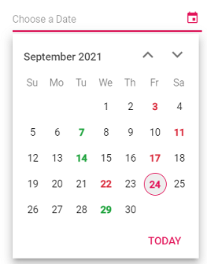

# Special Dates in Blazor DatePicker Component

Customize specific dates in the DatePicker using the [OnRenderDayCell](https://help.syncfusion.com/cr/blazor/Syncfusion.Blazor.Calendars.DatePickerEvents-1.html#Syncfusion_Blazor_Calendars_DatePickerEvents_1_OnRenderDayCell) event. This event is triggered for each day cell as it is created, allowing customization or disabling of specific dates. In the following example, selected dates in the current month are styled by adding the CSS classes personal-appointment and official-appointment defined in the sample.

```cshtml
@using Syncfusion.Blazor.Calendars
<div class="control-wrapper">
    <SfDatePicker TValue="DateTime?" Placeholder="Choose a Date" ShowClearButton="true" @bind-Value="@SelectedDate">
        <DatePickerEvents TValue="DateTime?" OnRenderDayCell="CustomDates" ValueChange="OnChange"></DatePickerEvents>
    </SfDatePicker>
</div>
<div id="display-date">
    <span>Selected Day : @SelectedValue</span>
</div>
@code {
    public DateTime? SelectedDate { get; set; }
    public string SelectedValue { get; set; } = DateTime.Now.ToString("M/d/yyyy");
    public DateTime? CurrentDate { get; set; } = DateTime.Now;
    public void CustomDates(RenderDayCellEventArgs args)
    {
        var CurrentMonth = CurrentDate.Value.Month;
        if (args.Date.Month == CurrentMonth && (args.Date.Day == 7 || args.Date.Day == 14 || args.Date.Day == 24 || args.Date.Day == 29)) {
            args.CellData.ClassList += " personal-appointment";
        }
        if (args.Date.Month == CurrentMonth && (args.Date.Day == 3 || args.Date.Day == 11 || args.Date.Day == 17 || args.Date.Day == 22))
        {
            args.CellData.ClassList += " official-appointment";
        }
    }
    public void OnChange(ChangedEventArgs<DateTime?> args)
    {
        var Count = 0;
        var CurrentMonth = CurrentDate.Value.Month;
        if (args.Value.Value.Month == CurrentMonth && (args.Value.Value.Day == 7 || args.Value.Value.Day == 14 || args.Value.Value.Day == 24 || args.Value.Value.Day == 29))
        {
            this.SelectedValue = this.SelectedDate?.ToString("M/d/yyyy") + " (Personal appointment)";
            Count++;
        }
        if (args.Value.Value.Month == CurrentMonth && (args.Value.Value.Day == 3 || args.Value.Value.Day == 11 || args.Value.Value.Day == 17 || args.Value.Value.Day == 22))
        {
            this.SelectedValue = this.SelectedDate?.ToString("M/d/yyyy") + " (Official appointment)";
            Count++;
        }
        if (Count == 0)
        {
            this.SelectedValue = this.SelectedDate?.ToString("M/d/yyyy");
        }
    }
}
<style>
    #display-date {
        max-width: 270px;
        padding: 15px 0;
        font-size: 13px;
    }
    .control-wrapper {
        width: 300px;
        margin: 0 auto;
        padding-top: 50px;
    }
    .e-calendar .e-content .e-cell.personal-appointment span.e-day,
    .e-calendar .e-content td:hover.e-cell.personal-appointment span.e-day,
    .e-calendar .e-content td.e-selected.e-focused-date.e-cell.personal-appointment span.e-day {
        color: #28a745;
        font-weight: 800;
    }
    .e-calendar .e-content .e-cell.official-appointment span.e-day,
    .e-calendar .e-content td:hover.e-cell.official-appointment span.e-day,
    .e-calendar .e-content td.e-selected.e-focused-date.e-cell.official-appointment span.e-day {
        color: #dc3545;
        font-weight: 800;
    }
    .e-calendar .e-content td.e-selected.e-focused-date.e-cell.personal-appointment span.e-day,
    .e-calendar .e-content td.e-selected.e-focused-date.e-cell.official-appointment span.e-day {
        background-color: #b511485e;
    }
</style>

```

