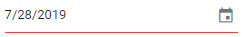

# Strict Mode in Blazor DatePicker Component

The [StrictMode](https://help.syncfusion.com/cr/blazor/Syncfusion.Blazor.Calendars.SfDatePicker-1.html#Syncfusion_Blazor_Calendars_SfDatePicker_1_StrictMode) property controls how typed input is handled with respect to the configured `Min` and `Max` range. By default, StrictMode is disabled (false).

When StrictMode is enabled (true):
- Only valid dates within the `Min` and `Max` range are accepted in the textbox.
- If the entered date is invalid (for example, 31 in a month with 30 days), the component retains the previous valid value.
- If the entered date is out of range, the component clamps the value to the nearest boundary (sets to `Min` when below range, or to `Max` when above range).

The following example demonstrates the DatePicker in StrictMode with a `Min`/`Max` range from the 5th to the 25th of May. Only valid dates within the range are accepted.

```cshtml
@using Syncfusion.Blazor.Calendars

<SfDatePicker TValue="DateTime?" Min='@MinDate' Max='@MaxDate' StrictMode=true Value='@DateValue'></SfDatePicker>

@code {
    public DateTime MinDate {get;set;} = new DateTime(DateTime.Now.Year,DateTime.Now.Month,05);
    public DateTime MaxDate {get;set;} = new DateTime(DateTime.Now.Year, DateTime.Now.Month, 25);
    public DateTime? DateValue {get;set;} = new DateTime(DateTime.Now.Year, DateTime.Now.Month, 28);
}
```


When StrictMode is disabled (false):
- The textbox allows invalid or out-of-range dates to be entered.
- If the date is invalid, the model value becomes `null`.
- If the date is out of range, the model can hold the out-of-range value. The input is highlighted with an `error` style to indicate an invalid or out-of-range entry.

The following example demonstrates StrictMode set to false. Both valid and invalid values can be entered in the textbox.

```cshtml
@using Syncfusion.Blazor.Calendars

<SfDatePicker TValue="DateTime?" Min='@MinDate' Max='@MaxDate' StrictMode=false Value='@DateValue'></SfDatePicker>

@code {
    public DateTime MinDate {get;set;} = new DateTime(DateTime.Now.Year,DateTime.Now.Month,05);
    public DateTime MaxDate {get;set;} = new DateTime(DateTime.Now.Year, DateTime.Now.Month, 25);
    public DateTime? DateValue {get;set;} = new DateTime(DateTime.Now.Year, DateTime.Now.Month, 28);
}
```



N> Calendar selection always respects `Min` and `Max` regardless of StrictMode; disabled dates cannot be picked from the popup. If the values of `Min` or `Max` are changed through code-behind at runtime, update the `Value` property to ensure it remains within the defined range.