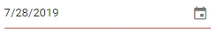

---
layout: post
title: Strict Mode in Blazor DatePicker Component | Syncfusion®
description: Checkout and learn here all the features about Strict Mode in Blazor DatePicker component and much more.
platform: Blazor
control: DatePicker
documentation: ug
---

# Strict Mode in Blazor DatePicker Component

The [StrictMode](https://help.syncfusion.com/cr/blazor/Syncfusion.Blazor.Calendars.SfDatePicker-1.html#Syncfusion_Blazor_Calendars_SfDatePicker_1_StrictMode) property controls how the DatePicker handles invalid or out-of-range values entered in the input. When `StrictMode` is enabled:

* If the entered value is invalid, the component keeps the previous value.
* If the entered value is out of range, the component clamps the value to the nearest `Min` or `Max` boundary.

The default value of `StrictMode` is `false`. When `StrictMode` is `false`, invalid or out-of-range values are accepted but the model value is set to `null` and the `e-error` CSS class is applied to the input to highlight the issue. The `Min` and `Max` properties are inherited from [CalendarBase<TValue>](https://help.syncfusion.com/cr/blazor/Syncfusion.Blazor.Calendars.CalendarBase-1.html) and default to `null` (no bound). For more information, see [Date Range](date-range).

## Strict mode enabled

The following example enables `StrictMode` and sets a `Min`/`Max` range of 5–25 of the current month. The initial `Value` is the 28th, which is outside the range.

```cshtml
@using Syncfusion.Blazor.Calendars

<SfDatePicker TValue="DateTime?" Min='@MinDate' Max='@MaxDate' StrictMode=true Value='@DateValue'></SfDatePicker>

@code {
    public DateTime MinDate {get;set;} = new DateTime(DateTime.Now.Year,DateTime.Now.Month,05);
    public DateTime MaxDate {get;set;} = new DateTime(DateTime.Now.Year, DateTime.Now.Month, 25);
    public DateTime? DateValue {get;set;} = new DateTime(DateTime.Now.Year, DateTime.Now.Month, 28);
}
```

In this configuration:

* If the user enters an out-of-range value such as the 28th, the `Value` is clamped to the `Max` date (the 25th), because 28 is greater than 25.
* If the user enters an invalid value, the `Value` remains at the previous valid value.


## Strict mode disabled (default)

The following example disables `StrictMode` (the default behavior). The DatePicker accepts invalid or out-of-range values but marks the input as invalid.

```cshtml
@using Syncfusion.Blazor.Calendars

<SfDatePicker TValue="DateTime?" Min='@MinDate' Max='@MaxDate' StrictMode=false Value='@DateValue'></SfDatePicker>

@code {
    public DateTime MinDate {get;set;} = new DateTime(DateTime.Now.Year,DateTime.Now.Month,05);
    public DateTime MaxDate {get;set;} = new DateTime(DateTime.Now.Year, DateTime.Now.Month, 25);
    public DateTime? DateValue {get;set;} = new DateTime(DateTime.Now.Year, DateTime.Now.Month, 28);
}
```

When the entered value is out of range or invalid, the model value is reset to `null` and the `e-error` CSS class is applied to the input to indicate the issue.



N> If the value of the `Min` or `Max` property is changed through code-behind, you have to update the `Value` property so that it stays within the range.

## See also

* [Date Range](date-range)
* [Min](https://help.syncfusion.com/cr/blazor/Syncfusion.Blazor.Calendars.CalendarBase-1.html#Syncfusion_Blazor_Calendars_CalendarBase_1_Min) property
* [Max](https://help.syncfusion.com/cr/blazor/Syncfusion.Blazor.Calendars.CalendarBase-1.html#Syncfusion_Blazor_Calendars_CalendarBase_1_Max) property
* [StrictMode](https://help.syncfusion.com/cr/blazor/Syncfusion.Blazor.Calendars.SfDatePicker-1.html#Syncfusion_Blazor_Calendars_SfDatePicker_1_StrictMode) property