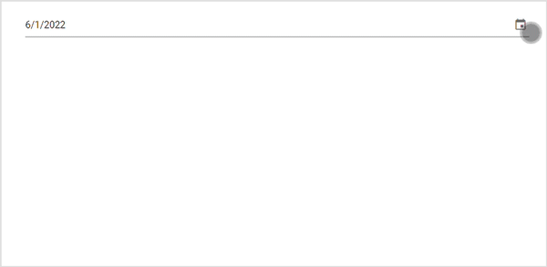
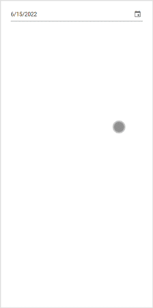

# Style and Appearance in Blazor DatePicker Component

The following content provides the exact CSS structure that can be used to modify the control's appearance based on the user preference.

## Customizing the appearance of DatePicker container element

Use the following CSS to customize the appearance of DatePicker container element.

```css
/* To specify height and font size */
.e-input-group input.e-input, .e-input-group.e-control-wrapper input.e-input {
        height: 40px;
        font-size: 20px;
}
```

## Customizing the DatePicker icon element

Use the following CSS to customize the DatePicker icon element

```css
/* To specify background color and font size */
.e-input-group .e-input-group-icon:last-child, .e-input-group.e-control-wrapper .e-input-group-icon:last-child {
        font-size: 12px;
        background-color: darkgray;
}
```

## Adding backgroud color to DatePicker container element

Use the following CSS to add color to DatePicker container element.

```css
/* To specify height and font size */
.e-input-group input.e-input, .e-input-group.e-control-wrapper input.e-input {
        background-color: green; 
}
```

## Customizing the Calendar popup of the DatePicker

### Mobile mode full screen calendar popup in material theme

We can render the full screen calendar popup in mobile device(s) by adding `e-popup-expand` class to the [CssClass](https://help.syncfusion.com/cr/blazor/Syncfusion.Blazor.Calendars.DatePickerModel.html#Syncfusion_Blazor_Calendars_DatePickerModel_CssClass) property of DatePicker component, Which supports both landscape and portrait orientations.











Also check the below section to customize the style and appearance of the Calendar component

[Customizing Calendar's style and appearance](../calendar/style-appearance/)