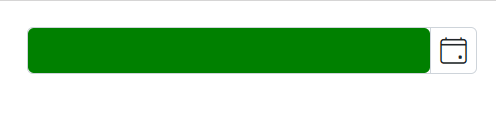
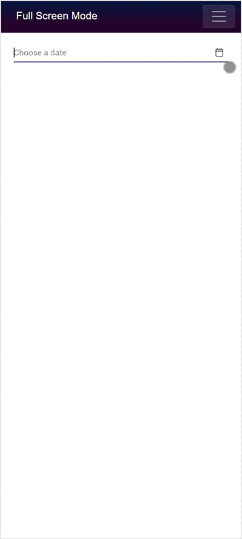

# Style and Appearance in Blazor DatePicker Component

This section describes how to tailor the DatePicker component’s appearance with CSS, component properties, and mobile full-screen support. For theming guidance, refer to Syncfusion themes and appearance documentation.

- Syncfusion Blazor themes overview: https://blazor.syncfusion.com/documentation/common/appearance
- DatePicker component: https://blazor.syncfusion.com/documentation/datepicker/getting-started

## Customize the DatePicker container element

Adjust the visible input height and font size by targeting the DatePicker wrapper. The following example scopes styles with a wrapper class to prevent affecting other inputs on the page.

```cshtml
@using Syncfusion.Blazor.Calendars

<div class="dp-container-custom">
    <SfDatePicker TValue="DateTime?" Placeholder="Select date"></SfDatePicker>
</div>
```

```css
/* Scoped container/input size adjustments */
.dp-container-custom .e-input-group input.e-input,
.dp-container-custom .e-input-group.e-control-wrapper input.e-input {
    height: 40px;
    font-size: 20px;
}
```

Preview:
- The DatePicker input renders taller with a 40px height, and text appears larger at 20px font size.

## Customize the DatePicker icon element

Modify the DatePicker’s icon size and background color with a scoped wrapper.

```cshtml
@using Syncfusion.Blazor.Calendars

<div class="dp-icon-custom">
    <SfDatePicker TValue="DateTime?" Placeholder="Select date"></SfDatePicker>
</div>
```

```css
/* Scoped icon size and background color */
.dp-icon-custom .e-input-group .e-input-group-icon:last-child,
.dp-icon-custom .e-input-group.e-control-wrapper .e-input-group-icon:last-child {
    font-size: 12px;
    background-color: darkgray;
}
```

Preview:
- The calendar icon displays slightly smaller glyphs and a dark gray background on the icon button.

## Customize the appearance of the DatePicker label

To adjust the floating label’s size and color, use the CssClass property with custom CSS. The example below applies a compact label size and blue color.

- CssClass API: https://help.syncfusion.com/cr/blazor/Syncfusion.Blazor.Inputs.SfInputTextBase-1.html#Syncfusion_Blazor_Inputs_SfInputTextBase_1_CssClass

```cshtml
@using Syncfusion.Blazor.Calendars
@using Syncfusion.Blazor.Inputs

<SfDatePicker TValue="DateTime?"
              Placeholder="Earliest date..."
              FloatLabelType="@FloatLabelType.Always"
              CssClass="e-small data-color"
              Width="150px">
</SfDatePicker>
```

```css
.data-color.e-float-input.e-control-wrapper label.e-float-text,
.data-color.e-float-input input:valid ~ label.e-float-text,
.data-color.e-float-input input ~ label.e-label-top.e-float-text,
.data-color.e-float-input.e-input-focus label.e-float-text,
.data-color.e-float-input:not(.e-error) input:valid ~ label.e-float-text,
.data-color.e-float-input:not(.e-error) input ~ label.e-label-top.e-float-text {
    font-size: 10px;
    color: blue;
}
```

Preview:
- The floating label renders in a compact 10px size and blue color above the input, including when focused or when the input has a value.

## Add background color to the DatePicker container element

Customize the background color of the visible input by targeting the wrapper class and setting the background-color property.











## Full screen mode support on mobiles and tablets

The DatePicker supports full-screen mode on mobile devices to improve popup visibility. Set the FullScreen property to true. On mobile devices, the calendar expands to occupy the entire screen; desktop behavior remains unchanged.

- FullScreen API: https://help.syncfusion.com/cr/blazor/Syncfusion.Blazor.Calendars.SfDatePicker-1.html#Syncfusion_Blazor_Calendars_SfDatePicker_1_FullScreen

```cshtml
@using Syncfusion.Blazor.Calendars

<SfDatePicker TValue="DateTime?" FullScreen="true"></SfDatePicker>
```


