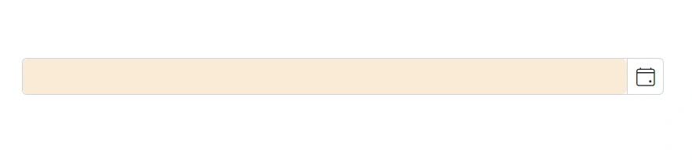
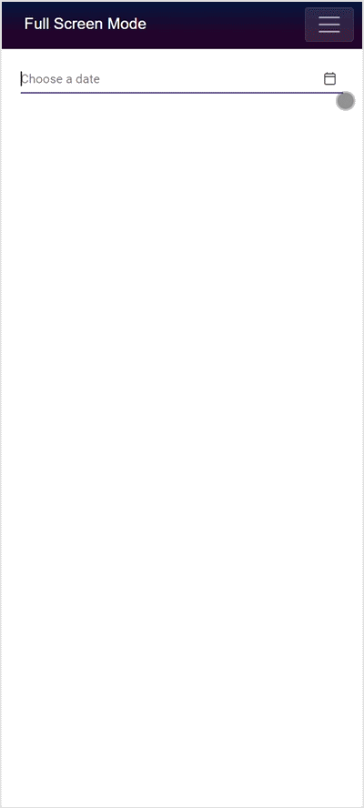

# Style and Appearance in Blazor DatePicker

The following content provides the exact CSS structure that can be used to modify the control's appearance based on the user preference.

## Customizing the appearance of DatePicker container element

Use the following CSS to customize the appearance of the DatePicker container element

```css
/* To specify height and font size */
.e-input-group input.e-input, .e-input-group.e-control-wrapper input.e-input {
        height: 40px;
        font-size: 20px;
}
```

## Customizing the DatePicker icon element

Use the following CSS to customize the DatePicker icon element

```css
/* To specify background color and font size */
.e-input-group .e-input-group-icon:last-child, .e-input-group.e-control-wrapper .e-input-group-icon:last-child {
        font-size: 12px;
        background-color: darkgray;
}
```

## Customizing the appearance of the DatePicker label

To customize the appearance of the DatePicker label, use the [CssClass](https://help.syncfusion.com/cr/blazor/Syncfusion.Blazor.Inputs.SfInputTextBase-1.html#Syncfusion_Blazor_Inputs_SfInputTextBase_1_CssClass) property in combination with custom CSS.

```cshtml
@using Syncfusion.Blazor.Calendars

<SfDatePicker TValue="DateTime?" Placeholder="earliest date..." FloatLabelType="@FloatLabelType.Always" CssClass="e-small data-color" Width="150px">
</SfDatePicker>

```
```css
    .data-color.e-float-input.e-control-wrapper label.e-float-text,
    .data-color.e-float-input input:valid~label.e-float-text, 
    .data-color.e-float-input input~label.e-label-top.e-float-text,
    .data-color.e-float-input.e-input-focus label.e-float-text,
    .data-color.e-float-input:not(.e-error) input:valid~label.e-float-text, 
    .data-color.e-float-input:not(.e-error) input~label.e-label-top.e-float-text
      {
      font-size : 10px;
      color: blue;
    }
```

## Adding background color to DatePicker container element

You can set the background color of the DatePicker container by targeting the `input.e-input` class with the `background-color` property.











## Full screen mode support in mobiles and tablets

The DatePicker can render its popup in full-screen mode on mobile and tablet devices, in both landscape and portrait orientations. Enable full-screen mode by setting the [FullScreen](https://help.syncfusion.com/cr/blazor/Syncfusion.Blazor.Calendars.SfDatePicker-1.html#Syncfusion_Blazor_Calendars_SfDatePicker_1_FullScreen) property to `true`. The default value of `FullScreen` is `false`.

```cshtml
@using Syncfusion.Blazor.Calendars

<SfDatePicker TValue="DateTime?" FullScreen=true></SfDatePicker>

```



Also check the below section to customize the style and appearance of the Calendar component

[Customizing Calendar's style and appearance](../calendar/style-appearance)

## See also

* [FullScreen](https://help.syncfusion.com/cr/blazor/Syncfusion.Blazor.Calendars.SfDatePicker-1.html#Syncfusion_Blazor_Calendars_SfDatePicker_1_FullScreen) property
* [CssClass](https://help.syncfusion.com/cr/blazor/Syncfusion.Blazor.Inputs.SfInputTextBase-1.html#Syncfusion_Blazor_Inputs_SfInputTextBase_1_CssClass) property
* [FloatLabelType](https://help.syncfusion.com/cr/blazor/Syncfusion.Blazor.Calendars.SfDatePicker-1.html#Syncfusion_Blazor_Calendars_SfDatePicker_1_FloatLabelType) property
* [Width](https://help.syncfusion.com/cr/blazor/Syncfusion.Blazor.Calendars.SfDatePicker-1.html#Syncfusion_Blazor_Calendars_SfDatePicker_1_Width) property
* [Customizing the Calendar style and appearance](../calendar/style-appearance)