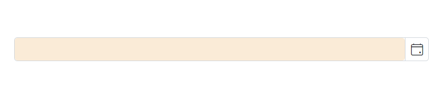

# Style and Appearance in Blazor DatePicker Component

The following content provides the exact CSS structure that can be used to modify the control's appearance based on the user preference.

## Customizing the appearance of DatePicker container element

Use the following CSS to customize the appearance of DatePicker container element.

```css
/* To specify height and font size */
.e-input-group input.e-input, .e-input-group.e-control-wrapper input.e-input {
        height: 40px;
        font-size: 20px;
}
```

## Customizing the DatePicker icon element

Use the following CSS to customize the DatePicker icon element

```css
/* To specify background color and font size */
.e-input-group .e-input-group-icon:last-child, .e-input-group.e-control-wrapper .e-input-group-icon:last-child {
        font-size: 12px;
        background-color: darkgray;
}
```

## Customizing the appearance of the DatePicker label 

To customize the appearance of the DatePicker label, you can use the [CssClass](https://help.syncfusion.com/cr/blazor/Syncfusion.Blazor.Inputs.SfInputTextBase-1.html#Syncfusion_Blazor_Inputs_SfInputTextBase_1_CssClass) property in combination with custom CSS. 

```cshtml
@using Syncfusion.Blazor.Calendars

<SfDatePicker TValue="DateTime?" Placeholder="earliest date..." FloatLabelType="@FloatLabelType.Always" CssClass="e-small data-color" Width="150px">
</SfDatePicker>

```
```css
    .data-color.e-float-input.e-control-wrapper label.e-float-text,
    .data-color.e-float-input input:valid~label.e-float-text, 
    .data-color.e-float-input input~label.e-label-top.e-float-text,
    .data-color.e-float-input.e-input-focus label.e-float-text,
    .data-color.e-float-input:not(.e-error) input:valid~label.e-float-text, 
    .data-color.e-float-input:not(.e-error) input~label.e-label-top.e-float-text
      {
      font-size : 10px;
      color: blue;
    }
```

## Adding background color to DatePicker container element

You can customize the background color of the container element for the DatePicker by targeting its CSS class, `input.e-input`, and setting the desired color to the `background-color` property.











## Full screen mode support in mobiles and tablets

The DatePicker component's full-screen mode feature enables users to view the component popup element in full-screen mode on mobile devices with improved visibility and a better user experience. It is important to mention that this feature is exclusively available for mobile devices in both landscape and portrait orientations. To activate the full screen mode within the DatePicker component, simply set the [FullScreen](https://help.syncfusion.com/cr/blazor/Syncfusion.Blazor.Calendars.SfDatePicker-1.html#Syncfusion_Blazor_Calendars_SfDatePicker_1_FullScreen) API value to `true`. This action will extend the calendar element to occupy the entire screen on mobile devices.

```cshtml
@using Syncfusion.Blazor.Calendars

<SfDatePicker TValue="DateTime?" FullScreen=true></SfDatePicker>

```


Also check the below section to customize the style and appearance of the Calendar component

[Customizing Calendar's style and appearance](../calendar/style-appearance)
