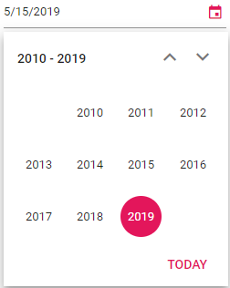

# Start and Depth View in Blazor DatePicker Component

The DatePicker provides predefined calendar views and properties to control the initial view and navigation depth when selecting a date.

| **View** | **Description** |
| --- | --- |
| Month (default) | Displays the days in a month. |
| Year | Displays the months in a year. |
| Decade | Displays the years in a decade. |

## Start view

Use the [Start](https://help.syncfusion.com/cr/blazor/Syncfusion.Blazor.Calendars.CalendarBase-1.html#Syncfusion_Blazor_Calendars_CalendarBase_1_Start) property to define the initial view shown when the popup opens. If not set, the initial view defaults to Month.

The following example demonstrates how to create a DatePicker with `Decade` as the initial view.

```cshtml
@using Syncfusion.Blazor.Calendars

<SfDatePicker TValue="DateTime?" Value='@DateValue' Placeholder='Select a date' Start='CalendarView.Decade'></SfDatePicker>

@code {
    public DateTime? DateValue {get;set;} = DateTime.Now;
}
```



## Depth view

Use the [Depth](https://help.syncfusion.com/cr/blazor/Syncfusion.Blazor.Calendars.CalendarBase-1.html#Syncfusion_Blazor_Calendars_CalendarBase_1_Depth) property to control how far the user can navigate when drilling down. Depth must be the same as, or a more detailed view than, Start (Month is more detailed than Year, and Year is more detailed than Decade). If Depth is set to a broader view than Start, the component constrains navigation to a valid combination.

The following example demonstrates how to create a DatePicker that allows users to select a month (Start at Decade, navigate down to Year):

```cshtml
@using Syncfusion.Blazor.Calendars

<SfDatePicker TValue="DateTime?" Value='@DateValue' Placeholder='choose a date' Start='CalendarView.Decade' Depth='CalendarView.Year'></SfDatePicker>

@code {
    public DateTime? DateValue { get; set; } = DateTime.Now;
}
```

N> To learn more about Calendar views, refer to the Calendar’s [Calendar Views](../calendar/calendar-views) section.