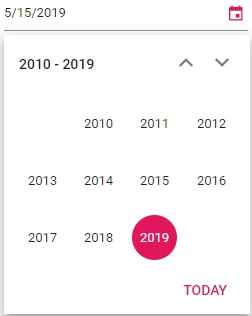

# Start and Depth View in Blazor DatePicker

The Blazor DatePicker provides the following predefined [CalendarView](https://help.syncfusion.com/cr/blazor/Syncfusion.Blazor.Calendars.CalendarView.html) values that let users navigate the calendar and select a date:

| **View** | **Description** |
| --- | --- |
| `CalendarView.Month` (default for `Start`) | Displays the days in a month. |
| `CalendarView.Year` | Displays the months in a year. |
| `CalendarView.Decade` | Displays the years in a decade. |

## Start view

Use the [Start](https://help.syncfusion.com/cr/blazor/Syncfusion.Blazor.Calendars.CalendarBase-1.html#Syncfusion_Blazor_Calendars_CalendarBase_1_Start) property to set the initial view shown when the popup opens. The default value of `Start` is `CalendarView.Month`. After the popup opens, the user can navigate to a deeper view (for example, from `Year` to `Month`) by clicking the view header.

The following example renders the Blazor DatePicker with `Decade` as the initial view.

```cshtml
@using Syncfusion.Blazor.Calendars

<SfDatePicker TValue="DateTime?" Value='@DateValue' Placeholder='Select a date' Start='CalendarView.Decade'></SfDatePicker>

@code {
    public DateTime? DateValue {get;set;} = DateTime.Now;
}
```



## Depth view

Define the [Depth](https://help.syncfusion.com/cr/blazor/Syncfusion.Blazor.Calendars.CalendarBase-1.html#Syncfusion_Blazor_Calendars_CalendarBase_1_Depth) property to control the view navigation.

> Always the Depth view has to be smaller than the Start view, otherwise the view restriction will be not restricted.

The following example demonstrates how to create a Blazor DatePicker that allows users to select a month.

```cshtml
@using Syncfusion.Blazor.Calendars

<SfDatePicker TValue="DateTime?" Value="@DateValue" Placeholder="Select a date" Start="CalendarView.Decade" Depth="CalendarView.Month"></SfDatePicker>

@code {
    public DateTime? DateValue { get; set; } = DateTime.Now;
}
```

N> To learn more about Calendar views, see the Calendar's [Calendar Views](../calendar/calendar-views) section. The [Navigated](https://help.syncfusion.com/cr/blazor/Syncfusion.Blazor.Calendars.DatePickerEvents-1.html#Syncfusion_Blazor_Calendars_DatePickerEvents_1_Navigated) event fires whenever the user navigates to a different view.

## See also

* [CalendarView](https://help.syncfusion.com/cr/blazor/Syncfusion.Blazor.Calendars.CalendarView.html) enum
* [Start](https://help.syncfusion.com/cr/blazor/Syncfusion.Blazor.Calendars.CalendarBase-1.html#Syncfusion_Blazor_Calendars_CalendarBase_1_Start) property
* [Depth](https://help.syncfusion.com/cr/blazor/Syncfusion.Blazor.Calendars.CalendarBase-1.html#Syncfusion_Blazor_Calendars_CalendarBase_1_Depth) property
* [Events](events)