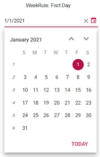
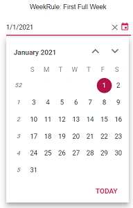
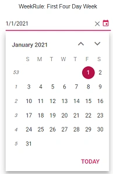

---
layout: post
title: Week Numbers in Blazor DatePicker Component | Syncfusion®
description: Checkout and learn here all the features about Week Numbers in Blazor DatePicker component and more details.
platform: Blazor
control: DatePicker
documentation: ug
---

# Week Number in Blazor DatePicker Component

The DatePicker can display the week number alongside each row of the calendar. Use the [WeekNumber](https://help.syncfusion.com/cr/blazor/Syncfusion.Blazor.Calendars.CalendarBase-1.html#Syncfusion_Blazor_Calendars_CalendarBase_1_WeekNumber) property to toggle the display. The default value of `WeekNumber` is `false`.

```cshtml
@using Syncfusion.Blazor.Calendars

<SfDatePicker TValue="DateTime?" Width="250px" WeekNumber="true"></SfDatePicker>
```


## Week rule

Use the [WeekRule](https://help.syncfusion.com/cr/blazor/Syncfusion.Blazor.Calendars.CalendarBase-1.html#Syncfusion_Blazor_Calendars_CalendarBase_1_WeekRule) property to specify the rule used to define the first week of the year. The default value of `WeekRule` is `WeekRule.FirstDay`. The available values are:

| Value | Description |
| --- | --- |
| `WeekRule.FirstDay` | The first week of the year is numbered 1. The numbering then continues as 1, 2, 3, ... |
| `WeekRule.FirstFullWeek` | The first week of the year is numbered 52 or 53 (that is, the last week of the previous December). The numbering then continues as 53, 1, 2, ... |
| `WeekRule.FirstFourDayWeek` | The week number is based on the majority of dates in the week: if the week contains more January dates than December dates, the first week of the year is numbered 1; otherwise it is numbered 52 or 53. |

The following example uses the `FirstFullWeek` rule.

```cshtml
@using Syncfusion.Blazor.Calendars

<SfDatePicker TValue="DateTime?" Width="250px" WeekNumber="true" WeekRule="WeekRule.FirstFullWeek"></SfDatePicker>
```







## See also

* [WeekNumber](https://help.syncfusion.com/cr/blazor/Syncfusion.Blazor.Calendars.CalendarBase-1.html#Syncfusion_Blazor_Calendars_CalendarBase_1_WeekNumber) property
* [WeekRule](https://help.syncfusion.com/cr/blazor/Syncfusion.Blazor.Calendars.CalendarBase-1.html#Syncfusion_Blazor_Calendars_CalendarBase_1_WeekRule) property
* [Date Format](date-format)
* [Calendar component](../calendar/getting-started)