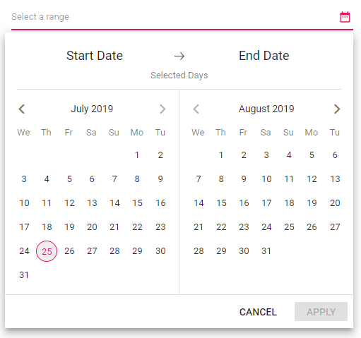

# Customization in Blazor DateRangePicker Component

The DateRangePicker is available for UI customization that can be achieved by using the available properties and events in the component.

## First day of week

Start day in a week will differ based on the culture, but you can also customize this based on the application needs.
For this, use the [FirstDayOfWeek](https://help.syncfusion.com/cr/blazor/Syncfusion.Blazor.Calendars.DateRangePickerModel.html#Syncfusion_Blazor_Calendars_DateRangePickerModel_FirstDayOfWeek) property.
By default, first day of a week in en-US is Sunday. In the following example, it is customized to Wednesday with the help of this property.

```cshtml
@using Syncfusion.Blazor.Calendars

<SfDateRangePicker TValue="DateTime?" Placeholder="Select a range" FirstDayOfWeek=3></SfDateRangePicker>
```

The output will be as follows.



> You can refer to our [Blazor Date Range Picker](https://www.syncfusion.com/blazor-components/blazor-daterangepicker) feature tour page for its groundbreaking feature representations. You can also explore our [Blazor Date Range Picker example](https://blazor.syncfusion.com/demos/daterangepicker/default-functionalities?theme=bootstrap4) to understand how to present and manipulate data.