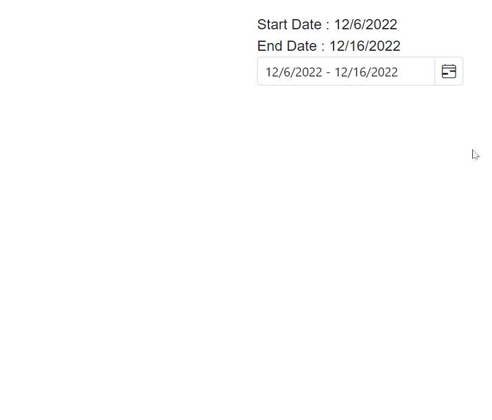

# DateOnly Support in Blazor DateRangePicker Component

The [DateOnly](https://learn.microsoft.com/en-us/dotnet/api/system.dateonly?view=net-7.0) type was introduced in .NET 6 to represent a date without a time component. To use DateOnly with the Blazor DateRangePicker component, set the generic type parameter (`TValue`) to `DateOnly`.

> The Blazor DateRangePicker component supports the `DateOnly` type in .NET 7 and later. Although DateOnly was introduced in .NET 6, full support in Blazor requires .NET 7 due to serialization and model binding updates.

Key points when using DateOnly:
- Configure `TValue="DateOnly"` (or `DateOnly?` for nullable scenarios, such as clearing the range).
- Ensure `StartDate` and `EndDate` properties and bindings use `DateOnly` (or `DateOnly?`) to match `TValue`.
- Use `@bind-StartDate` and `@bind-EndDate` for two-way binding with DateOnly properties.
- DateOnly represents dates only; formatting and parsing follow the current culture and do not include time or time zone.







