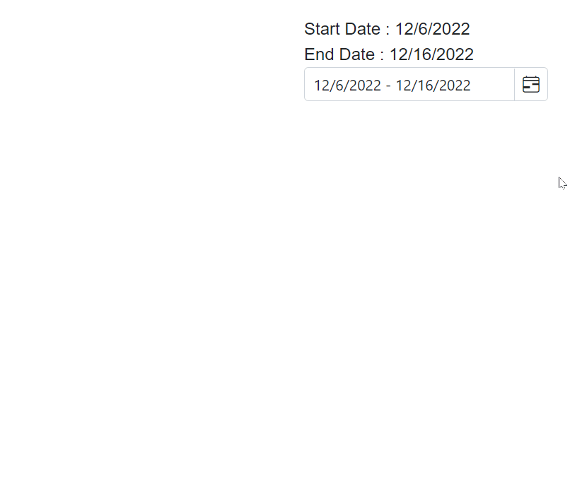

# DateOnly Support in Blazor DateRangePicker

The [DateOnly](https://learn.microsoft.com/en-us/dotnet/api/system.dateonly) type was introduced in .NET 6 and allows you to represent a date without a time component. To use it with the Blazor DateRangePicker component, set the `TValue` parameter to `DateOnly`.

> The Blazor DateRangePicker component supports the `DateOnly` type in .NET 7 and above only, even though it was introduced in .NET 6, due to a serialization problem.







