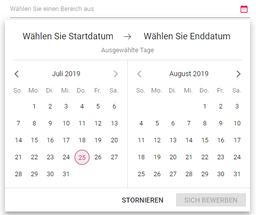

# Globalization in Blazor DateRangePicker Component

[Blazor DateRangePicker](https://www.syncfusion.com/blazor-components/blazor-daterangepicker) component can be localized. Refer to [Blazor Localization](https://blazor.syncfusion.com/documentation/common/localization) topic to localize Syncfusion Blazor components.

## Customize the localized text

You can change the localized text of particular component by editing the `wwwroot/blazor-locale/src/{{locale name}}.json` file.

[`wwwroot/blazor-locale/src/de.json`]

```csharp
{
  "de": {
    "daterangepicker": {
        "placeholder": "Wählen Sie einen Bereich aus",
        "startLabel": "Wählen Sie Startdatum",
        "endLabel": "Wählen Sie Enddatum",
        "applyText": "Sich bewerben",
        "cancelText": "Stornieren",
        "selectedDays": "Ausgewählte Tage",
        "days": "Tage",
        "customRange": "benutzerdefinierten Bereich"
    }
  }
}
```




## Right-To-Left

The DateRangePicker supports RTL (right-to-left) functionality for languages like Hebrew and Hebrew to display the text in the right-to-left direction. Use [EnableRtl](https://help.syncfusion.com/cr/blazor/Syncfusion.Blazor.Calendars.SfDateRangePicker-1.html#Syncfusion_Blazor_Calendars_SfDateRangePicker_1_EnableRtl) property to set the RTL direction.

The following code example initialize the DateRangePicker component in `Hebrew` culture.

```cshtml
@using Syncfusion.Blazor.Calendars
@inject HttpClient Http;

<SfDateRangePicker TValue="DateTime?" Locale="ar" EnableRtl=true></SfDateRangePicker>

@code {
    [Inject]
    protected IJSRuntime JsRuntime { get; set; }
    protected override async Task OnInitializedAsync()
    {  
        this.JsRuntime.Sf().LoadLocaleData(await Http.GetJsonAsync<object>("blazor-locale/src/ar.json")).SetCulture("ar");
    }
```


> You can refer to our [Blazor Date Range Picker](https://www.syncfusion.com/blazor-components/blazor-daterangepicker) feature tour page for its groundbreaking feature representations. You can also explore our [Blazor Date Range Picker example](https://blazor.syncfusion.com/demos/daterangepicker/default-functionalities?theme=bootstrap4) to understand how to present and manipulate data.
