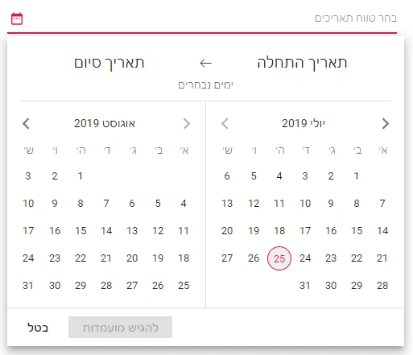

# Globalization in Blazor DateRangePicker

[Blazor DateRangePicker](https://www.syncfusion.com/blazor-components/blazor-daterangepicker) component can be localized. Refer to [Blazor Localization](https://blazor.syncfusion.com/documentation/common/localization) topic to localize Blazor components.

## Right-To-Left

The Blazor DateRangePicker supports RTL (right-to-left) functionality for languages like Arabic and Hebrew. Use the [EnableRtl](https://help.syncfusion.com/cr/blazor/Syncfusion.Blazor.Calendars.SfDateRangePicker-1.html#Syncfusion_Blazor_Calendars_SfDateRangePicker_1_EnableRtl) property to set the RTL direction. The component renders based on the system culture.

The following code example initializes the Blazor DateRangePicker component in RTL mode.

```cshtml
@using Syncfusion.Blazor
@using Syncfusion.Blazor.Calendars

<SfDateRangePicker TValue="DateTime?" EnableRtl=true></SfDateRangePicker>
```



N> You can refer to our [Blazor Date Range Picker](https://www.syncfusion.com/blazor-components/blazor-daterangepicker) feature tour page for its groundbreaking feature representations. You can also explore our [Blazor Date Range Picker example](https://blazor.syncfusion.com/demos/daterangepicker/default-functionalities?theme=fluent2) to understand how to present and manipulate data.
