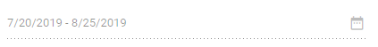

# Disable the Blazor DateRangePicker Component

DateRangePicker can be deactivated on a page. Setting [Enabled](https://help.syncfusion.com/cr/blazor/Syncfusion.Blazor.Calendars.SfDateRangePicker-1.html#Syncfusion_Blazor_Calendars_SfDateRangePicker_1_Enabled) value to false will disable the component completely from all user interactions, including form post. The following code demonstrates the disabled component.

```cshtml
@using Syncfusion.Blazor.Calendars

<SfDateRangePicker TValue="DateTime?" Enabled=false StartDate="@Start" EndDate="@End"></SfDateRangePicker>

@code {
    public DateTime? Start { get; set; } = new DateTime(DateTime.Now.Year, DateTime.Now.Month, 20);
    public DateTime? End { get; set; } = new DateTime(DateTime.Now.Year, DateTime.Now.Month + 1, 25);
}
```




N> You can refer to our [Blazor Date Range Picker](https://www.syncfusion.com/blazor-components/blazor-daterangepicker) feature tour page for its groundbreaking feature representations. You can also explore our [Blazor Date Range Picker example](https://blazor.syncfusion.com/demos/daterangepicker/default-functionalities?theme=bootstrap5) to understand how to present and manipulate data.