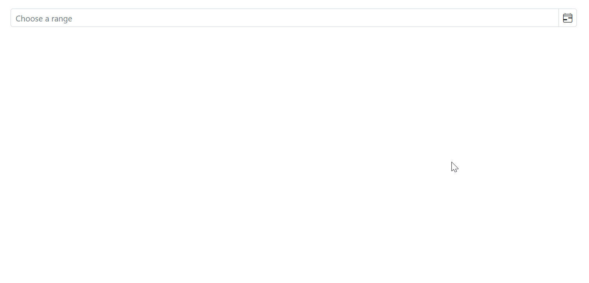

# How to open popup on input click in Blazor DateRangePicker

You can open the DateRangePicker popup on input focus by setting the [OpenOnFocus](https://help.syncfusion.com/cr/blazor/Syncfusion.Blazor.Calendars.SfDateRangePicker-1.html#Syncfusion_Blazor_Calendars_SfDateRangePicker_1_OpenOnFocus) property to `true`. The default value of the `OpenOnFocus` property is `false`.

The following example shows how to open the DateRangePicker popup on focus. The `ShowClearButton` property is enabled so the selected range can be cleared using the built-in clear button.

```cshtml
@using Syncfusion.Blazor.Calendars

<SfDateRangePicker TValue="DateTime?" Placeholder="Choose a range" OpenOnFocus="true" ShowClearButton="true"></SfDateRangePicker>
```




