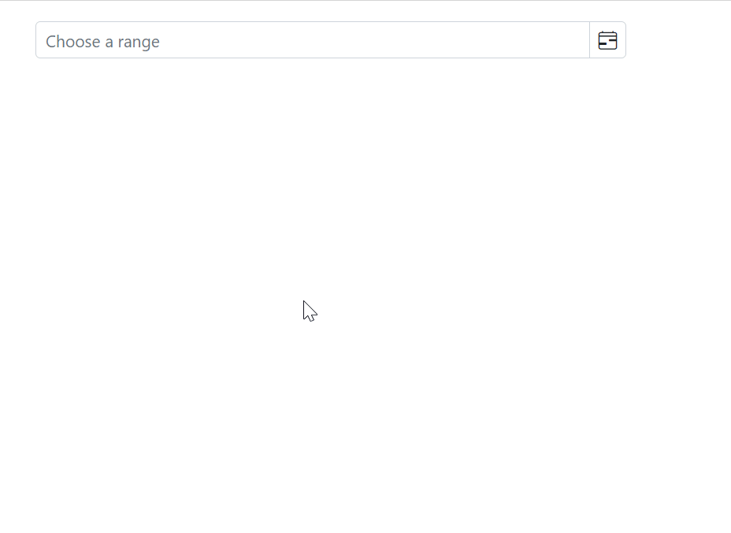

# Open the Blazor DateRangePicker popup on Focus

You can also open the DateRangePicker popup on input focus by setting the [OpenOnFocus](https://help.syncfusion.com/cr/blazor/Syncfusion.Blazor.Calendars.SfDateRangePicker-1.html#Syncfusion_Blazor_Calendars_SfDateRangePicker_1_OpenOnFocus) property to true.

The following example demonstrates how to open the DateRangePicker popup when the input is focused.

```cshtml
@using Syncfusion.Blazor.Calendars

<SfDateRangePicker TValue="DateTime?" Placeholder="Choose a range" OpenOnFocus="true" ShowClearButton="true"></SfDateRangePicker>

```




