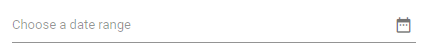

# Set the Placeholder

The following code demonstrates how to set [Placeholder](https://help.syncfusion.com/cr/blazor/Syncfusion.Blazor.Calendars.SfDateRangePicker.html#Syncfusion_Blazor_Calendars_SfDateRangePicker_Placeholder) in the DateRangePicker component.

Using `Placeholder`, you can display a short hint in the input element.

```cshtml
@using Syncfusion.Blazor.Calendars

<SfDateRangePicker TValue="DateTime?" Placeholder="Choose a date range"></SfDateRangePicker>
```

The output will be as follows.



> You can refer to our [Blazor Date Range Picker](https://www.syncfusion.com/blazor-components/blazor-daterangepicker) feature tour page for its groundbreaking feature representations. You can also explore our [Blazor Date Range Picker example](https://blazor.syncfusion.com/demos/daterangepicker/default-functionalities?theme=bootstrap4) to understand how to present and manipulate data.