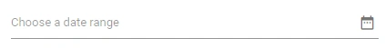

# Set the Placeholder in Blazor DateRangePicker Component

The following example shows how to set the [Placeholder](https://help.syncfusion.com/cr/blazor/Syncfusion.Blazor.Calendars.SfDateRangePicker-1.html#Syncfusion_Blazor_Calendars_SfDateRangePicker_1_Placeholder) in the DateRangePicker. The placeholder displays a short hint in the input element. The default value of the `Placeholder` property is an empty string.

```cshtml
@using Syncfusion.Blazor.Calendars

<SfDateRangePicker TValue="DateTime?" Placeholder="Choose a date range"></SfDateRangePicker>
```




N> You can refer to our [Blazor Date Range Picker](https://www.syncfusion.com/blazor-components/blazor-daterangepicker) feature tour page for its groundbreaking feature representations. You can also explore our [Blazor Date Range Picker example](https://blazor.syncfusion.com/demos/daterangepicker/default-functionalities?theme=fluent2) to understand how to present and manipulate data.