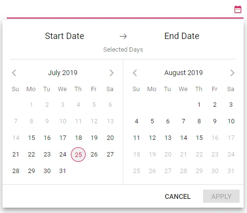
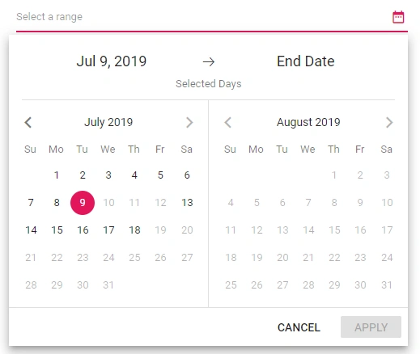
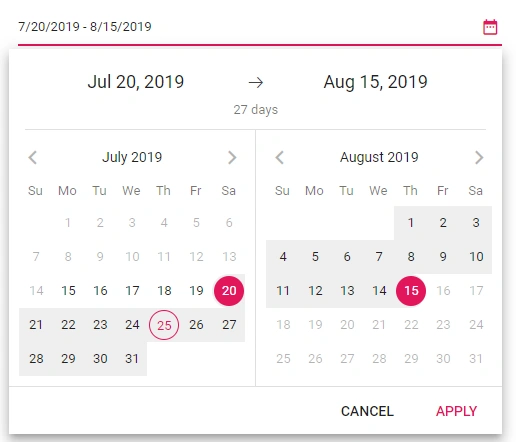
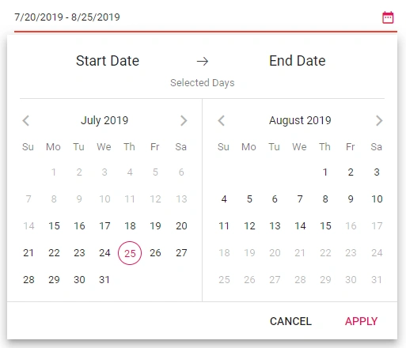

# Range Restriction in Blazor DateRangePicker

Range selection in the DateRangePicker can be customized with restrictions based on application needs.

## Restrict the range within a range

You can restrict the minimum and maximum dates that can be selected as the Start and End dates in a range using the [Min](https://help.syncfusion.com/cr/blazor/Syncfusion.Blazor.Calendars.DateRangePickerModel-1.html#Syncfusion_Blazor_Calendars_DateRangePickerModel_1_Min) and [Max](https://help.syncfusion.com/cr/blazor/Syncfusion.Blazor.Calendars.DateRangePickerModel-1.html#Syncfusion_Blazor_Calendars_DateRangePickerModel_1_Max) properties.

* `Min`: Sets the minimum date that can be selected as the StartDate.
* `Max`: Sets the maximum date that can be selected as the EndDate.

In the following sample, you can select a range from the 15th of this month to the 15th of next month.

```cshtml
@using Syncfusion.Blazor.Calendars

<SfDateRangePicker TValue="DateTime?" Min='@MinDate' Max='@MaxDate'></SfDateRangePicker>

@code {
    public DateTime MinDate {get;set;} = new DateTime(DateTime.Now.Year,DateTime.Now.Month,15);
    public DateTime MaxDate {get;set;} = new DateTime(DateTime.Now.Year, DateTime.Now.Month+1, 15);
}
```




## Range span

The span between the Start and End dates can be limited to enforce a minimum or maximum number of days in a range. The minimum and maximum span allowed within the date range can be customized using the [MinDays](https://help.syncfusion.com/cr/blazor/Syncfusion.Blazor.Calendars.SfDateRangePicker-1.html#Syncfusion_Blazor_Calendars_SfDateRangePicker_1_MinDays) and [MaxDays](https://help.syncfusion.com/cr/blazor/Syncfusion.Blazor.Calendars.SfDateRangePicker-1.html#Syncfusion_Blazor_Calendars_SfDateRangePicker_1_MaxDays) properties.

* `MinDays`: Sets the minimum number of days between the Start and End dates.
* `MaxDays`: Sets the maximum number of days between the Start and End dates.

In the following sample, the range must be between 5 and 10 days; otherwise the selection is not applied.

```cshtml
@using Syncfusion.Blazor.Calendars

<SfDateRangePicker TValue="DateTime?" MinDays=5 MaxDays=10 Placeholder='Select a range'>
</SfDateRangePicker>
```




## Strict mode

DateRangePicker provides an option to restrict the user to entering only valid dates. With `StrictMode` enabled, the Start and End dates are clamped to the `Min` and `Max` bounds when an invalid or out-of-range range is specified. This behavior is enabled by setting the [StrictMode](https://help.syncfusion.com/cr/blazor/Syncfusion.Blazor.Calendars.SfDateRangePicker-1.html#Syncfusion_Blazor_Calendars_SfDateRangePicker_1_StrictMode) property to true. The `MinDays` and `MaxDays` span rules still apply when `StrictMode` is enabled.

```cshtml
@using Syncfusion.Blazor.Calendars

<SfDateRangePicker TValue="DateTime?" StartDate='@Start' EndDate='@End' StrictMode=true Min='@MinDate' Max='@MaxDate'></SfDateRangePicker>

@code {
    public DateTime MinDate {get;set;} = new DateTime(DateTime.Now.Year,DateTime.Now.Month,15);
    public DateTime MaxDate {get;set;} = new DateTime(DateTime.Now.Year, DateTime.Now.Month+1, 15);
    public DateTime? Start {get;set;} = new DateTime(DateTime.Now.Year,DateTime.Now.Month,20);
    public DateTime? End {get;set;} = new DateTime(DateTime.Now.Year, DateTime.Now.Month+1, 25);
}
```

If the value of `Min` or `Max` property is changed through code behind, update the `StartDate` and `EndDate` properties to set within the range.

If the Start and End dates are out of specified date range, a validation error class will be appended to the input element. If `StrictMode` is enabled and both the Start and End dates are less than the Min date, then the Start and End dates will be updated with Min date.

If both the Start and End dates are higher than the Max date, then Start and End dates will be updated with the Max date.

If StartDate is less than Min date, it will be updated with Min date. If EndDate is greater than Max date, it will be updated with the Max date.




By default, the DateRangePicker has `StrictMode` set to false, which allows you to enter invalid or out-of-range dates in the text box.

If the Start and End dates are out of the specified date range or invalid, then the model value is set to an out-of-range value or `null`, and an `error` class is applied to highlight it.

The following sample sets `StrictMode` to false, which allows entering valid or invalid values in the text box.

```cshtml
@using Syncfusion.Blazor.Calendars

<SfDateRangePicker TValue="DateTime?" StartDate='@Start' EndDate='@End' StrictMode=false Min='@MinDate' Max='@MaxDate'></SfDateRangePicker>

@code {
    public DateTime MinDate {get;set;} = new DateTime(DateTime.Now.Year,DateTime.Now.Month,15);
    public DateTime MaxDate {get;set;} = new DateTime(DateTime.Now.Year, DateTime.Now.Month+1, 15);
    public DateTime? Start {get;set;} = new DateTime(DateTime.Now.Year,DateTime.Now.Month,20);
    public DateTime? End {get;set;} = new DateTime(DateTime.Now.Year, DateTime.Now.Month+1, 25);
}
```




N> You can refer to our [Blazor Date Range Picker](https://www.syncfusion.com/blazor-components/blazor-daterangepicker) feature tour page for its groundbreaking feature representations. You can also explore our [Blazor Date Range Picker example](https://blazor.syncfusion.com/demos/daterangepicker/default-functionalities?theme=fluent2) to understand how to present and manipulate data.