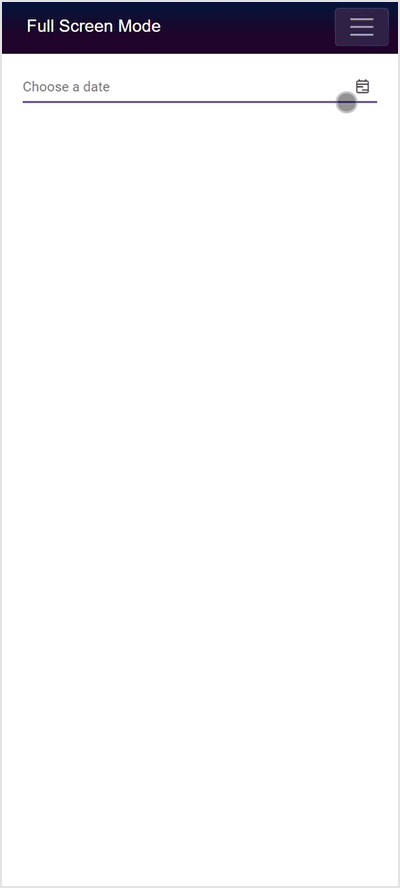

# Style and Appearance in Blazor DateRangePicker Component

Use the following CSS selectors to tailor the DateRangePicker component’s appearance based on user preferences and application themes.

## Customizing the appearance of DateRangePicker container element

Use the following CSS to adjust the input’s font size and height for the DateRangePicker container element.

```css
/* To specify height and font size */
.e-input-group input.e-input,
.e-input-group.e-control-wrapper input.e-input {
    font-size: 20px;
    height: 40px;
}
```

Preview of the code snippet: The DateRangePicker input field renders taller with a 40px height and displays larger text at 20px.

## Customizing the DateRangePicker icon element

Use the following CSS to style the DateRangePicker icon’s background color and size.

```css
/* To specify background color and font size */
.e-input-group .e-input-group-icon:last-child,
.e-input-group.e-control-wrapper .e-input-group-icon:last-child {
    background-color: darkgray;
    font-size: 14px;
}
```

Preview of the code snippet: The calendar icon at the right end of the input shows a dark gray background and slightly larger icon glyph.

## Customizing the DateRangePicker popup calendar header

Use the following CSS to customize the popup calendar header area (range summary section).

```css
/* To specify background and height */
.e-daterangepicker.e-popup .e-range-header {
    background: beige;
    height: 80px;
}
```

Preview of the code snippet: The popup header area displays a beige background with increased vertical space (80px height).

## Customizing the DateRangePicker popup calendar header title

Use the following CSS to style the start and end labels in the popup header.

```css
/* To specify color and font size */
.e-daterangepicker.e-popup .e-range-header .e-start-label,
.e-daterangepicker.e-popup .e-range-header .e-end-label {
    color: brown;
    font-size: 30px;
}
```

Preview of the code snippet: The “Start Date” and “End Date” labels in the popup header appear in brown with large 30px text.

## Customizing the DateRangePicker popup calendar content

Use the following CSS to change the popup calendar content background.

```css
/* To specify background color */
.e-daterangepicker.e-popup .e-calendar {
    background-color: brown;
}
```

Preview of the code snippet: The calendar area inside the popup uses a brown background behind the date grid.

## Customizing the DateRangePicker popup calendar content title

Use the following CSS to style the calendar title (month/year) in the popup.

```css
/* To specify color and font size */
.e-daterangepicker.e-popup .e-calendar .e-header .e-title {
    color: beige;
    font-size: 20px;
}
```

Preview of the code snippet: The month/year title in the calendar header appears in beige with a larger 20px font.

## Customizing the DateRangePicker popup calendar previous and next icon

Use the following CSS to change the size of the previous and next navigation icons.

```css
/* To specify font size */
.e-calendar .e-header .e-prev,
.e-calendar .e-header .e-next,
.e-bigger.e-small .e-calendar .e-header .e-prev,
.e-bigger.e-small .e-calendar .e-header .e-next {
    font-size: 20px;
}
```

Preview of the code snippet: The previous and next arrow icons in the calendar header render larger for improved visibility.

## Customizing the DateRangePicker popup calendar date cell grid on hovering

Use the following CSS to customize the hover style for date cells in the popup calendar.

```css
/* To specify background color and border */
.e-calendar .e-content td:hover span.e-day {
    background-color: beige;
    border: 1px solid black;
}
```

Preview of the code snippet: Hovering over a date cell highlights the day with a beige background and a black 1px border.

## Customizing the DateRangePicker popup calendar primary button in footer

Use the following CSS to customize the primary Apply button in the popup footer (disabled state shown below).

```css
/* To specify background color and border color */
.e-daterangepicker.e-popup .e-footer .e-btn.e-apply.e-flat.e-primary:disabled,
.e-daterangepicker.e-popup .e-footer .e-css.e-btn.e-apply.e-flat.e-primary:disabled {
    background-color: brown;
    border-color: black;
}
```

Preview of the code snippet: The disabled Apply button in the footer displays a brown background with a black border, making the disabled state visually distinct.

## Customizing the DateRangePicker popup calendar cancel button in footer

Use the following CSS to customize the Cancel button in the popup footer.

```css
/* To specify background color, color, and border color */
.e-daterangepicker.e-popup .e-footer .e-btn.e-flat,
.e-daterangepicker.e-popup .e-footer .e-css.e-btn.e-flat {
    background-color: beige;
    border-color: black;
    color: maroon;
}
```

Preview of the code snippet: The Cancel button renders with a beige background, maroon text, and a black border.

## Customizing the footer element in the DateRangePicker popup calendar

Use the following CSS to adjust the popup footer container’s background and size.

```css
/* To specify background color and height */
.e-daterangepicker.e-popup .e-footer {
    background-color: beige;
    height: 50px;
}
```

Preview of the code snippet: The footer area at the bottom of the popup expands to 50px height and appears with a beige background.

## Customizing the selected date cell grid in the DateRangePicker popup calendar

Use the following CSS to style the focused “today” cell when selected.

```css
/* To specify background and border */
.e-calendar .e-content td.e-focused-date.e-today span.e-day {
    background: lightgrey;
    border: 1px solid black;
}
```

Preview of the code snippet: The selected “today” cell shows a light grey highlight with a solid black border for emphasis.

## Full screen mode support in mobiles and tablets

The DateRangePicker supports a full-screen popup on mobile devices to improve visibility and usability in both landscape and portrait orientations. To enable full screen mode, set the [FullScreen](https://help.syncfusion.com/cr/blazor/Syncfusion.Blazor.Calendars.SfDateRangePicker-1.html#Syncfusion_Blazor_Calendars_SfDateRangePicker_1_FullScreen) property to `true`. On mobile devices, the calendar and presets popup expands to occupy the entire screen; desktop behavior is unchanged.

```cshtml
@using Syncfusion.Blazor.Calendars

<SfDateRangePicker TValue="DateTime?" FullScreen="true"></SfDateRangePicker>
```



Preview of the code snippet: On mobile devices, opening the DateRangePicker displays the calendar and presets in a full-screen overlay for improved usability; desktop layout remains unchanged.