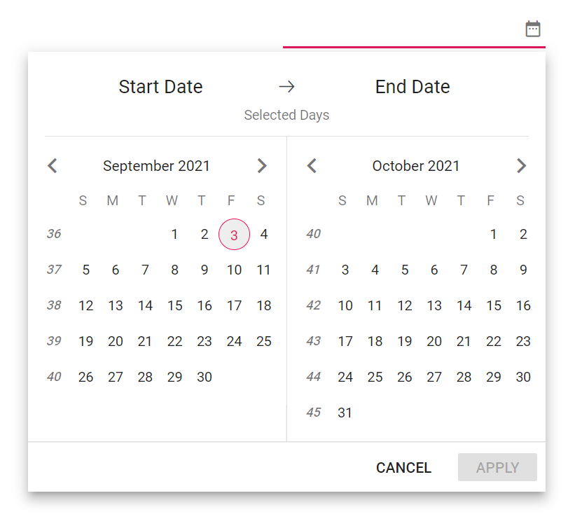
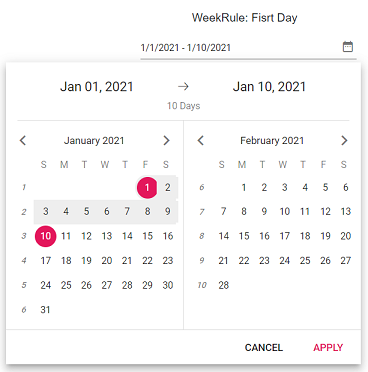
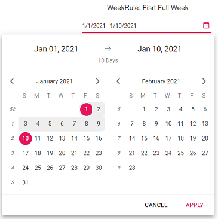
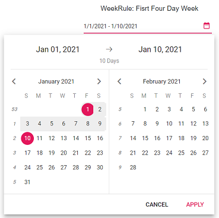

# Week Number in Blazor DateRangePicker Component

You can enable WeekNumber in the DateRangePicker by using the [WeekNumber](https://help.syncfusion.com/cr/blazor/Syncfusion.Blazor.Calendars.CalendarBase-1.html?&_ga=2.27644924.1192045546.1630297484-1815315561.1628088345#Syncfusion_Blazor_Calendars_CalendarBase_1_WeekNumber) property.

```cshtml

@using Syncfusion.Blazor.Calendars

<SfDateRangePicker TValue="DateTime?" Width="250px" WeekNumber="true"></SfDateRangePicker>

```




## Week Rule

You can enable `WeekRule` in the DateRangePicker by using the [WeekRule](https://help.syncfusion.com/cr/blazor/Syncfusion.Blazor.Calendars.CalendarBase-1.html#Syncfusion_Blazor_Calendars_CalendarBase_1_WeekRule) property. This property provide an option to specify the rule for defining the first week of the year. Find the possible values of `WeekRule` property.

Types  |Description  
-----|-----
FirstDay |Set the first week of the year's week number to be started from 1. Then it followed as 1, 2, 3 ...
FirstFullWeek |Set the first week of the year's week number to be started from 52 or 53 (i.e December last week's week Number). Then it followed as 53, 1, 2 ...
FirstFourDayWeek | Set the week number based on the majority of dates present in the week for the respected months. If January dates are presented in the week more than December, the first week of the year's week number will be started from 1. If December dates are presented in the week more than January, the first week of the year's week number will be started from 52 or 53.






