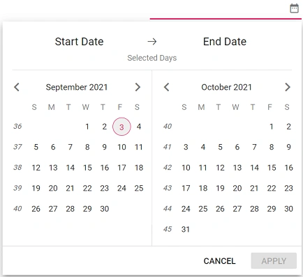
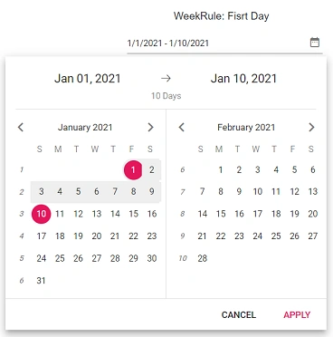
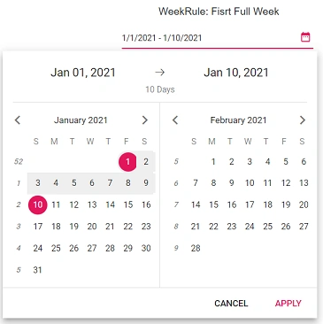
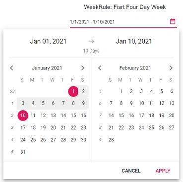

# Week Number in Blazor DateRangePicker

You can enable the `WeekNumber` in the Blazor DateRangePicker by setting the [WeekNumber](https://help.syncfusion.com/cr/blazor/Syncfusion.Blazor.Calendars.CalendarBase-1.html#Syncfusion_Blazor_Calendars_CalendarBase_1_WeekNumber) property (inherited from `CalendarBase`) to `true`.

```cshtml
@using Syncfusion.Blazor.Calendars

<SfDateRangePicker TValue="DateTime?" Width="250px" WeekNumber="true"></SfDateRangePicker>
```



## Week Rule

You can configure the `WeekRule` in the Blazor DateRangePicker by using the [WeekRule](https://help.syncfusion.com/cr/blazor/Syncfusion.Blazor.Calendars.CalendarBase-1.html#Syncfusion_Blazor_Calendars_CalendarBase_1_WeekRule) property (inherited from `CalendarBase`). This property provides an option to specify the rule for defining the first week of the year. The following table lists the possible values of the `WeekRule` property.

Enum value | Description
--- | ---
FirstDay | Starts the year with week 1, then continues as 1, 2, 3, …
FirstFullWeek | Starts the year with week 52 or 53 (i.e., the last week of the previous December), then continues as 53, 1, 2, …
FirstFourDayWeek | Sets the week number based on the majority of dates in the week for the respective months. If a week contains more days in January than in December, the year starts at week 1. If a week contains more days in December than in January, the year starts at week 52 or 53.

```cshtml
@using Syncfusion.Blazor.Calendars

<SfDateRangePicker TValue="DateTime?" Width="250px" WeekNumber="true" WeekRule="WeekRule.FirstDay"></SfDateRangePicker>
```






