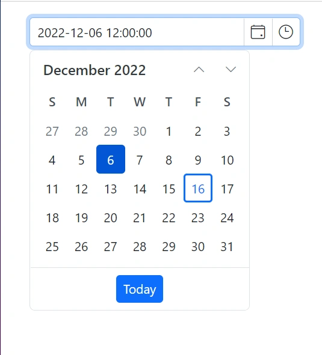

# DateTime Format in Blazor DateTime Picker

## Display date and time format

The display format defines how the date and time value is shown in the Blazor DateTime Picker.

When `Format` is not set, the component uses its built-in default pattern. You can apply a [custom](https://learn.microsoft.com/en-us/dotnet/standard/base-types/custom-date-and-time-format-strings) or [standard](https://learn.microsoft.com/en-us/dotnet/standard/base-types/standard-date-and-time-format-strings) .NET date and time format by using the [Format](https://help.syncfusion.com/cr/blazor/Syncfusion.Blazor.Calendars.SfDateTimePicker-1.html#Syncfusion_Blazor_Calendars_SfDateTimePicker_1_Format) property. For culture-aware display, build the value from the current culture's `DateTimeFormat` (for example, `@System.Globalization.CultureInfo.CurrentCulture.DateTimeFormat.ShortDatePattern`).

```cshtml
<SfDateTimePicker TValue="DateTime?" Format="yyyy-MM-dd HH:mm"></SfDateTimePicker>
```

> When a format string is specified, it is used consistently regardless of culture settings. This provides a predictable, standardized representation for both display and entry.










## Input Formats

The input format controls how users can type date and time values in the Blazor DateTime Picker.

The formats you specify determine the patterns users can enter. When the user types a value matching one of the input formats, it is parsed and then redisplayed using the configured display format after pressing Enter/Tab or when the input loses focus. This allows flexible, intuitive entry using multiple patterns. Configure acceptable formats with the [InputFormats](https://help.syncfusion.com/cr/blazor/Syncfusion.Blazor.Calendars.SfDateTimePicker-1.html#Syncfusion_Blazor_Calendars_SfDateTimePicker_1_InputFormats) property (a `string[]`) using .NET [custom](https://learn.microsoft.com/en-us/dotnet/standard/base-types/custom-date-and-time-format-strings) or [standard](https://learn.microsoft.com/en-us/dotnet/standard/base-types/standard-date-and-time-format-strings) date/time format strings. Order matters: when input is ambiguous, the first matching format in the array is used.





