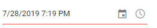

# DateTime Range in Blazor Datetime Picker Component

DateTimePicker provides an option to select a date and time value within a specified range
by using the [Min](https://help.syncfusion.com/cr/blazor/Syncfusion.Blazor.Calendars.SfDateTimePicker-1.html#Syncfusion_Blazor_Calendars_SfDateTimePicker_1_Min)
and [Max](https://help.syncfusion.com/cr/blazor/Syncfusion.Blazor.Calendars.SfDateTimePicker-1.html#Syncfusion_Blazor_Calendars_SfDateTimePicker_1_Max) properties.
Always the Min value has to be lesser than the Max value.

The `Value` property depends
on the Min/Max with respect to [StrictMode](https://help.syncfusion.com/cr/blazor/Syncfusion.Blazor.Calendars.SfDateTimePicker-1.html#Syncfusion_Blazor_Calendars_SfDateTimePicker_1_StrictMode) property. For more information about StrictMode, refer to the [Strict Mode](./strict-mode) section from the documentation.

The following code allows selecting a
date within the range from 7th to 27th day in
a month.

```cshtml
@using Syncfusion.Blazor.Calendars

<SfDateTimePicker TValue="DateTime?" Min='@MinDateTime' Max='@MaxDateTime' Value='@DateTimeValue'></SfDateTimePicker>

@code {
    public DateTime MinDateTime {get;set;} = new DateTime(DateTime.Now.Year,DateTime.Now.Month, 7, 0, 0, 0);
    public DateTime MaxDateTime {get;set;} = new DateTime(DateTime.Now.Year, DateTime.Now.Month, 27, DateTime.Now.Hour, DateTime.Now.Minute, DateTime.Now.Second);
    public DateTime? DateTimeValue {get;set;} = new DateTime(DateTime.Now.Year, DateTime.Now.Month, 14, DateTime.Now.Hour, DateTime.Now.Minute, DateTime.Now.Second);
}
```

The output will be as follows.


When the Min and Max properties are configured and the selected datetime value is out-of-range
or invalid, then the model value will be set to `out of range` datetime value or `null`
respectively with highlighted `error` class to indicates the datetime is out of range or invalid.

```cshtml
@using Syncfusion.Blazor.Calendars

<SfDateTimePicker TValue="DateTime?" Min='@MinDateTime' Max='@MaxDateTime' Value='@DateTimeValue'></SfDateTimePicker>

@code {
    public DateTime MinDateTime {get;set;} = new DateTime(DateTime.Now.Year,DateTime.Now.Month, 7, 0, 0, 0);
    public DateTime MaxDateTime {get;set;} = new DateTime(DateTime.Now.Year, DateTime.Now.Month, 27, DateTime.Now.Hour, DateTime.Now.Minute, DateTime.Now.Second);
    public DateTime? DateTimeValue {get;set;} = new DateTime(DateTime.Now.Year, DateTime.Now.Month, 28, DateTime.Now.Hour, DateTime.Now.Minute, DateTime.Now.Second);
}
```

The output will be as follows.



> If the value of `Min` or `Max` properties
changed through code behind, you have to
update the `Value` property to set within the
range.