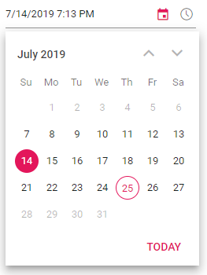
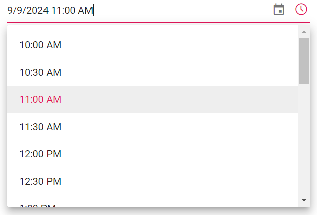

# DateTime Range in Blazor DateTimePicker Component

## DateTime Restriction

DateTimePicker provides an option to select a date and time within a specified range by using the [Min](https://help.syncfusion.com/cr/blazor/Syncfusion.Blazor.Calendars.SfDateTimePicker-1.html#Syncfusion_Blazor_Calendars_SfDateTimePicker_1_Min) and [Max](https://help.syncfusion.com/cr/blazor/Syncfusion.Blazor.Calendars.SfDateTimePicker-1.html#Syncfusion_Blazor_Calendars_SfDateTimePicker_1_Max) properties. The Min value must be less than the Max value.

The `Value` property is validated against Min/Max based on the [StrictMode](https://help.syncfusion.com/cr/blazor/Syncfusion.Blazor.Calendars.SfDateTimePicker-1.html#Syncfusion_Blazor_Calendars_SfDateTimePicker_1_StrictMode) setting. For details, see the [Strict Mode](./strict-mode) section.

The following code allows selecting a date within the range from the 7th to the 27th of the month.

```cshtml
@using Syncfusion.Blazor.Calendars

<SfDateTimePicker TValue="DateTime?" Min='@MinDateTime' Max='@MaxDateTime' Value='@DateTimeValue'></SfDateTimePicker>

@code {
    public DateTime MinDateTime {get;set;} = new DateTime(DateTime.Now.Year,DateTime.Now.Month, 7, 0, 0, 0);
    public DateTime MaxDateTime {get;set;} = new DateTime(DateTime.Now.Year, DateTime.Now.Month, 27, DateTime.Now.Hour, DateTime.Now.Minute, DateTime.Now.Second);
    public DateTime? DateTimeValue {get;set;} = new DateTime(DateTime.Now.Year, DateTime.Now.Month, 14, DateTime.Now.Hour, DateTime.Now.Minute, DateTime.Now.Second);
}
```



When Min and Max are configured:
- With StrictMode enabled, out-of-range input is clamped to the nearest boundary (Min/Max) and invalid input reverts to the previous valid value.
- With StrictMode disabled, the textbox allows out-of-range input and invalid input results in `null`. The input is highlighted with an error style to indicate an invalid or out-of-range entry.

```cshtml
@using Syncfusion.Blazor.Calendars

<SfDateTimePicker TValue="DateTime?" Min='@MinDateTime' Max='@MaxDateTime' Value='@DateTimeValue'></SfDateTimePicker>

@code {
    public DateTime MinDateTime {get;set;} = new DateTime(DateTime.Now.Year,DateTime.Now.Month, 7, 0, 0, 0);
    public DateTime MaxDateTime {get;set;} = new DateTime(DateTime.Now.Year, DateTime.Now.Month, 27, DateTime.Now.Hour, DateTime.Now.Minute, DateTime.Now.Second);
    public DateTime? DateTimeValue {get;set;} = new DateTime(DateTime.Now.Year, DateTime.Now.Month, 28, DateTime.Now.Hour, DateTime.Now.Minute, DateTime.Now.Second);
}
```


N> If the values of `Min` or `Max` are changed through code-behind, update the `Value` property to ensure it remains within the defined range. Calendar selection always respects Min and Max; disabled dates cannot be selected from the popup.

## Time Restriction

DateTimePicker provides an option to select a time value within a specified range by using the [MinTime](https://help.syncfusion.com/cr/blazor/Syncfusion.Blazor.Calendars.SfDateTimePicker-1.html#Syncfusion_Blazor_Calendars_SfDateTimePicker_1_MinTime) and [MaxTime](https://help.syncfusion.com/cr/blazor/Syncfusion.Blazor.Calendars.SfDateTimePicker-1.html#Syncfusion_Blazor_Calendars_SfDateTimePicker_1_MaxTime) properties. The MinTime value must be less than the MaxTime value.

The `Value` property is validated against MinTime/MaxTime based on [StrictMode](https://help.syncfusion.com/cr/blazor/Syncfusion.Blazor.Calendars.SfDateTimePicker-1.html#Syncfusion_Blazor_Calendars_SfDateTimePicker_1_StrictMode). MinTime/MaxTime apply to the time portion of the value and work together with Min/Max dates:
- For the Min date, times earlier than MinTime are restricted.
- For the Max date, times later than MaxTime are restricted.
- For dates between Min and Max, the allowed time range follows MinTime–MaxTime.

The following code allows selecting a time between 10:00 AM and 8:30 PM each day.

```cshtml
@using Syncfusion.Blazor.Calendars

<SfDateTimePicker TValue="DateTime?" MinTime='@MinTime' MaxTime='@MaxTime' Value='@DateTimeValue'></SfDateTimePicker>

@code {
    public DateTime DateTimeValue { get; set; } = new DateTime(DateTime.Now.Year, DateTime.Now.Month, 9, 11, 0, 0);
    public DateTime MinTime { get; set; } = new DateTime(DateTime.Now.Year, DateTime.Now.Month, 7, 10, 0, 0);
    public DateTime MaxTime { get; set; } = new DateTime(DateTime.Now.Year, DateTime.Now.Month, 27, 20, 30, 0);
}
```



The example below also allows selecting a time within the range from 10:00 AM to 8:30 PM of each day.

```cshtml
@using Syncfusion.Blazor.Calendars

<SfDateTimePicker TValue="DateTime?" MinTime='@MinTime' MaxTime='@MaxTime' Value='@DateTimeValue'></SfDateTimePicker>

@code {
    public DateTime DateTimeValue { get; set; } = new DateTime(DateTime.Now.Year, DateTime.Now.Month, 9, 11, 0, 0);
    public DateTime MinTime { get; set; } = new DateTime(DateTime.Now.Year, DateTime.Now.Month, 7, 10, 0, 0);
    public DateTime MaxTime { get; set; } = new DateTime(DateTime.Now.Year, DateTime.Now.Month, 27, 20, 30, 0);
}
```

