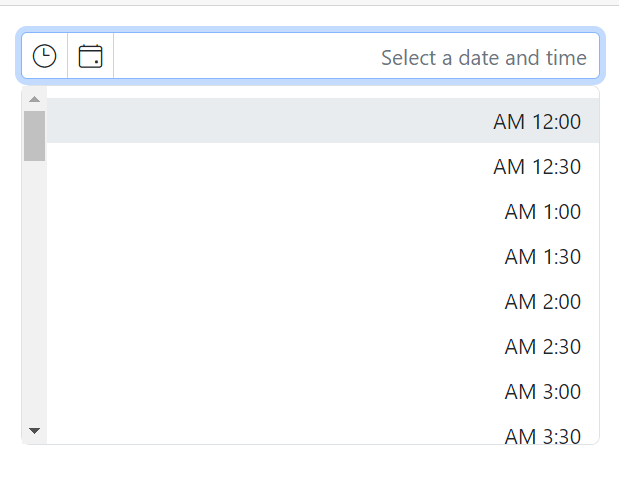

# Globalization in Blazor Datetime Picker Component

The [Blazor DateTimePicker](https://www.syncfusion.com/blazor-components/blazor-datetime-picker) component supports localization and culture-specific formatting. For configuration details, see the [Blazor Localization](https://blazor.syncfusion.com/documentation/common/localization) topic for Syncfusion<sup style="font-size:70%">&reg;</sup> Blazor components. When a Locale is set, the component reflects the culture’s date and time formats, month and day names, and other culture-specific settings. Ensure that the required culture data is loaded before rendering the component.

## Right-To-Left

The DateTimePicker supports right-to-left (RTL) layout for languages such as Arabic and Hebrew. Use the [EnableRtl](https://help.syncfusion.com/cr/blazor/Syncfusion.Blazor.Calendars.SfDateTimePicker-1.html#Syncfusion_Blazor_Calendars_SfDateTimePicker_1_EnableRtl) property to render the component in RTL direction. RTL layout is independent of the Locale setting; both can be combined to achieve the desired language and layout.

The following code example initializes the DateTimePicker component with the `ar` (Arabic) culture and RTL layout.

```cshtml
@using Syncfusion.Blazor.Calendars
@inject HttpClient Http;

<SfDateTimePicker TValue="DateTime?" Locale="ar" EnableRtl=true></SfDateTimePicker>

@code {
    [Inject]
    protected IJSRuntime JsRuntime { get; set; }
    protected override async Task OnInitializedAsync()
    {
        this.JsRuntime.Sf().LoadLocaleData(await Http.GetJsonAsync<object>("blazor-locale/src/ar.json")).SetCulture("ar");
    }
}
```

